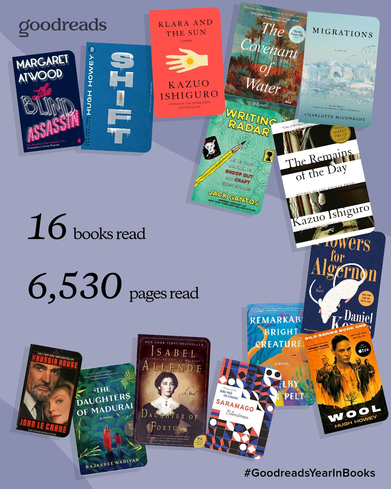

+++
title = "My 2025 in books"
url = "2025/12/2025-in-books.html" 
date = 2025-12-28
description = ""
tags = ["Books", "Lists"]
+++

Goodreads tells me that I read [16 books](https://www.goodreads.com/user/year_in_books/2025/4391307) this year. Though this is not a lot, I am pleased that I found time to read. I am even more pleased that I found time to write about most of these books. I reviewed 10 of these books on my site, and felt bad every time I did not write about a book. This was due to a self-imposed rule that I should create content in proportion to my consumption. I am hoping that writing becomes easier at some point in time, but it's been 15 years since I started hoping, and it has only gotten more difficult.

That's an eclectic mix, and I should briefly talk about how I pick my next read. It is extremely scientific, but I will try to simplify it. I use this thing called *impulse.* My excitement is sky-high when I finish a book, because I usually have no idea what I would pick next. Once I make a choice, it becomes a slog, because of the way my brain works. I guilt-trip myself to try and review the book I just finished, and feel bad about being too slow in reading the next book. To make sense of the choices I made through the year, I used [StoryGraph](https://app.thestorygraph.com/stats/adarshvee?year=2025) to generate the chart below. If you skip literary novels -- StoryGraph is labeling 9 of the books I read "*literary*" -- I read 5 dystopian books. Like I said, my picks are completely random, and my subconscious mind is not signifying the health of the world. Maybe it is, but none of us can prove or disprove it. 

I started with **Kazuo Ishiguro**’s [Klara and the Sun](https://www.goodreads.com/book/show/54120408-klara-and-the-sun). This was my first experience reading the popular and critically acclaimed Ishiguro. With *Klara and the Sun*, I sensed why the author is highly regarded. However, the book did not satisfy me completely. The novel is set in a future where kids have artificial playmates. Klara is one such playmate, and the book is a narration of her experience being a friend to a child. Ishiguro is flawless in terms of maintaining the perspective of the narrative. But his skill is the book's short-coming. Klara has blindspots, and her incomplete perspective means that the novel's themes remain abstract.

Later in the year, I read Ishiguro's more popular [The Remains of the Day](https://www.goodreads.com/book/show/28921.The_Remains_of_the_Day), which was my best read of the year. This is again a novel with a constrained perspective. The narrator here is a butler in Britain, and he is of a fading ilk of butlers who took their job extremely seriously. However, as our protagonist goes on a journey to meet a former colleague, his perspective widens, just enough to allow us a glimpse into his blind-spots. *The Remains of the Day* made me a fan of Ishiguro's economy of words and his deceptive knack to write emotional scenes. I gushed more about this book in my [review](https://www.thefreudiancouch.com/2025/04/remains-of-day-kazuo-ishiguro.html).

Isabel Allende’s [Daughter of Fortune](https://www.goodreads.com/book/show/16527.Daughter_of_Fortune) was my most enjoyable read of the year. I had preconceived notions about the genre of the book going in, and my notions were wrong. At its core, this is an adventure novel set across Chile, China and California. It is also a literary and historical fiction. I [reviewed](https://www.thefreudiancouch.com/2025/02/daughter-of-fortune-allende.html) this book on my blog where I compared it to *Gabriel Garcia Marquez*'s *Love in the Time of Cholera*. As an aside, I tell impromptu bedtime stories to my son, and Allende inspired me to make up a story about the California gold rush. The story was a huge hit with my son. On the flip side, he became too excited to sleep. Also, he does not want to visit California now because he is convinced it is a desert full of “*bad boys*” searching for gold. Maybe he is onto something. 

I read [Wool](https://www.goodreads.com/book/show/12287209-wool), part of the Silo series, because I wanted to read something contemporary. This, in my mind, would allow me to have conversations with kids in their twenties who are into dystopian thriller novels, or who watch shows on Apple TV. The book did engage me, but it hasn't been memorable. I wrote about the book's superhero protagonist [here](https://www.thefreudiancouch.com/2025/03/wool-silo-howey.html). I also read the second book in this series, [Shift](https://www.goodreads.com/book/show/17306293-shift), later in the year. In other news, I am still looking for people to talk with.

I picked [The Russia House](https://www.goodreads.com/book/show/270521.The_Russia_House) by *John Le Carré* on a whim, but hey, that's how I pick any book. It was a nostalgic return to the espionage genre which I loved as a teenager. Though the book successfully humanized the spies, as only Le Carré can do, it also hinged on a romance that did not work for me. You can read my thoughts on the book [here](https://www.thefreudiancouch.com/2025/04/russia-house-le-carre.html).

Since the world has been all rosy and nothing terrible has been happening anywhere, I read a few disturbing books as well. Han Kang's [The Vegetarian](https://www.goodreads.com/book/show/25489025-the-vegetarian) is a three-part novel about a woman who suddenly decides to become a vegetarian. However, she lives in the patriarchal Korean society. Han Kang uses this conceit to explore themes of body autonomy, consent, family, art and loneliness. This is a modernist book with very abstract themes. Han Kang's job is to enable the reader to think, and not to tell us what to think. She succeeds exceedingly well. I wrote more [here](https://www.thefreudiancouch.com/2025/06/vegetarian-han-kang.html).

I also read [Blindness](https://www.goodreads.com/book/show/40495148-blindness) by Jose Saramago. Saramago takes a dystopian setup: there is a contagion of blindness causing some people to be quarantined. The author pushes his unnamed characters to the brink, and examines their reactions under a microscope. This is a wonderfully written book that is hard to read both because of the prose and the gruesomeness. But if Saramago's characters seem perverted, it is only because they are human, and they do as we would do under similar conditions. I reviewed the book [here](https://www.thefreudiancouch.com/2025/09/blindness-jose-saramago.html).

[Flowers for Algernon](https://www.goodreads.com/book/show/18373.Flowers_for_Algernon) was yet another dystopian book I read this year. Daniel Keyes is a fantastic writer, and his premise is an experimental treatment that would increase the IQ of people with learning disabilities. The titular Algernon is a mouse on which the experiment was successful, but the novel is narrated by the first human subject of this treatment. This book published six decades ago is a harsh critique of how society treats differently abled people. Unfortunately, the book is relevant today as well. I gushed about the writing [here](https://www.thefreudiancouch.com/2025/08/flowers-for-algernon-daniel-keyes.html).

I considered myself a fan of Margaret Atwood, but last year, I realized that I hadn't actually read any of her books. So I started at an unlikely place, a collection of essays written by her across multiple years and published as [Burning Questions: Essays and Occasional Pieces](https://www.goodreads.com/book/show/58210662-burning-questions). I wrote about this book [here](https://www.thefreudiancouch.com/2024/11/margaret-atwoods-burning-questions.html). This year, I attempted to read [The Blind Assassin](https://www.goodreads.com/book/show/78433.The_Blind_Assassin). The book's wonderfully detailed description of an elderly lady's travails and psychology is moving, and Atwood's mastery of her craft is evident throughout. Unfortunately, the book did not work as a whole for me. I still consider myself a fan of Atwood. I just need to read more of her work to be able to justify this. 

Another book that I enjoyed and promptly forgot about is Shelby Van Pelt's [Remarkably Bright Creatures](https://www.goodreads.com/book/show/59710157-remarkably-bright-creatures). This is a bittersweet popular novel that is narrated in parts by an Octopus. It does what it sets out to achieve: tug your heart and make you smile. 

I loved Charlotte McConaghy's [Once There Were Wolves](https://www.goodreads.com/book/show/54860573-once-there-were-wolves), and looked forward to reading [Migrations](https://www.goodreads.com/book/show/42121525-migrations). But it was probably unfair of me to expect a book similar to *Once There Were Wolves*. Migrations is still good cli-fi, and McConaghy's wonder at nature shines. However, the book was too lyrical for my taste, since I lean more towards character-studies or philosophical ideas. I reviewed the book [here](https://www.thefreudiancouch.com/2025/09/migrations-charlotte-mcconaghy.html).

On a local library trip with my son, I decided that he is old enough to spend some time by himself. He sat at a lego table, and I suggested that I let him be by himself for a bit when I browse some books. He loves the idea of independence as well, and he was excited by the prospect. I started walking, but within a few feet from where he was, I double guessed myself, and decided to not go further. I was in the juvenile non-fiction section, and the title [Writing Radar: Using Your Journal to Snoop Out and Craft Great Stories](https://www.goodreads.com/book/show/33155333-writing-radar) attracted me. After all, I fancy myself as a writer (sorry about that). Back near the lego table, as I read a few pages among cranky toddlers and crawling babies, I felt that this book could teach me a thing or two. The book was fun, but I would have enjoyed this more as an adolescent. At my age, the book just causes regret that I don't journal enough. Counterpoint: this is my journal. 

I picked [The Daughters of Madurai](https://www.goodreads.com/book/show/61783327-the-daughters-of-madurai) because it has an unmissable cover. I was generous to the book in my [review](https://www.thefreudiancouch.com/2025/10/daughters-of-madurai-variya.html). In retrospect, I feel like I rated this more liberally than I should have. My opinion of the book changed significantly after -- SPOILER ALERT -- reading a far better novel set in India later in the year.

I wanted to read something for Halloween and I picked a random book called [Within These Walls](https://www.goodreads.com/book/show/22609323-within-these-walls) from a curated shelf in my library. My thinking was that if I published a review of a horror book on Halloween Eve, I would go viral and get a million readers. Unfortunately, I finished this book in December and I did not have much to say at the end, so I skipped the review. And that’s how I lost the opportunity to gain 999,999 new readers. To be fair to the book, I am not a horror fan. I still enjoyed the book's darkly humorous twisted ending.

I ended the year with a 700-page novel, [The Covenant of Water](https://www.goodreads.com/book/show/180357146-the-covenant-of-water). This multi-generational saga set in Kerala between 1900 and 1970s is an extremely well-written novel that examines a subculture in India. I wrote more [here](https://www.thefreudiancouch.com/2025/12/covenant-of-water.html). 

Goodreads tells me that I read about 20 pages each day on average. Put that way, it does not seem like a lot. But there is no point in looking at numbers. If I read 200 pages a day, I would still not get to all the books I want to read. If I read 2 pages a day, I still would have momentarily fought against the absurdity of life and the inevitability of gloom.

On that uplifting note, wish you a very happy new year!

 [My 2024 in books](/2024/12/my-2024-in-books.html) · [My 2022 in books](/2023/01/my-2022-in-books.html) · [My 2021 in books](/2021/12/my-2021-in-books.html) · [My 2020 in books](/2021/01/my-2020-in-books.html) · [The books that made my 2024](/2014/12/the-books-that-made-my-2014.html) 