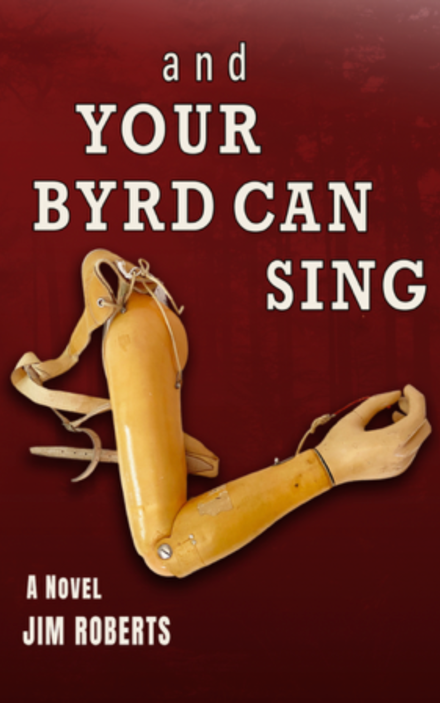

+++
title = "And Your Byrd Can Sing by Jim Roberts"
url = "2026/01/and-your-byrd-can-sing-roberts" 
date = 2026-01-11
description = "A gritty Southern-Gothic coming-of-age story that focusses on a misfit's attempts to fit, and to free himself of the burden of his past."
tags = ["Books", "Literary Fiction", "Book Review", "Historical Fiction", "Southern Gothic", "Coming of age"]
+++

> Most men, as they reach the far side of midlife, can look back on maybe a moment or two in their youth when they had the opportunity to take that final step from a boy to a man...My moment came that night in the basement men’s room of the Knope County courthouse...But there were no men there that night.

If I had known only one thing about *Jim Roberts*'s debut novel **And Your Byrd Can Sing**, and if it had been that both the title of the book and each of its 37 chapters are titles of songs by *The Beatles*, I might not have picked the book. I don't have anything against *The Beatles*; I even tried listening to a couple of their songs years ago in a quest to be well-versed in American pop-culture - I would have eventually reached Taylor Swift if I had persevered. I am glad that I did not know much about this gritty and hard-hitting novel before picking it up.

Though my taste (or lack of it) in music was not a barrier in enjoying the book, other aspects could have been. In theory. I am an Indian who grew up as a Hindu in deep south India and moved to the upper-South state of Virginia in my thirties. **And Your Byrd Can Sing** is a Southern-Gothic coming-of-age tale set in the fictional town of *Korvus* in deep south Texas, where The King James Bible is *"the official user’s manual"*. But the beauty of fiction is its ability to break barriers in culture and time. Even so, it was a pleasant surprise that soon after the prologue we see a statue and a picture of *Nataraja*: a depiction of the major Hindu deity, *Shiva*. This effect is, however, brief, for like *Billy Bastrop*, the protagonist of this novel, I am *"neither a believer nor a disbeliever"* in God, and *"The core of my heart on this subject was \[is\] empty"*.

**And Your Byrd Can Sing** begins with the words *"I’ve killed three men, but I’m not a murderer"*. It is 1963, the year of Kennedy's assassination, and Billy, the 9-year-old narrator, is a misfit in Korvus (*"*Home of the Blackest Oil and the Whitest People in Texas"*). Having lost his parents and a limb in a childhood accident, he lives with his aunt *"Sunny"* Sunshine. Billy's disability and his nature make him an outcast. Sunny and Billy live literally outside the town: *"our only neighbors being a tattered weekend drive-in movie theatre, scattered stands of loblolly pines, and forlorn cattle"*, says Billy. But despite this, Billy is not the town pariah. That role is played by Wonderful Byrd - a black boy who suffers from intellectual disability and some sort of melanin deficiency. Billy's quest, he thinks, is to fit in and be "*just another guy*". However, he fits in too well, and his past and his moral compass haunt him to seek redemption.

This book is apparently many years in the making, and the result is telling. The few Gothic novels I have read, such as *Mary Shelley*'s **Frankenstein** or *Emily Brontë's*'s ***Wuthering Heights***, were before I could tell one genre apart from another. Aspects of the Gothic story include the intrusion of past upon the present, and religious associations. The Southern Gothic genre, and this is my first foray into this territory, places these elements in the American South - the Bible Belt. They explore death, poverty, decay and despair. But not gratuitously. **And Your Byrd Can Sing** is a genre-novel, and understanding the genre helps appreciate this novel more. It also loosely fits the genre of Bildungsroman, or coming of age. We observe the transformation of Billy from a child who longs for normalcy to an adult grappling with the moral conundrums of justice and retribution.

Religion plays an oversized role in the lives of the people in Billy's World. Sunny -- "*a never-married, childless, fiftyish woman–thrust into reluctant motherhood*" -- is intensely devoted and follows the Holiness Pentecostal branch of Christianity. This involves abstaining from alcohol, speaking in tongues, and handling snakes. There is a lot to be said about her, though on the surface it does not seem like it. She veils herself in a "*perpetual cloak of sadness and negativism*". But beneath her tactlessness and intolerance, she is a strong woman who is fiercely independent and safeguards Billy's future. As a character, we feel sympathy for Sunny when we learn about her childhood. However, if we meet her in real life, we may judge her based on our own worldview. And that, at least to me, is a sobering thought. Her brother, Billy's dad *Cecil*, is the missing link in Billy's life. They did not have rosy childhoods - growing up in poverty, neglect and abuse. As a character says about the relationship between a father and son, "*he beat Jesus out of him and made a hole big enough for the demons to get inside."* It rests on Billy to break this vicious cycle. However, this is hard. Billy has to fall before he can rise.

The first-person narrative structure means that we get to see things only from Billy's restrained perspective. We see what Billy wants in the moment, but what he truly wants is subtext that is implied only at the book's resolution. There is a scene towards the end of the novel where Billy stops on a deserted highway to feed a dead snake to a juvenile possum that is too weak to help itself, prompting a passerby to yell *"Weirdo!"* Billy's subconscious drive is to make the World a better place for the young and the weak. *"But the road to respect, like any good quest road, is guarded by a malevolent force. An ancient, potent beast that is the wellspring of much war and chaos and mayhem, fed by putting young men, desperate to prove, under the charge of older men, insatiable for proof."* 

The narrative choice causes the titular character, *Wonderful Byrd*, to be seen only from afar and briefly at that, but he haunts the story like a ghost from folklore - a haint. It is a deliberate decision by the author to not show Byrd's perspective. This allows us to view Byrd as what he is - a true outcast. For after all, Billy does get his moment in the sun, albeit briefly. Society's treatment of Byrd reminded me of **Flowers for Algernon** by *Daniel Keyes* which was published in 1959. But Daniel Keyes operates on a psychological level and abstains from physical brutality to examine philosophical implications. **Jim Roberts** is interested in reality, and portrays the ugliness as is, causing us to flinch. Not all is bad though, for we meet many redeeming people. The most touching of these is an older man in Ohio who is just generous to everyone, but especially his wife whose mental acuity is receding. He serves as a perfect counterpoint to society in the time and setting of **And Your Byrd Can Sing**.

I enjoyed researching all the references to 1960s and 70s Texas. We encounter chain establishments like *Dairy Queen* and *Piggly Wiggly*, which seem like hot and happening destinations of small town America. I did not know that coin-operated photo booths were a thing - automation has always been a part of the American life. I also learnt about Rand McNally maps. Even the books Billy reads make a point. We see him reading **Slaughterhouse-Five**, the classic anti-war novel. Later, a character tells Billy: "*But let me just tell you, truthfully, since you are a young man seeking truth, no matter how heinous you think war is, it is far, far worse than anything a sane man can imagine.*" Of course, it is the *sane* people of Billy's world who make it hard for people like him.

The book does have a streak of humor running through. An Indian doctor and his assistant misunderstand the deep South accent leading to hilarity when the assistant serves a wine called *Asti* to an abstaining person who asks for iced-tea. However, these humorous scenes stood out to me rather than being blended through the narrative, so I would not classify this book as dark comedy. A few things felt out-of-place to me. We learn that Billy is a reader partway through the book, and to me, this was new information that came as a surprise. The fact that this voracious reader masters an aspect of football by reading an autobiography of a similar player and through sustained practice does not seem outside the realms of possibility. But his easy identification of various weapons seems odd to me. Maybe it's my distance from gun culture that makes me think so. I have never been to Texas after all. There is a whole subplot in Ohio dealing with a gang that seems necessary for Billy's character development. However, this plot is resolved when some incriminating evidence is conveniently found in an abandoned vehicle that serves as Billy's temporary home. 

Despite these small distractions from the genre as I understand it, I was thoroughly impressed by **And Your Byrd Can Sing**. I have read my share of disturbing books, but around the middle of the novel, there came a point where I feared what was to happen and just put the book down to take a break. I wanted to love Billy, but sensed that it may not be possible. That indicates how effective **Jim Roberts** is. He makes us love Billy, breaks our heart, and gradually makes us sympathize with his character again. This book is definitely not for everyone. It is dark, dreary and violent before it gets to a satisfying conclusion. It could be viewed as a masculine novel. However, I was hooked from the beginning and engaged throughout. Like the best American writers, **Jim Roberts** writes with economy and is still profoundly effective. I still may not be a fan of The Beatles, but I discovered a new genre to pursue more of.

> But you should know everybody says they want to know the truth. That’s what you’re supposed to say… People old as me, we give truth a wide berth. We know that truth’s just a sad, lonely bastard. He’s that mean motherfucker who’ll get you drunk and steal your money and get you arrested.

PS : This is a review of a pre-publication Advance Reader Copy (ARC) I received through BookSirens. All views are my own.

 [Kurt Vonnegut's Slaughterhouse-Five](/2024/12/kurt-vonneguts-slaughterhouse-five.html) · [Flowers for Algernon by Daniel Keyes](/2025/08/flowers-for-algernon-daniel-keyes.html) . [Thoughts on Crime and Punishment](/2014/07/thoughts-on-crime-and-punishment.html)  