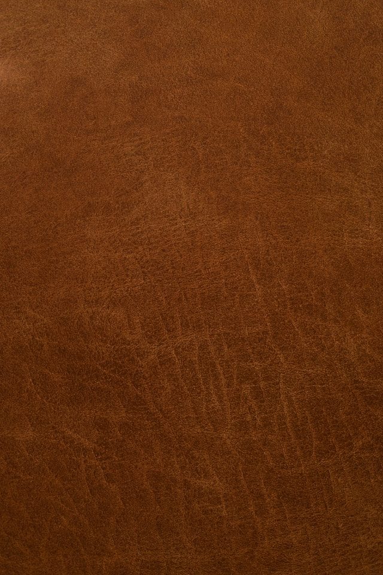

+++
title = "Brown - A short story"
url = "2026/08/brown" 
date = 2026-08-07
description = "A short story about interview anxieties and the desire to help others"
tags = ["Short Story", "Literary Fiction", "Fiction"]
+++

It was an overcast morning as I dragged my bike outside. I looked at my plain white shirt in the rear-view mirror. It was brand new, crisp and clean. I glanced around, and saw Kamala aunty.

“*Thambi*, up so early? No shift today?” she asked.  
“*I have an interview, aunty.*”  
“*Oh okay, pa. All the best\!*”

As her eyes rested at an empty spot meant for her son’s Honda Activa, I hastened to leave and eased into the streets. An auto-driver stared at me. A roadside tender coconut seller’s eyes lingered on me. I flattened my shirt and adjusted the rear-view mirror. My shirt was still spotless, and the buttons were done properly.

I rode on, practicing my elevator pitch under my breath. “*Hi, I am Narayanan. I did my B.E. in E.C.E. and finished my MBA at XLRI. I was a dean’s lister. Some of my, uhmmm, projects were..*” They were shit. I could ace any exam, but hated anything practical. 

At least during school, projects had been fun. Mostly because I teamed up with my friend. I recalled our Physics project. We were attempting to demonstrate the potential of fibre optic cables. Vivek had dragged me to a Television cable shop in Mudichur to get some sample cables, and they sent us to the supplier, who invited us to sit and offered us juice.

“*How many kilometers of cable do you need, sir?*”  
“*Kilometers illa, sir. This much is enough*,” I said, placing my right forefinger on the wrist of my outstretched left hand. 

It had been Vivek’s idea. All bad ideas were his, as were some good ones. The fibre optic cable we had eventually acquired turned out to be useless. He salvaged the project by threading a hidden wire under the thermocoal. We flicked a switch on one end of the cable, and a light glowed on the other end. *Voila*\! Full marks. On our way back home that day, we stopped to buy biscuits and feed stray dogs. His idea.

A dog barked, a car beeped, and I realized that I was not driving in a straight line. My hands were unsteady. I was crossing Medavakkam Kootu Road junction. I straightened the bike and twisted my wrist, accelerating steadily. The recruiter had sounded positive during the screening call. Amma would be proud if I aced this. But I had to focus. “*I believe in leading through action and example. During my project..*"

I was nearing Medavakkam now, and the traffic was uncharacteristically light. A bus ambled on the other side of the road. A stout, elderly man walked unsteadily ahead of the bus. Something about him drew my eyes to him. He kept tottering along. And then, he slumped. A shapeless mound of sand becoming one with the ground. The bus’s unoiled brakes screeched as it halted some distance away. I stopped too. 

And waited.

The man looked drunk. I hoped that someone from the bus would get down, but no one stirred. Reluctantly, I crossed the road on my bike, parking it a few steps away from the man. His shirt was brownish from dirt and filth, but it had surely been another color once. The left leg of his pants reached only till his knee. He had no footwear. 

Was he drunk, or just ill? I walked towards him.  
“*Sir, are you okay*”, I muttered. “*AYYA?*"   
He mumbled incoherently.   
I looked around, waiting for someone to tell me what to do. I decided to fetch my water bottle. It was empty. I sensed the bus moving a little, but it was reversing slowly. With a sigh, I headed back towards the collapsed man. 

That’s when I saw the second vehicle, standing closer to the man. A Honda Activa. Its driver was already on his feet, reassuring the man.

Kamala Aunty’s son. Vivek.

“*Let’s lift him, da,*” he said.

I rushed to help, and grunted as the man leaned on my shirt. Vivek steadied him.

“*AUTOOO*,” he bellowed.   
A passing auto-rikshaw stopped, the driver’s forehead furrowed and his mouth partly open.

“*Let’s get him in\!*” Vivek said forcefully, and the man seemed lighter as we dragged him into the vehicle. Vivek produced a wallet, grabbing a few notes of currency, thrusting some into the outstretched palms of the driver and shoving others into the man’s shirt pocket. 

“*Take him to a hospital\!*”  
“*Saamy*.”  
Vivek and I looked at the man.  
“*I haven’t eaten anything. Please give me fifty more rupees.*”

I looked at him, trying to ascertain if I had imagined the smirk. Vivek snatched a few more notes without hesitation and handed it to the man, waving the auto away. The auto driver hurried, as if not wanting to be summoned back.

The bus went past us as we stood in silence. Vivek climbed his Activa, and finally looked at me.

“*Why are you dressed so formally? Are you going for an interview?*”  
“*Yes. And you?*” He didn’t respond. His collarless brown t-shirt had tiny holes in it.  
“*You should visit your mother sometime. Forget this charity stuff.*”  
“*All the best*”, he said, smiling, before driving away.

As I continued on my way, the skies still cloudy, I realized that I hadn’t inspected my shirt in a while. There was a speck of dirt on my shoulder where the man had leaned. But passers-by had stopped staring at it.

*Photo by [**Felipe Santana**](https://unsplash.com/@felipesantana?utm_source=unsplash&utm_medium=referral&utm_content=creditCopyText) **on [Unsplash](https://unsplash.com/photos/brown-leather-xJkTCbtuqAY?utm_source=unsplash&utm_medium=referral&utm_content=creditCopyText)***

### Glossary and author’s notes

*Thambi \-* Tamil word literally meaning younger brother, used to refer to younger males  
*Pa \- A suffix of endearment*  
*Da \- An informal suffix of male endearment*  
*XLRI \- Xavier School of Management, A upper-middle tier business school in Jamshedpur*  
*XAT \- An entrance exam to qualify for XLRI*  
*B.E. in E.C.E \- Bachelor of Engineering in Electronics and Communications Engineering*  
*Illa \- No, not*  
*Saamy \- Term of respect for males. Literally, God.*  
*Ayya \- Tamil equivalent of sir*

Author’s Note : This is a fictionalized account of a true incident I had written about in [The Freudian Couch](/2013/03/on-kindness.html).

---
This story was originally [published at Pro Writers Room](https://prowritersroom.com/brown/) in response to the prompt "Write a story where an apparently insignificant background character is revealed as the true protagonist only in the final two paragraphs. (Word Limit 600-900)"

 [On Kindness](/2013/03/on-kindness.html) · [By myself](/2026/03/by-myself/) · [Moonshine](/2026/07/moonshine/) 
