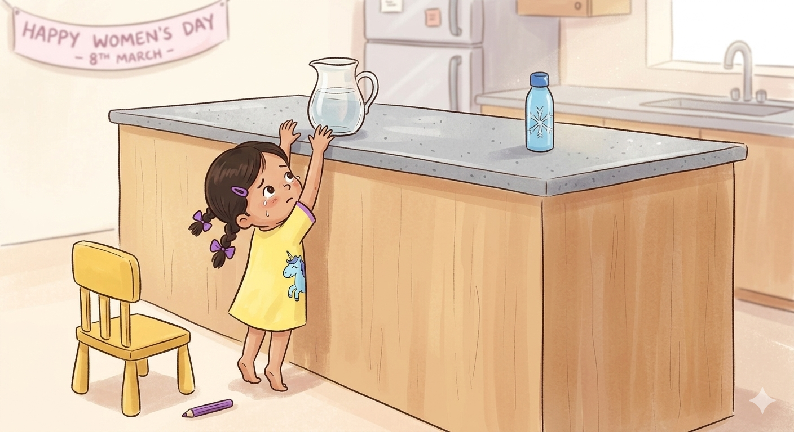

+++
title = "By myself - A short story"
url = "2026/03/by-myself" 
date = 2026-03-07
description = "a literary fiction that captures the fragile, everyday negotiations between a child’s stubborn independence and a mother’s weary resilience"
tags = ["Short Story", "Literary Fiction", "Fiction", "Childhood"]
+++

“Yes, her school is closed today, ma,” Amma said on the phone.

“Amma! I can’t find my purple color-pencil.” Amba looked and looked, but she didn’t know where it was. She wanted her unicorn to have a purple horn. Purple was her favorite color.

“Yes, the interview is today, ma. I am going to leave her with Adit’s nanny.”

“I don’t want to go to…” Amba started to say, when her print-out slipped off the table. “YAY! I FOUND MY PURPLE PENCIL!” she squealed, grabbing the pencil that had been hiding under the paper. “Don’t be excited, yet, mom!” she whispered, as she picked up her paper and started to color.

“Amba! We are getting late, stop coloring please.”, said her mom.

Amba didn’t want to stop.

“I said it is on the 8th of March, not 9th… No I still need to prepare. Okay, I really need to go now, ma. I will call later. Good night!”

“Come Amba, I am getting ready. You should get changed too,” Amma said as she walked into her room.

Amba kept coloring. She was almost done. The unicorn was looking beautiful already. Once she finishes coloring the horn, she will stick the picture on the wall. 

“AMBA!” Amma’s loud voice scared her, dragging her pencil. She had colored outside the lines. “I want another print out,” she said, pushing the paper to the ground.

“Do you, now? I said get ready. Go, change your clothes. Now!”

“NO! I want to color another unicorn.” 

“Amba, I am telling this very softly. You need to get ready now. I am going to put your colors away for now,” said Amma.

Amba wanted to protest, but Amma was very angry, so she followed her to the room and searched inside her closet . “Yellow unicorn shirt!” she jumped with joy, having found her favorite shirt. Her mom left her to change and stepped outside the room.

“Yes, Isa. Adit’s mom gave me your number…She is 5 years old,” mom was speaking on the phone again when she came out. “Thank you! We will be there soon.” 

“Who is that? I want to speak on the phone!” said Amba when she saw that Amma was about to fill her water bottle with water. “I wanted to do that! I want to fill my bottle!” she screamed, half-hopping towards her mother and grabbing her pants. 

“No, Amba! We are late, and we need to leave now. You will spill the water.”

“I WILL NOT! You never even give me a turn!”

“You can do it yourself when you are older. Let me do it for you now.”

“NO! I WANT TO DO IT NOW!” Amba wailed, and started to weep.

“AMBA! Stop pulling my clothes. Will you please listen to me? You will make a mess and I will be late for my interview. We need to leave now.”.

“NO! I WANT TO DO IT!”

“I said STOP! Why are you so stubborn? You never listen. Ever since your dad left us…” Amma took a deep breath. But then, there was a loud bang. Amba covered her ears, and looked near the fridge where the noise was coming from. Her water bottle was lying on the floor, sideways. 

“You THREW my bottle!” she cried.

”I can’t do this alone. I need a break,” Amma said, wiping her tears with her arms, and left the kitchen.

Amba stared at the bottle for some time, with tears in her eyes too. Her nose was blocked by boogers. She fetched the bottle and reached up to the counter, but the glass jug was far away from the edge. She was too small. Everything was so tall. 

She looked around. There was a noise from the table. The unicorn drawing was flying away again. She walked towards it. When she reached her yellow chair, she looked around, unsure what to do with her bottle. She put it on the chair, and pulled the chair with her. 

At the counter, she reached over her head once again putting the bottle at the edge of the counter. She climbed the chair and raised her head slowly, bumping softly against the edge of the counter. The chair was too close. She moved it away and climbed up once again. Stretching her arms, she could reach the jug now. She tried lifting it with one hand, it was too heavy. She tried lifting it with two hands, it was too heavy. 

She tried once more. This time, she could lift it. It was hard, but she bent the jug over the bottle and some water fell into her bottle. And then a lot more. When the bottle was almost full, she grunted and straightened the jug. The jug almost slipped as she placed it down with a bang. She started to get down from the chair, but pushed against the counter by mistake. The chair started tilting backwards as she leaned forward, holding on to the counter. “AMMA!” she shouted, as she started to fall down.

“AMBA! What are you doing? You almost fell and hit your head!”, said her mom rushing towards her and supporting the chair.

“See. I didn’t make a mess. I did it by myself.”

“You are such a stubborn monkey. You are me.”

-----------
This was originally published [here](https://prowritersroom.com/by-myself/).
The story was in response to [this prompt](https://prowritersroom.com/inntales-3-writing-event-march-2026/?fbclid=IwY2xjawQZw41leHRuA2FlbQIxMABicmlkETFlY1k5VEhTNnpDeXl5TWlEc3J0YwZhcHBfaWQQMjIyMDM5MTc4ODIwMDg5MgABHpNivhTGRGhzxKhj_iEN7ZoKhWEGbHw0p5P8WeUBZU5H_7guT1o4bnjd26p6_aem_M989tvAD0rpQPqfvosAk3Q).

 [Nithya](/2017/07/nithya.html) · [The Prodigy](/2017/08/the-prodigy.html) . [Social Network](/2012/11/the-social-network.html)  