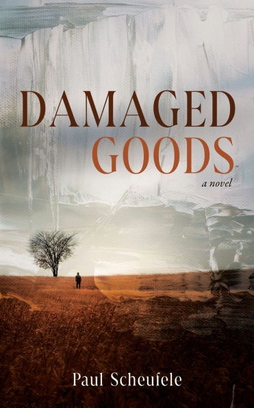

+++
title = "Damaged Goods by Paul Scheufele"
url = "2026/03/damaged-goods-scheufele" 
date = 2026-03-02
description = "Paul Scheufele's Damaged Goods tackles class, luck, and sibling bonds in an engaging but uneven debut — a review."
tags = ["Books", "Literary Fiction", "Book Review"]
+++

At the beginning of *Paul Scheufele*'s debut novel **Damaged Goods**, we meet a fleeting Indian character who introduces herself as *Dr. Prana*. *Prana* is the Sanskrit word for life-sustaining energy. Later on, we learn that another character is a Doula who helps women give birth. The metaphors with birth and life are hard to miss, and foreshadow the themes of the book. But then a character dies. **Damaged Goods** ponders questions of a fulfilling life, wasted potential, and legacy. 

Brendon is a 50-ish-year-old Wall Street trader whose sister's passing forces him to reckon with the circumstances that made him successful while denying the same opportunities to his sister. **Damaged Goods** is set mostly in *New England*, with bitter cold winters helping isolate the characters. The timeline of the novel precedes the 2008 mortgage crisis, but we also travel back to the 1970s to learn about the characters' formative years. The narrative is generally from a third person point of view, interspersed with Cassie's first person narration of her youth.

The novel deals with some weighty themes. What is the role of chance in life? "*How much did success depend on luck, and how much on preparation?*", reflects Brendon. Brendon and Cassie share an imperfect childhood. Their father is a daily wage earner working as a butcher, slowly devolving into alcoholism. Brendon is hyper-focused on the American dream, and works hard to leave the shadow of his family. Cassie would probably have loved to as well, but she is trapped in a vicious cycle that she cannot escape. '*Just when I thought my fortune had changed, Lady Luck said, “Hell no, Cassie. Hell no!”*' The fact that she is a woman growing up in a lower-income Irish family is significant as well. Brendon's ambition -- he is a football star and a sincere student -- gets him what he wants. But does it really? He ends up as a controlling and absent father. While Brendon's father misses his first day at college so as to not lose one day's wages, he himself misses his son's first day because his bank might lose millions of dollars. 

**Damaged Goods** is an engaging read. For a debut author, *Paul Scheufele* does well in terms of craft. However, there are flaws that creep in. The dialogues feel unnatural. When Brendon gets a phone call, it is described thus: "*He reached in his pocket for his vibrating cell phone and glanced at the number. Oh no. His Irish twin sister, Cassie, born ten months before him, was calling.*" I can't wait for the next time I get called by my brother to exclaim "*oh no, my Indian brother!*" The following phone conversation has some grating dialogues: "*What about stopping by my place for an early meal, say one o’clock, then going back to your place in Vermont to meet your friends at night?*", followed by “*You come to my place in New Hampshire then scoot across to Vermont in the late afternoon.*” These lines are informing the readers, rather than taking us into the world of the characters. I don't think I would talk to my family this way. Not unless I am deliberately misdirecting eavesdroppers who are stalking me to physically stop my parenthetical asides. 

Though Scheufele admirably refuses to take the easy way out on many occasions, for life is messy, the major plot points are tied up conveniently. Brendon is a flawed character. He unwittingly does some irreparable damage to his sister, and drives away his son by being inflexible. '*“A child is a do-better,” he said. “Parents want their kids to do better than they did. That’s part of the American dream”*'. He redeems himself on some of these aspects, but not all. Towards the resolution, we get this trite line: "*\[d\]esire good for all, and the universe will work with you*". No, it won't. I don't mind books that have sugary endings, but this does not seem earned.

And finally the narrative perspectives left me with questions. In Cassie's "*memoir*", the description of events is as detailed as a diary entry. Is Cassie writing this as an older person recollecting events from decades ago, or were they penned as the events happened. Is Cassie the sort of person who would journal every day? **The Dutch House** by *Ann Patchett*  is another novel on sibling relationships that shows masterful control of perspectives. Patchett treats memory as fallible and the narrative is firmly of a man reminiscing on his sister's life, while acknowledging gaps in his knowledge.

**Damaged Goods** has great ideas that vie with middling execution. It left me unsatisfied.

PS : Thank you NetGalley and Wolf House Publishing LLC for sending this book for review consideration. All opinions are my own.

 [The Dutch House by Ann Patchett](/2026/01/dutch-house-ann-patchett/) · [And Your Byrd Can Sing by Jim Roberts](/2026/01/and-your-byrd-can-sing-roberts/) . [Treated like a fly](/2026/02/treated-like-a-fly/)  