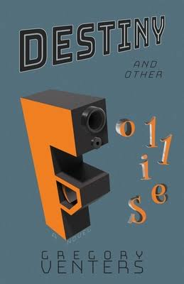

+++
title = "Destiny and other Follies by Gregory Venters"
url = "2026/03/destiny-other-follies-venters" 
date = 2026-03-19
description = "Gregory Venters's Destiny and other Follies looks like a novel about corporate politics. At its core, it is about the animal instincts that civilization only thinly disguises."
tags = ["Books", "Book Review", "Literary Fiction"]
+++

He knew then with immediate, intuitive certainty that his career, his life’s work, his surrendered existence had only ever been collectively statistical, individually commonplace, his own relevance nothing more than one more name among the dead, one more gravestone identical to all the others in a field of many.

Humans are animals once you peel away the veneer of civilization. The arena is different, and so are the rules, but our instincts – shaped by millions of years of gradual evolution and shared with every other organism on earth – remain the same. In *Gregory Venters*’s **Destiny and other Follies**, a hunting dog aptly named Darwin *suffers* the consequence of such an instinct. Later, a villainous character justifies his acts with the words “*survival of the fittest*".

The overt stating of the evolutionary themes is an exception rather than the norm. At the surface, Venters’s plot could be made to look dull. Let me give it a shot: *Calder Brandt* is a 52-year-old cancer survivor, but his treatment has caused him irreparable damage. He expends all his remaining energy into his work as a sales consultant. When denied a deserved promotion, his baser instincts take over. The resulting existential spiral affects not only him, but also his wife *Hana*.

*Destiny and other Follies* made me sit up attentively when its focus shifted to Hana. She is of Balkan origins, and married to a much older man who is hyper-focussed on his career. She is childless and remarks “*I don’t think anyone who had a childhood like mine would want children*”. Hana stands out because she is unconventional when compared to other American women. Not confidently so, for she is simultaneously judgmental and jealous of some of their characteristics. Like the vocal fry : "She makes that grinding sound. *That sound American women make when they talk.*" Apart from her own insecurities, especially as she takes up a new job, she is left to deal with Calder's self-obsession. Her interest is not fully charitable though. "*If he became immobile, she would be the one nursing him. If he went away, she would be left stranded in a country not her own.*" Self-preservation is a humane trait.

The protagonist, Calder, slips easy categorization. Venters renders his perspective from inside Calder's mind, and what we see is his personality in his own assessment. We know that he is not like others and is marked by "*his authentic success, his genuine abilities, his uniqueness among sophisticated peers*". He has a tendency to feel awkward in groups: "*\[h\]e tried to join the ongoing conversation, but his first words scratched like an old phonograph needle and passed unnoticed. He stabbed at the salad on his plate, swallowed forkfuls of over-chewed lettuce as temptation raged to shrink further into his silence.*" But then, his work as a sales consultant thrives on relationship-building. Was Calder's success despite his aversion to small-talk, or is he just underestimating his own abilities? There are no easy answers in this book.

*Destiny* begins with the words "*The fiber-optic camera cable slid up into his sinus and down the back of his throat, only becoming uncomfortable when it reached the point that prompted his impulse to swallow.*" This sets the stage for microscopic observations, both physical and psychological. We witness the frailty of the human body as Calder suffers from anxiety attacks, chokes on his food, and wakes up screaming from nightmares. *Venters* also magnifies situations that we all likely to encounter in our own work to the level of a dramatic tragedy. When Calder hears bad news about his promotion, it is described thus: "*\[e\]ach word branded his memory with something so indelible, a thing so alien, so outside any previous experience that his cognition collapsed. Grasping for a hold, anything to stay above water, his mind clung to the HR-speak—the script Vincent was following—a noxious stake in shifting ground."* When Calder finds false salvation, we are transported to the practical arithmetic of an alcoholic: ”*He calculated with repetitive, restarting resistance how much time he had, how many more could he drink, divided into quarters, one now within fifteen minutes—he located the bartender—two more with a high degree of confidence, two more, summing it again.*"

The stand-out quality of Gregory Venters's debut is his conviction to make his readers work for meaning. *Destiny* can be read as just a novel about workplace politics in the modern day. We sit through meetings, read email chains, and are pulled into power struggles. “*You expect a drug cartel to be mentally weak and morally unsound. Not your respected employer. Not your boss*”, says Calder. But many of us are employed today by morally unsound corporations whose decisions hinge on short-term profits. There are throwaway lines that criticize consumerism and capitalism, but Venters mocks socialism too as "a *uniform plight shared by everyone, a pessimistic outlook that demanded concession, expected disappointment, anticipated decline*".

But if you peel the layers, *Destiny and other Follies* is an examination of our absurd Kafkaesque necessity to hinge ourselves on falsities such as career and status. Calder has his own American justification for continuing his fight: "*\[o\]nce you lose your job, you lose everything. You lose your house because you can’t pay the bank. You lose healthcare because your employer pays for it.*" The house is significant to him because it is associated with a childhood desire. Another character is just jaded into being part of the struggle because, as he words it, "*I’ve come to appreciate the benefits of permanent employment and made my peace with the concessions. Man-made institutions—companies, governments… churches—are never perfect. I can accept their failings and keep the faith.*"

We had traded the pacifying comforts of faith for our own inventions and possessions. In this exchange of an old fiction for a future promise, a myth for a lie, we cheated ourselves, a self-inflicted ruse that left us stranded, the old bridges burned behind us, the gleaming boats on the beach meant for better, brighter shores, broken and useless.

*Destiny and other Follies* is a very challenging read, and it frustrated me with the covertness of its themes. But despite this, the book resonated with me because of its focus on modern human failings. We do not have it in us to control our natural instincts, so we battle each other in a more "civilized" fashion. That we succumb to our inner animal is our collective failure.

Thanks to BookSirens and Atmosphere Press for an advance copy of the book.

 [Treated like a fly](2026/02/treated-like-a-fly/) · [And your Byrd Can Sing by Jim Roberts](/2026/01/and-your-byrd-can-sing-roberts/) . [The Remains of the Day by Kazuo Ishiguro](/2025/04/remains-of-day-kazuo-ishiguro.html)  