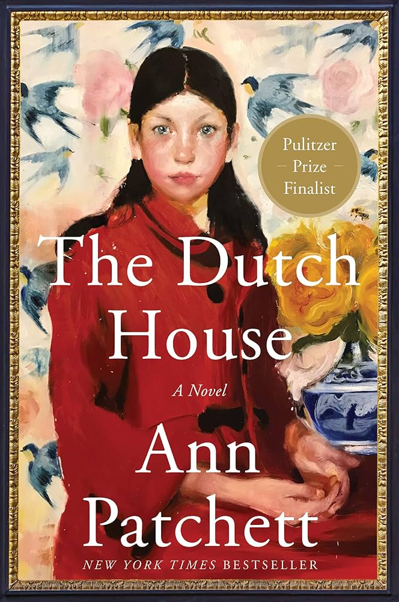

+++
title = "The Dutch House by Ann Patchett"
url = "2026/01/dutch-house-ann-patchett" 
date = 2026-01-24
description = "A family saga where a grand house becomes a symbol for the vacuum caused by maternal absence."
tags = ["Books", "Book Review", "Historical Fiction", "Literary Fiction"]
+++

> But we overlay the present onto the past. We look back through the lens of what we know now, so we’re not seeing it as the people we were, we’re seeing it as the people we are, and that means the past has been radically altered.

When I finished *Ann Patchett*'s **The Dutch House** late one night, I reflected on the central theme of the book. It was surely not an account of the Dutch people, for the novel is set in *Philadelphia* and *New York City*. The title leads us to think that it is about a specific house with the narrator remarking *"\[t\]he house was the story"*, but is it really about home and belonging? The novel also portrays a moving sibling relationship with the narrator saying elsewhere: *"\[t\]he story of my sister was the only one I ever meant to tell."*  Maybe it is about brothers and sisters? We learn that two significant characters love *Marilynne Robinson*'s **Housekeeping**. This extremely popular novel published in 1980 is about, my research tells me, *"\[f\]amily, memory, loss, transience, search for a place to belong"*. *"Perfect!"*, I told myself at this discovery, and put myself to sleep, after watching reels for about 53 minutes.

I woke up the next day unsatisfied. My usual guilt at not having slept early enough mixed with a feeling that I hadn't yet cracked the novel. My wife and I discussed the book, for she had just read it before recommending it to me and moving on to another *Ann Patchett* book. It took me two days of subliminal thinking when I transcribed my notes and highlights from my Kindle to a Google document before I landed on what I think is the central theme of **The Dutch House**: mothers and maternal love. Later, I realized that **State of Wonder**, the only other novel I have read by Patchett, also dealt with similar themes.

It is hard to pinpoint the theme of **The Dutch House** because the writing is beguilingly simple. The book begins with the lines *"\[t\]he first time our father brought Andrea to the Dutch House, Sandy, our housekeeper, came to my sister’s room and told us to come downstairs."* This functional sentence conveys a lot. The narrator lives in a fancy house that has a housekeeper. There is a father, and a sister. There is another woman: *Andrea*. But it also implies the absence of a mother. **The Dutch House** is the story of Danny and his sister Maeve who lose their childhood home. This loss is a pivotal moment in their lives, and plays an oversized role in shaping their future. Over a span of about five decades, they realize that the house is only a symbol for a different void in their life.

> I would have loved to have evidence more irrefutable than my own memory

**The Dutch House** is narrated non-linearly from the first person point-of-view of Danny. But it is immediately evident that he is an unreliable narrator. Sometimes, he is just oblivious : *"\[t\]he news of this affair came to me as most of my information did: many years after the fact, in a car parked outside of the Dutch House with my sister."* At other times, he is not observant: *"\[t\]he problem, I wanted to say, was that I was asleep to the world. Even in my own house I had no idea what was going on."* Occasionally, he is making things up for convenience. *'“I did,” I said, because I probably had'*, he says as an 8-year old, when asked if he had brushed his teeth. But most importantly, human memories are fallible. Danny, Maeve and others have differing versions of the same event. *“You know he never liked to drive”*, says someone to Danny about his father prompting him to think *“\[i\]n my memory, my father loved to drive”*. 

The role of Danny's mother is filled partly by an assortment of house helps, but mostly by his sister *Maeve*. Maeve is a remarkable character. "*After our mother left, Maeve took up the job on my behalf but no one did the same for her*", says Danny. But she is not just a maternal figure. She is a math prodigy who is restricted by the era she is born in. In mid-20th century America, when Maeve was a child, women were not equal citizens. Columbia University was not admitting women yet, and Maeve goes to the neighboring all-women Barnard University instead. She suffers at home too. Her father, Cyril, shows a clear preference to his boy, seldom having a conversation with her. "*Maeve, sit up straight. Maeve, look me in the eye if you want to ask me for something. Maeve, get your hands out of your hair. Maeve, speak up, don’t expect that anyone will do you the favor of listening if you don’t trouble yourself to use your voice*" is the extent of what he tells her. Her dad's legacy does not offer much to Maeve as well. Despite this, she anchors her brother's life.

> He had protected me from the world so completely that I had no idea what the world was capable of.

In her father's defense, being distant is just his personality. *"If I had asked father a question when he was quiet, he would say he was having a conversation with himself and that I shouldn’t interrupt"*, says Danny. Danny is cognizant that he is getting a preferential treatment from his father, but he still owes a lot to the man. We see Cyril as a youngster wooing his future wife, a benevolent landlord who is fair and respected by his tenants, and a father who teaches valuable skills to his son. He is also a veteran with a permanent war-injury. Cyril grows wealthy and shocks his wife with expensive gifts, but his very affluence pushes her away. *Maeve* is the one person who stays through this transition. It could be that she reminds him of his past, and that might explain his treatment of her. Nevertheless, Danny spends impactful time with his dad, leading him to eventually follow his father's footsteps in some ways.

When Danny chooses his father's profession, it upsets his wife, *Celeste*. We first see *Celeste* as she is reading a poem by *Adrienne Rich* - a second-wave feminist. However, *"\[w\]omen had read about their liberation in books but not many of them had seen what it looked like in action"*. Celeste attaches herself to Danny since she *"had no idea what she was supposed to do with a life that was entirely her own"*. Once again, like with Maeve, Patchett is hinting at the fact that women were yet not really free. The relationship between *Celeste*, *Danny* and his family is portrayed realistically: it is constituted of sweetness, sourness and bitterness. In a very moving moment, Celeste notices Danny building something for his sister and remarks that she would have liked it too. His response is *“\[r]eally? Did I know that?”* Danny does not know a lot about the desires of people who love him.

**The Dutch House** is set during a momentous period in American history. There are two kinds of good historical fiction, and I hate myself enough to enjoy both. On an extreme end of the spectrum, we have *Umberto Eco*'s **The Name of the Rose** or **The Prague Cemetery**. The plot is an excuse for the author's love for history. On the other hand, History in some novels is -- to paraphrase *Amor Towles*, author of **A Gentleman In Moscow** -- like a set property in a stage-play. It is meticulously researched, but does not distract from the plot. **The Dutch House** firmly lies on this end of the spectrum. Post World War 2, *Eisenhower* won a decisive election beating *Stevenson* (Danny suspects that his dad would have been a staunch supporter of the victor). Following a period of quietness, even "cold"ness, Vietnam protests erupt. These are events just mentioned in the passing, and readers have the choice to enjoy the story on a purely emotional level if they wish to.

> “At what point do you say to her, Okay, it was an awful childhood, it’s a terrible thing to be rich and then not be rich, but now everybody has to grow up?”

An important theme of **The Dutch House** is obsession over past misfortune. The siblings spend countless hours across decades observing the house they lost from a distance and reminiscing on what was and what might have been. "*We had made a fetish out of our misfortune*", reflects Danny. But his compulsion is only an extension of his sister's. Maeve's inability to let go of the past manifests in her forcing Danny to train as a doctor. "*You wouldn’t think a person could succeed in something as difficult as medicine before wanting to do it, but it turned out I was part of a long and noble tradition of self-subjugation.*" Gradually, the obsession morphs into a mix of nostalgia and hatred. Danny and Maeve are so completely enveloped in this together that it keeps others out. The resolution is in Maeve realizing that the house signifies something else.

**The Dutch House** is understated for the most part. This is the strength of *Patchett*'s writing, but any potential flaws also arise from this. It would be very easy for readers to look past the political events that shape the characters. We learn that Danny's mother left to serve the poor in India and worked with *Mother Teresa*. But the author does not examine the controversies around Mother Teresa in India, where her saintliness is taunted by her religious zeal. This reminded me that in **State of Wonder**, the protagonist has an Indian parent, and has memories of visiting India as a child. She specifically recalls seeing cows in the middle of the roads. I can't tell if *Patchett* has any connections to India, but I low-key wish she went beyond the cliches.

In a stand-out dialogue, a character says *“\[m\]en leave their children all the time and the world celebrates them for it. The Buddha left and Odysseus left and no one gave a shit about their sons. They set out on their noble journeys to do whatever the hell they wanted to do and thousands of years we’re still singing about it”*. This line addresses the central question readers will grapple with. Why are the responsibilities of mothers and fathers perceived so differently? But the same sentence also feels glaring and out of form for a book that is subtle and does not draw attention to its themes.

Crafting a non-linear story through fragments of memory is very hard to do. *Patchett* achieves this while making it seem effortless. **The Dutch House** can be enjoyed as an emotional family drama. But if you peel the top layer to look beneath, there are more treasures to be found. I would not be surprised if I come up with a completely different interpretation of the book a few days later after publishing this. Like Danny suggests in my opening quote, each time I think back to this book I will overlay who I am at that moment to find meaning.

 [The Remains of the Day by Kazuo Ishiguro](/2025/04/remains-of-day-kazuo-ishiguro.html) · [Nadine Gordimer's House Gun](/2021/12/review-of-nadine-gordimers-house-gun.html) . [The Illicit Happiness of Other People by Manu Joseph](/2014/09/the-illicit-happiness-of-other-people.html)  