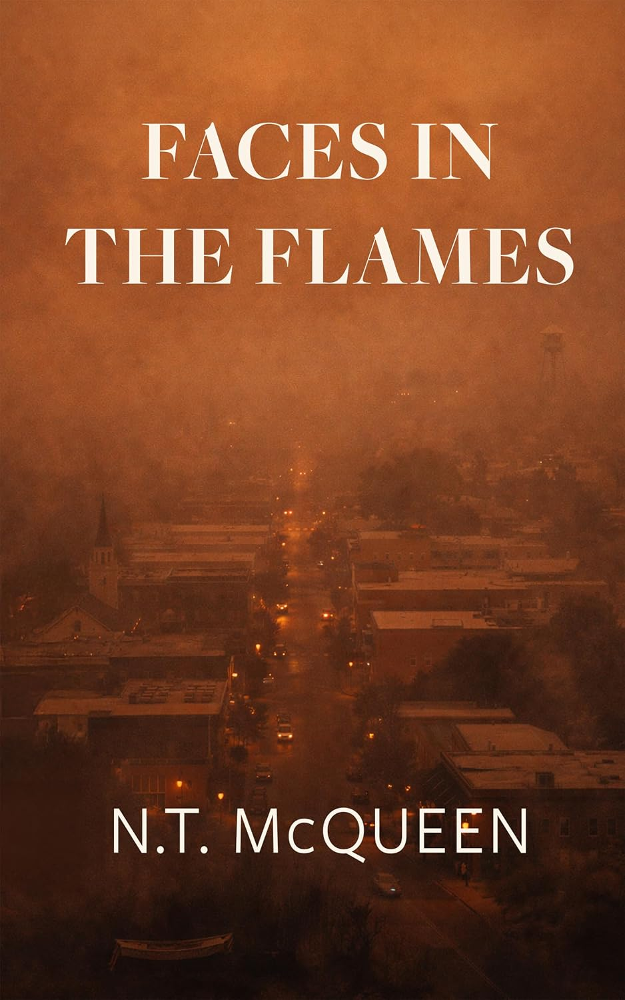

+++
title = "N.T. McQueen's Faces in the Flame"
url = "2026/07/faces-in-the-flame-mcqueen" 
date = 2026-07-07
description = "An interlinked anthology of thirteen stories that are subtle and evocative"
tags = ["Books", "Review", "Book Review", "Literary Fiction"]
+++

**Faces in the Flame** by N.T McQueen is an anthology of thirteen inter-linked short stories that will sit with you for a long time. In many ways, this book reminded me of *Elizabeth Strout*’s *Olive Kitteridge*. While Strout set her collection of thirteen stories in Maine, *N.T. McQueen* uses a town near Sacramento, California. Like in Olive Kitteridge, we have a central character that links all stories. However, unlike Olive Kitteridge, this character makes only a fleeting appearance until we learn more about him in the titular story. The interlinking here is more behind-the-scenes, and the tone is more modernist.

**Houses and Homes**, the first story, gives us a feel of McQueen’s writing abilities by using a masterful economy of words. The story begins with the lines “*Saul Bauchmann worked until he reached sixty-six and, even in his old age, he did not retire of his own volition. During construction on a home near the hills that held a scenic view of the skyline of Stone Lake, Saul craned at an odd angle to hammer into a stud. The ladder wobbled and danced for the first time in fifty-seven years*”, and we are immediately drawn into the lives of a father and his two sons who share a complicated relationship. 

But the real tone of the book is set in **On the Mountain**. Here, we meet a black mechanic who “*listened to the vehicle and, within minutes, made a proper and accurate diagnosis like some shaman.*” His loneliness hides a history, and the climactic moments are understated, hard to grapple with, but evocative. Later, **Time Takes Time**, pushes our emotions even further. This is a story about a war veteran who is keeping it together, barely, until he is not. The story hints at how the country treats its veterans, but McQueen is not the sort of author who belabors a point that he can make us feel subconsciously.

My favorite story in the collection is **Paper Ashes**. This is about a Vietnamese girl, Chenda, who “*did not remember the stories her father told at night, despite his claim that he tucked her under his arm as he recounted their family’s journey.*” Instead, her memories are of an abusive father and a helpless mother. The fact that McQueen makes the choice to narrate the perspective of a Vietnamese girl and write an affecting story is a testament to his skill. Interestingly, both **Paper Ashes** and **The Girl Made of Porcelain** have female characters that have complicated relationships with their mothers. McQueen manages to portray mothers as real people who are often nice, and often not. 

In **Eating Vices**, McQueen shows that he can write humor too, as much as the realistic material would allow him to. There are other stories like **Lower Lights** that exhibit a similar skill, but **Eating Vices** is probably the only story that continues to stay light.

We meet a diverse set of characters from different races, classes and genders. They are all linked, as people often are in small towns. Apart from the fact that they glimpse each other as they go about their lives, these characters are also brought together by the raging forest fires in the surrounding hills of California. These fires become the climatic setting for most of the stories, with the title turning into a metaphor.

The titular story, **Faces in the Flame**, ties most of the stories together. While doing it, it also gives us the most interesting character in the anthology \- someone who reads Foucault and Derrida, but doesn’t finish school. Other characters see him as a passing figure, but internally, we see that “*\[h\]is thoughts moved again, forward, backward, words floating and shifting cataclysms like little beloveds he cherished. They soothed him. Sustained him. Spoke life.*” McQueen does a wonderful job of showing the positive impact one person can play on so many lives.

I had a few complaints with this book. Some stories were not as well-polished as others. **The Savior’s Face** was hard to relate to, probably because of its religious connotations. But in  **Lovers**, it felt as if some editing errors had slipped through. These may not have been obvious but for the quality of the rest of the book. I also felt that in some stories such as **Lower Lights,** I missed a couple of scene transitions. As an eternal self-doubter, I wondered if it was my lack of attentiveness, or the density of the writing. 

This anthology is not an easy read. But if you love stories that move you without seeming to, you might enjoy **Faces in the Flame**. 

**Faces in the Flame** by N.T. McQueen will be published on 25th August 2026\. I received an advance review copy for free, and I am leaving this review voluntarily. Thanks to BookSirens, Silent Clamor Press, and the author for the advanced copy. 

 [And Your Byrd Can Sing](/2026/01/and-your-byrd-can-sing-roberts/) · [Covenant of Water](/2025/12/covenant-of-water.html) . [The Loneliness of Sonia and Sunny](/2026/07/loneliness-sonia-sunny/)  