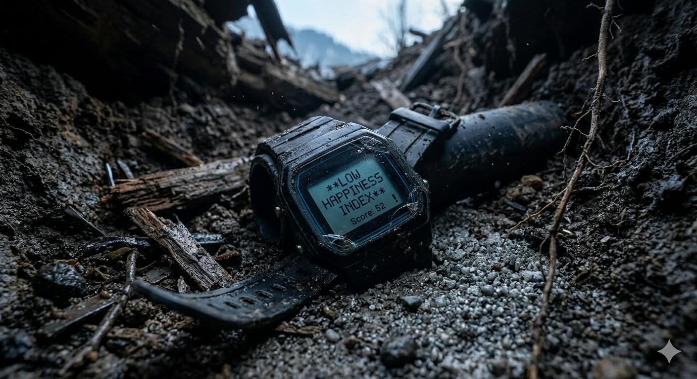

+++
title = "Hallucination - A short story"
url = "2026/05/hallucination" 
date = 2026-05-06
description = "A dystopian thriller that ponders on the cost of happiness."
tags = ["Short Story", "Literary Fiction", "Fiction", "Dystopian"]
+++

“Goooood morning\!”, said the watch in an intimate voice. It knew that Gautam had no chance of falling back asleep. He had tossed and turned around long enough. Gautam rubbed his eyes, and glanced at its face. It was 3:15 AM, and he had slept for 4 hr 32 minutes. 

His happiness score was a measly 52\. 

He walked over to the medicine cabinet and opened the pillbox. 

Only to close it back. *Soma* had been causing him migraines lately.

Following some push ups and squats to get his endorphins going, he slipped on a hoodie and headed out for a walk.

The stillness of the air was punctured by the occasional biting chill spring wind. The hills that surrounded *Sukh Valley Village* were still peppered with a powdered white coating of winter snow. Summer was coming, but it was tantalisingly slow.

Before that though, there were festivities to be had. *Wellness Day* was just around the corner, and this was a special year. It had been ten years since the establishment of the town. It was the tenth time *Sukh Valley Village* ranked first in the Happiness Index (HI). 

A rare stray dog wandered beneath one of the banners that had been installed. It paused to bare its teeth at Gautam. He scowled back at it. On the banner itself, the words “*Happiness is a choice*” were etched in pastoral green. The ageless Akka smiled lovingly, revealing a hint of polished white teeth. Her eyes looked joyous too. But Gautam sensed a sternness in them, as if Akka had personally been monitoring the data from Gautam’s watch. His mind was starting to work like Rita’s.

His body shivered at an icy breeze. 

A lamppost detected his motion and chirped like an extinct cardinal. These towers had been Akka’s own idea. She had been extensively involved in designing *Sukh Valley Village* to maximize the happiness of its people. She had architected the transformation of the barren, rocky and vacant land into a thriving town.

Gautam found himself heading towards the metro station, his mind having unilaterally decided on his behalf to ride a train back home. Sukh Valley was renowned for its extensive, free public transport.

Trains reminded him of Rita. They had shared part of their commute, to and fro from their work building cutting edge AI models. Rita had become increasingly obsessed over her pet theories and quest for arcane “truths” over many such journeys.

Another stinging draft of air forced Gautam to take a shorter route to the train station. It was on this unpaved road that Gautam had realized Rita had reached a point of no return. Her unconventional beliefs had festered inside her, causing mood swings. It was inevitable that she was forced to relocate to the capital.

Gautam’s peripheral vision alerted him to something unfamiliar. He reached for his phone to turn on the flashlight. A large excavator. More preparations for the celebrations. 

He took a disoriented step forward, and his legs tripped. He spun around his phone and caught the PVC pipes criss-crossing the ground.  

He paused, turned around and took a step back. Without warning, the ground gave away and he found himself sinking into it. 

He grasped for something firm with his flailing hands.

His fall was cut short by solid ground. Only momentarily.

The earth began to crumble again. With a shriek, he was sucked inside, along with the debris around him. 

His eyes fluttered, and darkness enveloped them. 

As he lay there, the first rays of sunlight found their way from the rising sun to his eyes and forced them open.

Groggy eyed, he looked at his surroundings. His lower body was under a mountain of sand and gravel. He tried pulling it out, but lacked the strength and room to maneuver. 

Another tug. Same result.

Bending downwards, he dug out some mud with his bare hands. 

A few digs later, he paused to catch a breath and to glance at his nails. They looked filthy.

But the physical exertion helped. He felt alive. 

His watch face showed that it was 6:42, his score now touching 70s. 

He hurried to extricate himself, gathering larger chunks of dirt.

His hands hit something mushy. 

He paused, and tried to wrench his legs once more. It wouldn’t budge.

His hands trembled as they grabbed another handful of rubble and threw them aside. The light was barely enough to make out the shape.

An oval. 

It was an elbow. He tugged it.

The arm of a doll. Dressed in pink and yellow, with a missing limb.

Fragments of what Rita had told him on the gravelly road came back to him.

Uninhabited. Unmanned detonation. AI program. Hallucination. Hospital.

Gautam stared at the lifelike eyes of the childlike doll. It stared back at him with a faint smile.

His watch beeped urgently.

“Immediate attention required. Decreasing HS. Advised to take Soma NOW\!”

He unlatched it with his right hand and held it for a moment. His left wrist positioned itself to be latched on again. The other hand paused for a moment longer, before throwing the watch violently, face downwards. 

The screen cracked. The beeping stopped. The wind relented, leaving behind stillness.

**Glossary**  
Soma : A fictional drug in Aldous Huxley's Brave New World, named after a mythological Indian drink  
Sukh : Hindi word for joy, happiness  
Akka : Tamil word for elder sister

**Inspired By**  
The Ones Who Walk Away from Omelas by Ursula Le Guin to ponder on the cost of happiness  
Brave New World by Aldous Huxley for soma and soft dystopia  
Fahrenheit 451 by Ray Bradbury for Rita

This story was originally [published at ArtoonsInn](https://prowritersroom.com/hallucination/) in response to the prompt "There is an isolated village that sits in a valley. This village has one rule everyone follows without question."

 [Dystopian](/tags/dystopian/) · [Sigma](/2026/04/sigma/) . [By myself](/2026/03/by-myself/)  

