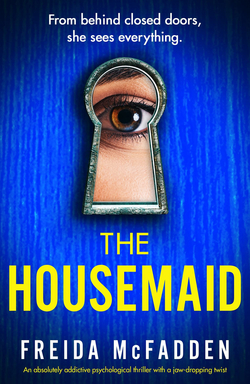

+++
title = "The Housemaid by Freida McFadden"
url = "2026/09/housemaid-mcfadden" 
date = 2026-09-03
description = "Freida McFadden's bestselling thriller delivers pulpy, page-turning suspense, but its twists don't always survive scrutiny."
tags = ["Books", "Book Review", "Thriller", "Suspense", "Fiction"]
+++

I was 15 when I discovered **James Hadley Chase**. An uncle described to me the plot of **The Vulture is a Patient Bird**, and the writer’s name was etched in my mind. Months later, I grabbed **I Would Rather Stay Poor** in a second-hand bookstore in New Delhi, initiating my journey into the world of Chase. **This Way for a Shroud**, **Mission to Venice**, **Tiger by the Tail**, **Sucker Punch**, and more. I was a fan.

My streak ended when I started having nightmares filled with blackmailers, conmen and gangsters. But Chase was still my guilty pleasure for a while. I was once in an argument with a cousin about him. While I defended his writing, she challenged me to name one aesthetically pleasing thing in his books. Apart from women, she added. She had a point. Chase’s women were either damsels in distress or dangerous seducers. 

Growing up in India, I felt that readers around me were men. Pulpy stories with male protagonists in dangerous situations were immensely popular. Think Alistair McLean, Frederick Forsyth, or James Hadley Chase. Chase was especially popular because book resellers would package his paperbacks with unrelated lurid covers. Some people bought his books for the author’s name recognition, while most got them for the covers. 

Today, multiple reader surveys show that [women read more fiction than men](https://www.arts.gov/stories/blog/2025/men-women-split-reading-real-and-persists-amid-historical-rate-declines). My theory is that thrillers written by female writers with female protagonists are the rage now. **The Housemaid** by **Freida McFadden** is one such novel that constantly shows up in Bookstagram, Booktok and Goodreads. The book is, per Goodreads, the [most read book](https://www.goodreads.com/book/most_read?category=all&country=all&duration=y) in the past 12 months. 3.25M people have read it on Goodreads, and the average rating of the book is 4.2 out of 5\. 

There are just two male characters in **Freida McFadden**’s **The Housemaid**. One of them is described as “*pretty hot. He looks to be in his mid-thirties with thick jet-black hair damp from exertion, olive skin, and rugged good looks.*” The other, we are told, “*is an incredibly handsome man. Piercing brown eyes, a full head of hair the color of mahogany, and a sexy little cleft in his chin.*” 

**The Housemaid** is a suspense thriller, and it delivers on its promise. Reading the book in my bed one night, my heart was beating so fast that I closed the book. I fell asleep early that night watching videos of Would I Lie To You on YouTube. I woke up early the next day and picked the book back up. It is hard to deny that this book is a page turner. 

As befits good thrillers, the plot is thin. Millie is a woman with a past and no future. She sees an opening when she is, to her own surprise, hired as a housekeeper by Nina Winchester. But then, no one in the Winchester household is what they seem to be on the surface. The story is narrated from the first person point of view of a couple of characters. There is a generous dose of twists and turns. Many of the twists don’t surprise us, but the “whys” rather than the “whats” keep us invested.

The narration itself is laced with humor. We are cued into the tone early on, as Millie is shown around her employer’s house. She says: “*\[s\]he guides me through the house in painstaking detail, to the point where I’m worried I got the ad wrong and maybe she’s a realtor thinking I’m ready to buy.*” This gives us an intimacy with the characters. McFadden is very effective in building tension, both sexual and emotional. The latter kept me more invested in the book. We root for Millie, and even though her choices seem a little questionable, they are defensible given her situation.

The Housemaid has a tendency to belabor details. Mrs. Winchester insists that Millie address her by her first name, Nina. Later, when she exhibits an inconsistency, we get: “*\[o\]n the very first day I met her, she instructed me to call her Nina. I’ve been calling her that the entire time I’ve been working here, and she’s never said a word about it. Now she’s acting like I’m taking liberties.*” McFadden, through Millie, likes to state the obvious, in case we were too distracted by online reels. Millie also refers to her “*carefully doctored resume*”, and claims later that “*\[m\]y ease in the kitchen is the only thing on my resume that isn’t a lie*”. But in a different context, she tells us that she doesn’t “*like to lie*”. Well, what is it? Maybe, just maybe, she is lying to us?

McFadden does not give us any indication her narrators are unreliable. But, they constantly withhold information from us. For example, a character says, and I paraphrase, “*hey I did this to escape my fate*”. Later on, right when the reveal would have maximum impact, she adds, and I paraphrase again, “*hey, I was also secretly hoping my choice would lead to my enemy getting killed.*” Art is manipulation. But there needs to be an internal consistency. When writers withhold information purely for the sake of a twisty reveal, the reveal works. But, it also feels like we are being cheated. 

The “*hey I was secretly hoping for a murder*” idea is the core of the plot. The character refers to this plan as “*so beautifully simple*”. But this simple plan relies on a Hercule Poirot level psychological understanding of two people, and assumes two individual dominos will fall in exactly the right way to produce a desired effect. Call me a novice, but brute force murder feels easier to me. The biggest problem with The Housemaid is that this plan, the “*why*” behind the “*what*”, does not stand up to scrutiny. The Housemaid has many such moments that sound cool on paper, but are implausible. Wait, did the mother really feel happy that her child was killed in response to his poor dental hygiene? Cool.

Criticizing a best seller has questionable value. Why would one complain that a convenience store smoothie has more sugar than vitamins? The vitamins are incidental, and the sugar is the point. As a teenager I enjoyed the sugary high of a James Hadley Chase novel despite having to wrap its NSFW cover with an old newspaper to avoid people’s judgement. I was delighted by the fact that in Chase’s world, there is no moral center, no messages and no takeaways. I completely understand why most people are lapping up The Housemaid. What I don’t understand is why the novel had to end with a vigilante angle. Actually, I do. There are two sequels to this novel and two movie adaptations from the series. 

We all pick our poison. My preference, if I am looking for fun and thrills, is a book that doesn’t deceive me, and remains amoral.

 [The Russia House](/2025/04/russia-house-le-carre.html) · [Treated Like a Fly](/2026/02/treated-like-a-fly/) · [The Loneliness of Sonia and Sunny](/2026/07/loneliness-sonia-sunny/) 
