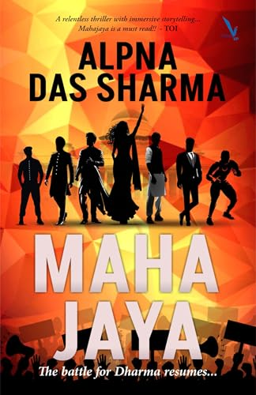

+++
title = "Alpna Das Sharma's MAHAJAYA: The battle for Dharma Resumes..."
url = "2026/08/mahajaya" 
date = 2026-08-24
description = "A modern retelling of the Mahabharata set among Delhi University students, fought out over campus politics and a game of Kabaddi."
tags = ["Books", "Book Review", "Literary Fiction", "Mythology"]
+++

The Indian epic Mahabharata is said to contain every story that can ever be told. It is also dismissed by detractors as a “horrible chaos”. When I recently read the first of Ramesh Menon’s two volume translations of the book, I had a dual reaction : part-frustration and part-awe. My favorite parts of the story are the many side-quests and smaller episodes that make up the book. 

**MAHAJAYA: The battle for Dharma Resumes…** by **Alpna Das Sharma** is a modern adaptation of the epic. The author does something that I would not have been brave enough to attempt. Rather than focussing on one of the side stories, she borrows the complete arc and fits it into a modern context. Some side-stories show up in fleeting moments, but we follow the main plot for the most part. The fun in reading **Mahajaya** is in attempting to decipher how the events from the original story morph into Sharma’s modern transformation.

Mahajaya is about a group of students in Delhi University who band together to defeat their enemies - in a game of Kabaddi. The game could be seen as mirroring either the ultimate war where Arjuna and his brothers are guided by Lord Krishna to take on their enemies, or the decisive game of dice midway through the story which sets the stage for the war. I lean towards the second interpretation.

Sharma makes smart choices in her adaptation that allow this to be read as a purely contemporary story. Instead of five brothers, which is impractical in India after years of “we two, our two” government messaging, the kids here are unrelated, getting together due to circumstances. Yaj, Bhav, Aryan, Neil and Sehaj are boys who grow up in different regions of India. They represent Yudhisthira, Bhima, Arjuna, Nakula and Sahadeva respectively. We also have Kaizad reincarnating Karna, and Dwija representing Draupadi. There is a Krishna, a Shakuni, and a Bhishma too.

I was initially sceptical given that a story about an epic war is reduced to college politics, university elections and a sport. But therein lies the fun. The heroes from the epic were teenagers and young adults, and it is not far-fetched to imagine them chiding and goading each other. The stakes are not always low in Mahajaya though, for there are more sinister subplots. The tone remains light, like a mystery involving amateur sleuths.

Structurally, the book begins with a scene where we meet all the main characters. This is followed by one chapter each from the first person narrative of each character. I felt this structural choice removed some unpredictability and a part of me was waiting for the plot to begin. But a different part of me was enjoying the little surprises strewn through these chapters.

The vocabulary feels out of place in some places, with phrases such as “*titian glow*” repeated multiple times. But generally, Sharma is in control. In describing Bhav’s love for food and cooking with the line  “*[o]ver time, the enticing aromas that emanated from the kitchen whenever I cooked, had melted the unflinching walls built around gender stereotyping in the household*”, she compresses a sensory description with cultural observation. 

Mahajaya repeatedly questions traditional gender roles. Dwija, representing Draupadi, is portrayed as full of spunk and courage. She is shown as a Dalit, and her tough childhood shapes her activist mindset. A minor female character calls out Aryan for being oblivious of his surroundings when she remarks : “*Grow up, Aryan! You are born in a community where holier than thou elders drown their female infants in tubs and pits of milk. That’s Doodh Peeti. And one of your sisters faced the same fate*”.

I was pleasantly surprised at many of the decisions the author made that retain the flavor of the epic while giving a modern twist. Neil and Sehaj, representing the twin brothers Nakula and Sahadeva, are shown as best friends. The description of their growing up years has some of my favorite passages, dealing with issues such as body consciousness, learning disabilities, and addiction. My favorite moment in Mahajaya is when we discover how Yaj and Kaizad are related, completing the circle from Mahabharata where Yudhisthira and Karna are half-brothers. We get a version of Kunti in Mahajaya that is cleverly hidden until the reveal, making the twist land when it comes. To me, this is also the emotional peak of the story. 

Kannan is a South Indian boy who represents Krishna. I enjoyed how his words of wisdom to the characters are woven together within the context in which they are operating. Kannan comes across as a lovable young man. But he begins every sentence with “*aiyyo*”, throwing in an occasional “*anna*” or “*thalaiva*”. This results in an unfortunate stereotype of South India. Admittedly similar stereotypes about people from the North exist in the South as well, but it is surprising to see this misstep in a book that generally makes it a point to be politically aware.

An example of such awareness is seen in the portrayal of Aryan. In Mahabharata, Arjuna is proud and haughty, having been assured by his guru Dronacharya that he is the best archer the teacher has trained. Later, they discover Eklavya, a self-trained archer who practices beside a statue of Dronacharya, considering the guru as his own teacher. When Arjuna comes across this tribal youngster who is at least as good at archery as himself, his disappointment guilt-trips Dronacharya. The guru demands a fee from Eklavya, the thumb of his dominant right hand, erasing his mastery over the weapon. In Mahajaya, we see that Aryan himself is born with a dysfunctional thumb. The irony is fantastic. 

This leads me to one of my complaints about the book, one that I am grappling with in my own head. Mahabharata, in my reading, is a complex portrayal of gray characters. In one of the darkest passages in the epic, the Pandavas take residence in a palace built by their enemy Duryodhana. When they discover that the palace is built of wax with a sinister plot of burning them all down with the palace, they find lower caste body doubles who burn in their place, allowing the brothers to escape undetected. But in a different place, we see the same Duryodhana making a stunning defence of Karna when he is discriminated against by the Pandavas because of his caste. The ambiguity is such that Mahabharata is rough at the edges, and this is what makes it a “horrible chaos”. Horrible, but magnetic. In Mahajaya, the 100 Kaurava brothers are reduced into Daman and Dvit. These two characters have no interiority, and are generic bad guys. 

Mahajaya resolves the ambiguity of its inspiration in service of its palatable plot. As a result, Alpna Das Sharma’s debut novel is an assured fast-paced contemporary thriller that adapts the epic without the shades of gray.

 [N.T. McQueen's Faces in the Flame](/2026/07/faces-in-the-flame-mcqueen/) · [Kiran Desai's The Loneliness of Sonia and Sunny](/2026/07/loneliness-sonia-sunny/) · [Destiny and other Follies by Gregory Venters](/2026/03/destiny-other-follies-venters/) 
