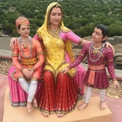

+++
title = "Moonshine - A Short Story"
url = "2026/07/moonshine" 
date = 2026-07-14
description = "A historical fiction about loyality, sacrifice and maternal love"
tags = ["Short Story", "Historical Fiction", "Historical", "Dystopian"]
+++

The streets weren't safe after dawn.

Darkness was their ally. Darkness punctured by a slice of moonlight paving their way through the rocky hills of Aravalli. Moonlight from a waning moon - faint, disappearing, but still present. Like Chandan.

Panna paused, glanced behind her, and waited for the prince to catch up. As he climbed the incline, she took in his tired legs, his resolute face, the panic in his eyes at a scurrying noise from the bushes, and the slow movement of his hands as they searched for the outlines of the royal knife in his cloth bag.

As the first rays of the sun highlighted the bluish rocks around them, they hurried on to a Bhil hamlet, where they took refuge from the daylight. 

That evening, she woke up early, but continued to lie down, staring at her companion. He slept in the same brown longshirt that he wore when they left Chittor. A shirt she had stitched by herself for her son. A movement towards the door forced her up, and she saw her host, the *Gameti*, waiting for her outside.

“*DhaiSa, the usurper Banbeer has declared himself the ruler of Chittor.*”  
She responded with silence.  
“*Governor Asa Sah in Kumbhalmer is a good man. But the road to the fort is still not safe. I will send some of our men with you.*”  
“*No. A single mother with a son will not raise any suspicions. And, your people have already done much for me.*”  
“*But, DhaiSa..*”  
“*Forget it. The Bhils suffer enough regardless of who rules,” she said, before adding “as we all do.*”

The next night, the last before the new moon, they quickened their pace, not giving in to their weary legs. They had been walking from Chittor since half-moon now, through Deolia, Dungarpur, and Idar, taking a circuitous path that resembled a horseshoe. Flames from lanterns that hung on the faraway fort acted as their semaphore as they descended the hills.

The flames became feebler as the sun crept up, but Panna and the prince kept walking. As they were about to cross a river bed, its water reflecting the hazy moon, they heard footsteps from the path ahead. 

Panna froze, before darting her body to tug the prince into a rill beside them. They hid inside the depression, their legs drenched in cool water. But they hadn’t been quick enough.

A tall and hefty man emerged, looking right above where they were hiding.

“*Who is there! Show yourself. You can’t hide*”, he shouted, stepping towards them.

Panna stood up, and the prince followed. Her hands tugged his, pressing it, sending him an urgent message.   
”*Don’t move, he will g..*”, she whispered.  
But then, the prince’s other hand had already disappeared inside the bag, only to reappear with the knife. 

The turquoise gems on the golden scabbard glinted in the fogginess of the dawn. The man’s eyes were drawn magnetically to the marvelous object, and he was immobile.

Only for an instant. He lunged towards the object, his movement quick for a man of his size. He took the prince down with him into the slushy ground, as the prince lost grip of his dagger and let go.

Panna watched the two unmatched fighters. They disappeared under the water momentarily, and the prince’s head bobbed up first as he rolled away from his attacker, the neck of his brown longshirt colored red. It reminded Panna of another day, as she watched Banbeer the usurper stab her son Chandan while he was lying in the bed, blood staining his princely clothes. 

She picked up the knife, and mustered all her maternal strength, aiming for the man’s neck as he bobbed up from the water. Nothing happened for a moment, and then, he slumped to the ground. She dropped the weapon and fell to the ground on her knees, covering her face. Her wails caused some parakeets to flutter, and her tears found their way out of her fingers into the rill.

The prince helped himself up, picked the knife up, and stabbed the dead man a few more times before kicking his helpless body. His rage expended, he looked at Panna, but stayed afar.

Later that afternoon, as they waited outside the gates of Kumbhalmer for Governor Asa Sah, Udai turned towards Panna.  
“*Panna Dhai, you shouldn’t have swapped Chandan with me.*”  
It seemed as if she hadn’t heard him.  
“*You fed from my breasts too.*”  
“*It is too dangerous for you to go back.*”  
“*I can’t be away for long. Banbeer thinks you are dead, but my being here would be noticed. You will be safe with Asa Sah until you are ready.*"

Later that night, as she started her trek back through the Aravallis, the moon had finally waned. Panna kept walking though, guided by Chandan. Disappeared, but present.

**Glossary**

*Bhil* - Indigenous people across various parts of India including Rajasthan  
*Gameti* - Headman of a Bhil village  
*Dhai* - Wet nurse*  
*Sa* - Rajasthani term of respect

***References***  
*Annals and Antiquities of Rajasthan* by James Tod  
*A History of Rajasthan* by Rima Hooja  
Various online sources

**Image Attribution** : Kshatriya Yoddha, [CC BY-SA 4.0](https://creativecommons.org/licenses/by-sa/4.0), via Wikimedia Commons

**Author’s note**

*Inspired by Paul Yoon’s short story "*At the Post Station.*", and the life of Panna Dhai.*

Panna Dhai’s story is a legend, and like any legend, there seems to be a lot of creative liberty in how her story is told. After all, that’s what makes legends memorable. I did not attempt to break that trend.

**Note** : A version of this was first published in [ProWritersRoom](https://prowritersroom.com/moonshine/) for the following prompt.

> Write a story using the exact opening line: "*The streets weren't safe after dawn.*" You must subvert the typical "*danger after dark*" trope by creating a world or a psychological situation where the literal daylight brings the ultimate threat, building immediate intrigue right from the first sentence.

 [Trinkets](/2026/06/trinkets/) · [Sigma](/2026/04/sigma/) . [By myself](/2026/03/by-myself/)  

