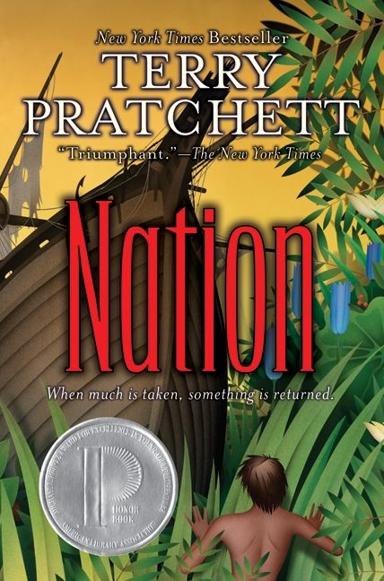

+++
title = "Nation by Terry Pratchett"
url = "2026/02/nation-terry-pratchett" 
date = 2026-02-13
description = "Terry Pratchett's Nation tackles imperialism and belief with sincerity that feels naive to a cynic—and that's exactly why young readers need it."
tags = ["Books", "Book Review", "Fantasy", "Literary Fiction"]
+++

> One person is nothing. Two people are a nation.

> That’s what the gods are! An answer that will do! Because there’s food to be caught and babies to be born and life to be lived and so there is no time for big, complicated, and worrying answers! Please give us a simple answer, so that we don’t have to think, because if we think, we might find answers that don’t fit the way we want the world to be.

I used to be intensely spiritual as a teenager. As a middle-aged man, I just carry on about life and hope that God, if they exist, will excuse my lack of devotion considering my general decency. I did not have a single transformational moment that changed my belief system. *Mau*, the protagonist in *Terry Pratchett*'s **Nation**, does. 

*Mau* is a resident of an island in the *Great Southern Pelagic Ocean* -- Pratchett sets his novel in an alternate reality -- and he is halfway through a ritualistic rite of passage into adulthood. A disaster wipes out his home island and all its residents. Mau realizes that the burden of lineage falls solely on him. He is the Nation, but he now hates its gods for the destruction they bestowed upon his people. Caught with him is *Daphne*, an English girl brought up with Victorian education and manners. She forms an unlikely friendship with *Mau* as he transforms into an adult, and grows into the chief of his island which is now a refuge.

I have read only Terry Pratchett's *The Color of Magic*, which is part of his parodic fantasy Discworld series. Pratchett is so popular that I already think of him as a great writer. *Nation* begins on the coast of England with a tone that's similar to *The Color of Magic*: absurd humor, witty writing and characters who say ridiculous things. However, the tone shifts once we encounter the flood. The humor becomes sparse, and Pratchett is sincere until the resolution where we meet more Englishmen. 

A very prominent theme through the book is the nature of God and belief. As the story progresses, we meet indigenous people who share the beliefs of the Nation. Instead of completely romanticizing such people, Pratchett humanely depicts their superstitions. For someone who grew up as a Hindu, a pagan religion which continues a tradition of worshipping nature, the beliefs of the *Nation* are not foreign to me. A ritual that we see multiple times involves extracting a liquid from a plant, spitting into it, and singing a traditional song to magically convert it into beer. We later hear a scientific explanation for this process - the plant contains a toxin that reacts with a chemical in the human saliva that breaks it down. This sort of scientific explanation of a traditional practice is also very common in a country like India.

Another major theme is imperialism. The indigenous people refer to Westerners thus: "*the pale people in the north who wrapped their legs in cloth so they looked like a grandfather bird. They were called the trousermen, and were as pale as ghosts*". The book is prominently narrated from the indigenous perspective, and as *Mau* learns more about the people, he marvels at their ability to build nifty tools and their technological advancement. Pratchett's explanation for this disparity is not guns, germs, or steel, but harsh winters. "*they came from a place where, sometimes, the weather could get so cold, the sky shed freezing feathers, like the hail you sometimes got in storms, but more fluffy, and so they had to invent trousers to stop their wingos getting frozen and big boats to find places where the water never got hard. They had to learn new ways of thinking: a new toolbox.*" 

> You didn’t have to know Pilu for long to see that he floated through life like a coconut on the ocean. He always bobbed up. There was some sort of natural spring of cheerfulness that bubbled to the surface. Sadness was like a cloud across the sun, soon past. Sorrow was tucked away somewhere in his head, locked up in a cage with a blanket over it, like the captain’s parrot. He dealt with troubling thoughts by simply not thinking them; it was as if someone had put a dog’s brain in a boy’s body, and right now, Mau would have given anything to be him.

The Nation is a relatively short book, but Pratchett manages to tackle some heavy themes with sincerity. He also does justice to many characters. We see Mau as someone who "*tries to carry the world on his back*" and who "*wanted to be everywhere and do everything*". Daphne is the quintessential outsider, contrasting her situation with her home where "*etiquette*" was paramount. When given a lesson on courtship by the natives, she thinks "*her way to get a husband was to have a very rich father who was governor of a lot of islands.*" There are other memorable people who are part of the Nation, and many of them are given moments to shine. One of these is a priest who not only believes, but believes in the necessity of belief. Terry Pratchett's unbiased portrayal of both sides of the debate shines.

The prose is lyrical. "*Light died in the west. Night and tears took the Nation. The star of Water drifted among the clouds like a murderer softly leaving the scene of the crime*", is how he describes the aftermath of a flood. The author is also self-aware and navigates his own status as a Westerner without awkwardness. The jokes are scattered throughout, but Pratchett is evidently at home poking fun at his own countrymen. “*No, Your Majesty. We are forbidden to laugh at the things kings say, sire, because otherwise we would be at it all day*”, says a subject to his king. There is even a seeming nod to Joseph Conrad, we hear a dialogue that goes "*\[i\]n the heart of darkness, I have found illumination! I was right!*". Conrad's *Heart of Darkness* is critically acclaimed for its depiction of an imperial occupation, but also criticized for its portrayal of the indigenous people. Pratchett is operating in a different genre, but he circumvents similar criticism.

Despite the merits of the book, I found it hard to enjoy. And that sucks, because this was a subjective feeling involving false expectations and timing. I picked this book knowing nothing about it, and expected a parody. The beginning of the book did not dispel my expectation, but as the narrative shifts to the island, I had to reorient myself. I also learnt that this is a young adult novel only after finishing it. Try as I might, I can't go back and judge the book differently now. As a middle-aged person living in a postmodern time, *Terry Pratchett*'s sincerity and hope seem naive. Imperialism is once again rearing its head. It is hard to imagine a world where the powerful and the powerless get along so well. Both the rationality of *Mau* and the generosity of *Daphne* seem too fantastical.

But then, I am being cynical, and that itself is an argument for works like these. If you are a more optimistic person than me, go and read this book. You will enjoy it, for it has its heart in the right place. I would suggest this to younger readers. Like *Mau*, they need to start as believers, until life forces them not to be.

> “Everything I know makes me believe Imo is in the order that is inherent, amazingly, in all things, and in the way the universe opens to our questioning. When I see the shining path over the lagoon, on an evening like this, at the end of a good day, I believe.”

 [Little Women](/2013/09/little-women-review.html) · [Marjane Satrapi's Persepolis](/2021/12/review-of-marjane-satrapis-persepolis.html) . [The Curious Incident of the Dog in the Night-Time](/2017/04/review-of-mark-haddons-curious-incident.html)  