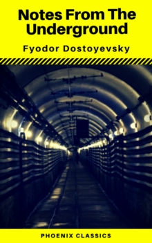

+++
title = "Treated Like a Fly"
url = "2026/02/treated-like-a-fly" 
date = 2026-02-24
description = "Fyodor Dostoyevsky's Notes from the Underground makes us hate its narrator while forcing us to admit we are more like him than we would like. A review, and a confession of my own ineptness"
tags = ["Books", "Classics", "Personal"]
+++

When I was fifteen, I started an argument with a schoolmate. He was well-built and the second-tallest boy in the class, while I was skinny and the second-shortest. We were on the third floor of our school building, standing near a balustrade which overlooked the central lawn. I can't recall what the argument was. But the sight of the green lawn from great height as he effortlessly lifted me up over his head and held me there for a whole minute before setting me down calmly is clear as yesterday. I was not hurt, but my ego was. I could feel the pity of the onlooking kids as I walked away in silent defeat. This event stays buried in my brain, but no one else is likely to remember or remark on it today.

But how did Dostoyevsky predict with precision what would happen to me about 150 years later? In his novella **Notes from the Underground**, the unnamed narrator blocks the way of a lieutenant in a pub who reacts by having, the narrator says, "*without a warning or explanation—moved me from where I was standing to another spot and passed by as though he had not noticed me.*" The narrator follows this up with "*I had been treated like a fly. This officer was over six foot, while I was a spindly little fellow.*" I had remarked about Dostoyevsky's uncanny ability to make every character feel like me in an [essay](https://www.thefreudiancouch.com/2014/07/thoughts-on-crime-and-punishment.html#:~:text=He%20lays%20bare%20the%20deepest%20motive%20of%20every%20single%20character%20in%20a%20way%20that%20is%20unsettling%2C%20for%20I%20kept%20comparing%20myself%20to%20various%20characters) on Crime and Punishment. It is as if he was a sophisticated computing machine which could lay out how a human mind reacts under certain conditions. After all, the narrator in this novella wonders if "*human actions will then, of course, be tabulated according to these laws, mathematically, like tables of logarithms up to 108,000, and entered in an index*". 

> You see, gentlemen, reason is an excellent thing, there's no disputing that, but reason is nothing but reason and satisfies only the rational side of man's nature, while will is a manifestation of the whole life, that is, of the whole human life including reason and all the impulses.

But actually, Dostoyevsky was anything but a rational computer. **Notes from the Underground** was published in 1864, when Russian thinkers were leaning towards rationalist ideas. *Adam Smith* had made it the foundation for his capitalistic economic theory in his *The Wealth of Nations*. The Russians -- as skilled at deliberately misinterpreting a text as I am -- used this to defend their own ideas. They claimed that if people are rational, they would realize that a collectivist society is civilization's best bet. Had no one from either of these camps met an irrational person like me? Dostoyevsky apparently had, for he questions this assumption using his narrator. "*And how do these wiseacres know that man wants a normal, a virtuous choice? What has made them conceive that man must want a rationally advantageous choice? What man wants is simply INDEPENDENT choice, whatever that independence may cost and wherever it may lead.*"

**Notes from the Underground** is structured as a discovered journal of an unnamed character. He expresses anxiety against the idea that human mind is predictable. This is interestingly the same anxiety we face today as Large Language Models (LLMs) are, some say -- while others shout till our ears ring -- primed to usurp our role in society. Our protagonist rebels against the power of prediction though: "*I admit that twice two makes four is an excellent thing, but if we are to give everything its due, twice two makes five is sometimes a very charming thing too.*" Unwittingly, we already have a term for when LLMs do this: *hallucination*. Maybe LLMs consumed Dostoyevsky and believe that he was a self-help guru. Wait till they knock out an elderly money-lender and enter a guilt spiral that consumes all of the worlds electricity. Thanks, Fyodor.

Dostoyevsky's narrator has other problems. He suffers from an "*over-acute consciousness*". He is also too wise for his own good: "*I am cleverer than any of the people surrounding me*". His very intelligence and bookish knowledge -- "*\[w\]hy, you … speak somehow like a book*", a girl tells him -- prevents him from acting. Instead, he goes on a tirade against men who act: '*all "direct" persons and men of action are active just because they are stupid and limited*'. As a total misfit in society, our man confines himself to the "*underground*", which is an internal state he imprisons himself in.

This book is a timeless classic because of its ability to be interpreted in multiple ways. Books like **Catcher in the Rye** are popular because we all have a tendency to think of ourselves as misunderstood geniuses. At least, I do. I also, on the other extreme end, overthink about the motivation of anyone who willingly spends time with me. Are they just being nice? Like our narrator here who double-guesses himself on his way to meet a friend, thinking that "*the man disliked me and that it was a mistake to go and see him.*" This character's oscillation between self-pity and narcissism is a scarily precise portrait of me.

**Notes from the Underground** stays in the underground for a while as the narrator debates rationality, certainty and other weighty topics. Until the line "*\[s\]now is falling today, yellow and dingy. It fell yesterday, too, and a few days ago*" sets the stage for a little transition to the overground. The novella still operates at a psychological level, but as the protagonist reminisces on a few incidents from his life involving other people, we realize that he was not lying when he said earlier "*I was rude and took pleasure in being so*". He mistreats people beneath his stature, and wishes for the downfall of people above him. He does regret his actions, but this awareness does not stop him going into an inevitable spiral towards destruction. Even in the rare occasion where he makes a genuine connection with another human being, he backs away violently. To paraphrase the stand-up comedian James Acaster, every time he breaks the ice, he resets it.

> Why, to tell long stories, showing how I have spoiled my life through morally rotting in my corner, through lack of fitting environment, through divorce from real life, and rankling spite in my underground world, would certainly not be interesting; a novel needs a hero, and all the traits for an anti-hero are EXPRESSLY gathered together here

*Notes from the Underground* is a cautionary tale of a pathetic man. But it is also a tale about you and me. Maybe not as who we are today, but as who we might have become if circumstances were different. "*I have only in my life carried to an extreme what you have not dared to carry halfway, and what's more, you have taken your cowardice for good sense, and have found comfort in deceiving yourselves*", he says, and we would do well to heed him. It is not a lack of knowledge that makes our protagonist an anti-hero. It is his irrational choice to suffer.

My memory of physical ineptness as a teenager stayed dormant inside me until *Notes from the Underground* awakened it. All these years, I was not seething with rage and planning an elaborate revenge. I was just getting through life with my own oscillation between self-doubt and vanity. Like with the narrator, confident people make me think "*I hated the abrupt self-confident tone of his voice, his admiration of his own witticisms, which were often frightfully stupid, though he was bold in his language; I hated his handsome, but stupid face*". But then, my mind recovers from such defeatist thoughts when it remembers the people who love me and people who I love. Maybe that is the missing piece in our anti-hero's origin story. 

> If I had had a home from childhood, I shouldn't be what I am now.

 [Ministry of Utmost Happiness](/2017/06/review-of-arundhathi-roys-ministry-of.html) · [Crime and Punishment](/2014/07/thoughts-on-crime-and-punishment.html) . [Serious Men](/2017/05/review-of-manu-josephs-serious-men.html)  