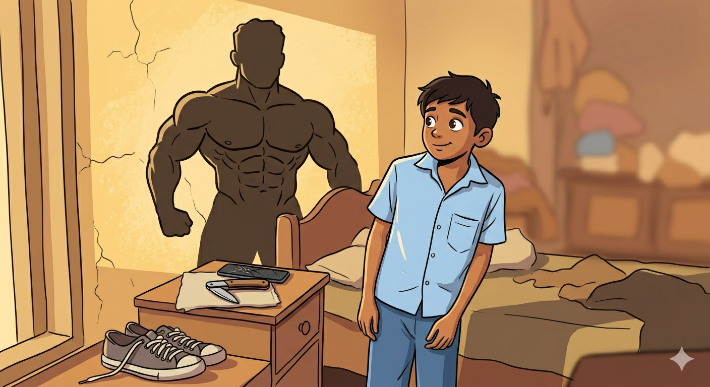

+++
title = "Sigma - A short story"
url = "2026/04/sigma" 
date = 2026-04-03
description = "a darkly humorous story about the influence of manosphere on adolescents in a South Indian town"
tags = ["Short Story", "Literary Fiction", "Fiction", "Childhood", "Dark Humor"]
+++

"*That's it. I have decided to kill him.*"

Narayana turned around quickly away from the wild bushes he was facing, his mouth wide open. He felt something drip on his shoes, and then his pants.

"*Fuck\!*", he murmured, zipping up his pants. He wiped his wet hands on them, and turned back around.

Thankfully, Raja Anna hadn't noticed. He walked away from the bushes nonchalantly.

"*He has been irritating me for a long time. And now, he keeps parking his cycle at my spot. We need to teach him a lesson.*"
"*But, Anna. How?*"
"*On Friday evenings, he loiters around the tank ground with his gang of simps, trying to attract college girls who walk there. He rides his bicycle back home alone. That's when we will corner him.*"
Narayana nodded.
"*I will bring my knife. You bring the cricket stumps.*"
"*What knife?*"
"*Didn't I tell you? I stole one from my chittapa last week. The drunken louse didn't even notice. It is the real deal. As sharp as an aruval. Come with me, I will show you.*"

As they walked to Raja anna’s home, he described a YouTube video he had been watching.

"*They arrested this poor currycel for the acid attack. It's all fake. The pussies in the Government don't want us to know the truth. They did the same thing in Europe to Andrew Tate.*"

Narayana nodded, giving the impression that he understood.

"*They're all controlled by the illuminati. Even the feminazis.*”

Narayana noticed a familiar face at the corner of the street.
Savitha.
She was talking with a boy he couldn't recognize. He smelt his hands, and was not sure if he was imagining the faint stink.

"*Did you watch the video uploaded by the man who killed himself in Coimbatore? His wife filed a fake marital rape case... Oh, look at that chad. He thinks he can bed that witch Savitha. He will end up as a frustoo*".

Savitha smiled and waved at Narayana, but he kept his eyes steadfastly away. Through the corner of his eye though, he noticed her staring sternly at Raja Anna. She looked pretty in her yellow shirt. He hoped Raja Anna hadn't noticed him.

"*That reminds of what I did to Giriraj*"

Giriraj sir, their former English teacher, had been kind to Narayana. But he had stopped coming to their school. The circumstances were mysterious. There were whispers that he had been intimate with another teacher in the staff room.

"*He said some shit about me to my mom. I started a rumor about him and that Casidy. I even made it known that there were videos of them together. Once the gossip got out to the management, they kicked both of them out. They are too scared to face controversies.*"

They arrived at Raja Anna's house. Anna rushed to his room at the back of the house to use the bathroom, leaving Narayana alone with his mom

"*Sollu pa. Anything new at the school?*"

"*They distributed science exam paper..*" he trailed off, hoping that Raja anna hadn't heard him.

"*They did, did they? Why didn't Raja tell me anything? How much did you get?*"

"*I got only 10, aunty*"

"*Oh you got 10, is it? That's okay. You help your dad with everything and still manage to score decently. How much did he get?*"

3\. 3 out of 50\.

"*I don't know, ma. Actually, I should leave now. Appa will be looking for me*"

"*Of course, go. Go eat. Do you want to take home some dosa maavu?*"

As Narayana walked back, he realized that he hadn't seen the knife. If Raja Anna was still in a good mood, he might let him peek at it through the window.

He went around the house and crawled under the hibiscus bush outside the room. At the window, Narayana stood up and peeped inside. He couldn't see anything for a moment. Once his eyes adjusted to the darkness inside, he scanned around.

He had almost missed it, but it was right on the side table. A regular foldable knife.

Like the one his mother had always carried in her bag. To cut apples and other fruits. And butter.

The loud wail came first, but before he could comprehend the sound, Raja Anna stumbled backwards into the room.

"*Ahhh\! It hurts, ma. Stop it. I am sorry. I was planning to tell you.*"

"*Scoundrel\! You lie to me, do you? Always watching memes and videos on the phone. You already failed one year. The kids who studied with you are all in the next class. Brainless pig\!*"

“*Amma, please ma\! People will hear us. Stop screaming.*”

“*So what? Sir is concerned about his honor, is it? That poor motherless kid will stop respecting you, will he? Why don't you find someone your age to roam around with? Thickhead\!*”

Aunty entered the room, facing the window, but eyes gleaming at Raja Anna. It looked straight out of an Amman movie.

Narayana quickly crouched below the window sill, moving back in the same position. Like a green beret. His legs betrayed him as he stepped on a rock and slipped, scratching himself on the bush and emitting a short shriek.

The voices inside quietened.
Resisting the temptation to look, Narayana bolted.
He ran.
And ran.
Until he saw a distant yellow figure on a bicycle.
He slowed down to catch his breath.
Narayana was about to lift his hands, but wiped it over his pants first before waving to Savitha.

---

**Glossary**

*Anna* - Tamil word for elder brother. Used as a sign of respect for any elder male
*Simp* - Manosphere term for a male who shows excessive devotion to women in the hope of romantic or sexual reward
*Chittapa* - Tamil word for paternal uncle \- father's younger brother
*Aruval* - A sickle
*Currycel* - Manosphere term, both derogatory and owned, for a South-Asian incel
*Incel* - involuntarily celibate. The core idea in Manosphere ideology
*Frustoo* - Indian Manosphere term for a man frustrated by lack of romantic reciprocation
*Sollu* - Tamil word for tell/say
*Pa* - Tamil term of male (and sometime female) endearment
*Appa* - Tamil word for father
*Amma* - Tamil word for mother
*Dosa* - Dosa is a South Indian crepe dish.
*Maavu* - Rice and lentil based flour used to make dosa
*Amman* - South Indian Goddess, depicted as a fierce deity

---
This story was originally [published at ArtoonsInn](https://prowritersroom.com/sigma) in response to the prompt "You see something you were never meant to."

 [Nithya](/2017/07/nithya.html) · [The Prodigy](/2017/08/the-prodigy.html) . [By myself](/2026/03/by-myself/)  