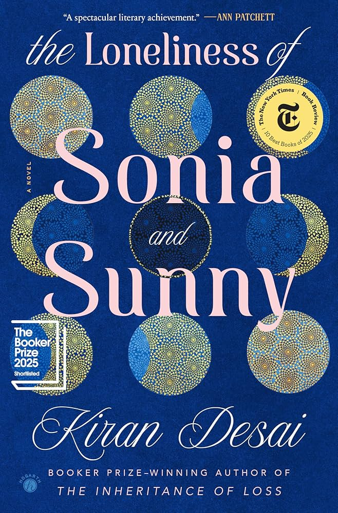

+++
title = "Kiran Desai's The Loneliness of Sonia and Sunny"
url = "2026/07/loneliness-sonia-sunny" 
date = 2026-07-02
description = "A sprawling tale of romance and loneliness that spans India, the USA and a few other countries"
tags = ["Books", "Review", "Book Review", "Literary Fiction", "Indian Diaspora"]
+++

> “Why do we try to solve other problems? There is only one that is necessary to solve.”\
>“Loneliness?” \
>“The other problems would melt away in importance.”

>  “All the best people are lonely. Or you belong to the herd. You suffer no doubt. I don’t like those people who belong to the herd and suffer no doubt.”

It is easy to fall into the trap of thinking that loneliness is a modern ailment. Humans have lived in close-knit societies for thousands of years, and living in smaller, nuclear families is a modern habit. A more modern factor is social media, whose masters profess it connects us, but which only imprisons us and makes us lonelier. Researchers are unsure if loneliness is a fundamental human emotion like love, fear, anger or jealousy. There is no doubt, however, that it is a contemporary condition that affects a significant percentage of us. In **The Loneliness of Sonia and Sunny**, *Kiran Desai* examines this condition by setting her novel at a potent time - before the advent of social media, but right at a time when many Indians from the recently liberalized country started migrating to the United States.

At the very beginning of the novel, we meet an elderly couple in Allahabad in 1996. They live with their spinster daughter *Mina Foi*. The family’s immediate concern is the menu for that night in celebration of her fifty-fifth birthday, “*through [a] vigorous process of elimination*”. Mina Foi, treated as a second-class citizen because of her circumstances, reflects that there is “*just a poignancy, a melancholy that comes from eating such royal food when your life is so very empty, when there is austerity in all matters save dinner.*” Gradually, we learn about *Mina Foi’s* brother, *Manav*, and his daughter *Sonia*.

> In Allahabad they had no patience with loneliness. They might have felt the loneliness of being misunderstood; they might know the sucked-dead feeling of Allahabad afternoons, a tide drawn out perhaps never to return, which was a kind of loneliness; but they had never slept in a house alone, never eaten a meal alone, never lived in a place where they were unknown, never woken without a cook bringing tea or wishing good morning to several individuals.

*Sonia* lives in Vermont, pursuing an undergraduate course in creative writing. It is winter break in the cold state, and Sonia commits the mistake of confessing to her family that she is lonely.  They try to set her up with *Sunny*, the son of an acquaintance. Despite this failed attempt at an arranged marriage, the two eventually meet. *The Loneliness of Sonia and Sunny* travels across continents as its characters search for an elusive love and a cure for their loneliness. *Kiran Desai* permits herself to be expansive,  both in terms of geography and characters. 

> “... the brooding type.”\
>“With a name like Sunny?”\
>“Yes, they called him that pet name to change his nature, but it had no effect.

Sunny grows up more American than Indian. “*That Sunny Bhatia was here. Nice chap, but he’s not a Hindustani. He’s a foreigner*”, remarks a character. As an aspiring journalist, he needs life experiences that he sorely lacks. He realizes that he neither knows the country of his birth nor his adopted country. *“He’d barely touched his nation. He’d never taken a bus, never eaten in a dhaba. It was in the States where for the first time he had lunched at street vendor carts, caught public transport, used toilets in bus stations.”* Sunny is hyper-aware of his warped sense of identity, and that’s the source of his loneliness.

I was once advised by a writer to never conflate a character with the author, especially if the author is a woman. Despite this, my mind kept muddling *Sonia* with Kiran Desai herself. Sonia is a writer inclined towards fiction. Her struggle, apart from life and loneliness, is in portraying India. “*This was India, she thought. You might try to write a slender story, but it inevitably connected to a larger one. The sense could never be contained.*” Kiran Desai grapples with this as well, and in attempting to avoid Indian cliches, *The Loneliness of Sonia and Sunny*, like Sonia’s own work, becomes intensely personal and unique. *Sonia’s* loneliness is more profound than Sunny’s. Noticeably (and for this reader, relatably) she does not have a single friend. Desai makes the narrative choice of rarely showing Sonia’s interior thoughts. We see her actions and reactions, and we get a hint of her feelings, but we are never inside her mind. It is as if Desai wants Sonia’s loneliness to be stark. 

There are so many other remarkable and lonely characters that populate this world. *Babita* is *Sunny’s* mother, and acts as a powerful figure who prefers the practical over the moral. After all, her late husband suffered the consequence of being sincere in the corrupt Indian system. She flexes her class privilege to get what she wants, and she clutches Sunny tightly to herself, hoping to shape his life to fit her stature. *Seher* is *Sonia’s* mother, and she is one of the few characters in the novel who seeks loneliness. She follows the footsteps of her deceased German father who was drawn to India during the theosophical moment. Her choice has repercussions for her husband, *Manav*. We meet him as a typical Indian uncle, with humor that borders on being inappropriate and a general lack of self-awareness. But he is forced to reevaluate himself during his mid-life, and transforms himself--to the extent he can.

> “You know,” he said, shifting his feet around in his slippery Kolhapuris, “my life’s work has been in business firms that invest in the future—in microwaves, in Hindi computer word processing, in cement and cement sacks—but midway through life, I’ve discovered that it’s only by the past that a man can be profoundly moved.”

*Ilan de Toorjen Foss* is an artist who takes *Sonia* under his wing. He appears to be a wise man who is willing to sacrifice himself for the purity of his art. But it turns out that like many famous people, his preference is to sacrifice others. Kiran Desai’s writing is most effective during this stretch as she depicts *Sonia* and *Illan's* relationship with unsettling intimacy. When Desai writes that *Sonia* is “*scared of staying—but also scared of leaving*”, we feel the suffocation of being caught in an abusive relationship. 

*Satya* is *Sunny’s* only friend. Unlike *Sunny*, *Satya* is happy to be Indian, even in the American south. *Sunny’s* friendship with him takes the form of secretly judging him for his Indianness and for his low-brow tastes. At some point, he comes to the realization that “*Satya had no need for newspapers and news, he had no need for art—he had life!*” That doesn’t mean that *Satya* is not lonely too, for he works in a place where his co-workers open up the windows regardless of the weather when he unpacks his Indian food.

*Sunny’s* observation about *Satya’s* lack of necessity for art is something to ponder on. Some of us neglect life and the people around us in pursuit of art. “*When you became a real artist, all roads led to your art: the people, the landscape, the news, the gossip, the suppressed shame, the dream, the flutter in the night of a pelican who should have flown north.*” Is such art worth it if it has the potential to erode life? Is Illan’s art worth the people he swats on his way to fame? Is the novel Sonia conceives towards the end of the book worth her suffering at the beginning?

This is not a book that provides easy answers. *Kiran Desai* worked on it for close to two decades. The effect is nuanced micro-observations. I can’t recall another book talking about the experience of an Indian in the USA with such depth. Desai cuts right through the anxieties, the hypocrisy, the inability to belong, the outward kindness of White liberals, and the loneliness of Indians abroad and at home.

On the flipside, not everything works. At some point, Kiran Desai describes a stray dog : “*She found a piece of last night’s mackerel cutlet under the table, which she ate. Then she licked the essence of the cutlet, then she licked the hope of the cutlet, then, losing hope, she became slightly desperate and licked the memory*”.  The prose here is beautiful, but there does not seem to be a pattern to what Desai chooses to zoom into. It is now a random dog, now a Goan driver who insists on stopping his car to collect plastic waste strewn by tourists, and now the filthy nails of a cook.  I am all for sprawling books, but the sprawl here with 688 pages doesn’t cohere at times.

Secondly, this is undeniably a book about rich people. They may be relatively poorer in another country due to exchange rates, but they are rich nevertheless. These are people who converse about art and culture, and discuss books in a profound way. Where are such people? Why are they not reading what I write? Why am I so lonely? Kiran Desai attempts to address the problem of class by writing an arc for characters like Vinitha and Punitha. This thread is tied up neatly in a decision Sunny makes towards the end of the novel. But, perhaps, too neatly. This is in contrast to the author's earlier work *The Inheritance of Loss*, which had an Indian cook's son slave away in New York for a better life. 

> Sonia argued that Latin American, Asian, and African cultures possessed a great deal of homegrown magic. Rumors of ghosts came bursting out of folk societies, especially those without electricity.

Towards the end, there is a tiny genre shift as the book turns towards magical realism. I personally don’t mind a good shift in genre. But I did feel that this turn allowed things to be resolved too conveniently. Kiran Desai's overarching thesis seems to be that loneliness is a root problem exacerbated by people who move across borders. But then, we see characters who pursue loneliness and characters who are lonely even at home.  This is a novel packed with many powerful moments that caused me to be in awe of Desai’s writing abilities. But it is hard for me to tell if I loved it. Figuring that out gives me something to do for when I am inevitably lonely. 

 [And Your Byrd Can Sing](/2026/01/and-your-byrd-can-sing-roberts/) · [Covenant of Water](/2025/12/covenant-of-water.html) . [The Vegetarian](/2025/06/vegetarian-han-kang.html)  