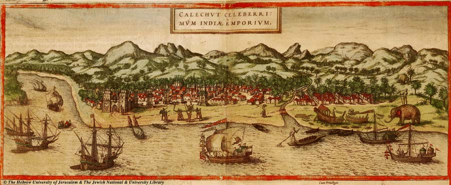

+++
title = "Trinkets - A short story"
url = "2026/06/sigma" 
date = 2026-06-09
description = "A blend of historical fiction and magical realism set in 15th century Calicut for the prompt 'For Sale - Baby Shoes - Never Worn'"
tags = ["Short Story", "Historical Fiction", "Fiction", "Magical Realism", "Absurdism"]
+++

As his eyes set upon Ko-li’s shining hills, his ears deafened by the cacophony at the shore, Kung Chen realized that nothing Ma Huan had said about the country prepared him for its magic. 

He alighted from his Zaw in a daze. There was a commotion at the port. The Zamorin’s guards were confiscating the handsome horses that had arrived from Ormuz, to the consternation of the Arabs.

Chen gleaned what was happening from the Tamil and Malabar words murmured by the onlookers. Someone had prophesied that the Zamorin would be stamped to death by a horse’s hooves. The Zamorin was a secular ruler, but he had been convinced that the prophet was a black magician serving his paymasters in Kochi. 

Chen walked on, feeling inside his vest to make sure he still had the anklets. They  jingled, making a pleasant noise. A moment later, he touched them again. Wasim had made them from the rare trinkets found in the shores of Ceylon. Theirs was an unlikely friendship \- a Chinese traveller and a fisherman from Tamilakam united by faith. Kung Chen’s eyes clouded as he remembered his friend’s sacrifice to protect his life during the pirate attack. He had to find Wasim’s newborn grandson.

As he hurried South, he noticed that the shores were covered with coconut trees. There were also trees bearing a fruit that resembled a persimmon, but green in color.

The palayam was a bazaar teeming with exotic goods. Inside, he was greeted with a rice seller hawking in Tamil. He enquired about Iqbal, Wasim’s son, and was pointed to a tall, charismatic man. As Chen approached the man, he noticed the wares that were for sale. Chinese silks and porcelains, Buddhist sutras, sandalwood incense, ivory tusks, rhinoceros horns. And a tiny pair of shoes. Elegantly made. Never worn. Were they not the shoes Wasim had couriered to Iqbal through Ma Huan?

“*Iqbal\!*” he called out as he approached the man. “*I come from Wasim.*”

The man stared at him for a moment, and looked away. A younger apprentice with traces of a beard came forth unbeckoned and blocked Chen.

“*You have the wrong man, Sahib\!*” he said, his teenage voice barely masculine. Chen paused nevertheless.

Iqbal straightened his neat, shining red vest and limped away, as fast as his legs allowed him to. Except for the gait, Iqbal’s resemblance to Wasim was uncanny. Chen hurried behind him.

At the entrance, he was blocked by another man.   
“*Swami\! Can I help you? I am Devadutt*”  
“*Naan Poganum*”  
“*Oh, you know Tamil ah? Nalladu.*”  
He thrust a glass containing a purple liquid to Chen.  
“*Here, drink this. It's good for travel sickness.*”  
Chen hesitated, but accepted it.  
Devadutt then unwrapped a fabric bag tied to his waist and smeared some ash on Chen’s forehead. Ox-dung ash.

Chen’s eyes glanced at Iqbal to see if he had escaped, and Devadutt followed them.  
“*Pishukkan\! Don’t get fooled by him, swami. I treated his pregnant wife, and the ingrate hasn’t paid me a single copper coin.*”

Chen broke loose and set out to follow Iqbal. He heard Devadutt shout “*Swami, I am not only an Ashtavaidya. I know Jyothista too. The stars are aligned. You will be privy to a great secret. Pinne vannu kaananam*”

Iqbal walked towards what must be the Kallayi river, and vanished between thickets of trees. Chen quickened his pace, fearing that he would lose his quarry. Inside the woods, a cool breeze lightened his head.

And then he saw something to his right.   
A pirate ship.   
Right in the middle of the forest.  
But then, it was no longer there.

Chen sighed. The stars did not seem to be helping him after all. 

A noise.  
Tick-tock. Tick-tock.   
It sounded very familiar, but he couldn’t place it.

Chen was drawn to it, and arrived at a stone dwelling. 

He saw a fleeting streak of red near the door. He rushed, swift as the wind. Just as the door was about to be shut, he slipped a foot in. 

Iqbal pushed the door hard. But his anger turned into uncertainty, as he let Chen in.

The inside was large, as befit a thriving trader. They could see the Kallayi from the windows at the back. But the house was bare, with only outlines of furniture on the dusty floor. 

“*Wasim is dead. He wanted his grandson to have this*”, he said, reaching inside his vest.

Shouts from the river interrupted them. A large open boat appeared, on top of which the Zamarin’s men were restraining a yelling, fighting, but powerless man. It was Devadutt.

“*That scoundrel deserves this.*”  
“*Why are they taking him away?*”  
“*His drunken ramblings. He claims that the Zamorin will be killed by a horse’s hooves.*”

A tiny gurgle escaped from the other room. Followed by a sound that transported Chen back to China.   
Tick-tock. Tick-tock.  
A tender child emerged from the room. Its face as white as milk, its feet as absent as Wasim. In their place were two hooves. A walking newborn.  
Tick-tock. Tick-tock.  
“*All I asked from Devadutt was for my son to be able to move better than me. Look at him now. What if the Zamorin finds out? He moves faster than me. I can’t keep up with him.*"  
Chen drew out the anklets.   
“*Maybe these will help you find him when tries to run away.*"

Image source : [https://franpritchett.com/00routesdata/1700\_1799/malabar/calicut/calicut.html](https://franpritchett.com/00routesdata/1700_1799/malabar/calicut/calicut.html) which points to the defunct [http://historic-cities.huji.ac.il/india/calicut/maps/braun\_hogenberg\_I\_54\_1.html](http://historic-cities.huji.ac.il/india/calicut/maps/braun_hogenberg_I_54_1.html)

Glossary and author’s notes

Ko-li \- Calicut (Kozhikode) in Kerala, India, as referred to by 15th century Chinese travellers. Ko-li itself is referred to as a country  
Ma Huan \- A Chinese Muslim voyager who visited Kerala with Admiral Zheng He multiple times, starting in 1405 and documented his travels in “The Overall Survey of the Ocean's Shores”  
Kung Chen \- Name borrowed from a real traveller in 1405\. Character is fictional  
*Zaws* \- Medium sized Chinese boats  
Zamorin \- Anglicized word for Samoothari, the title of the ruler of Calicut  
Ormuz \- Port of Hormuz. I promise that I am not optimizing my story with trending topics. At least, not consciously  
Kochi \- Another city in Kerala. In early 1400s, the rulers of Kochi and Kozhikode were at loggerheads  
Ceylon \- Sri Lanka  
Tamilakam \- Tamil Nadu, India  
Palayam : I initially thought this word translates to market, but it apparently does not. I still kept it because I see it mentioned in at least one source [https://www.livehistoryindia.com/story/cover-story/zamorins-of-calicut](https://www.livehistoryindia.com/story/cover-story/zamorins-of-calicut)  
Ashtavaidya \- Ayurvedic physician  
Jyothista \- Astrologer  
*Naan Poganum \-* Tamil for “I need to go”  
*Nalladu \-* Tamil for “good”  
Pinne vannu kaananam \- Malayalam for “come and see me later”  
Pishukkan \- Malayalam for “miser”

Other sources 

1) The Overall Survey of The Ocean’s Shores by Ma Huan  
2) [https://www.livehistoryindia.com/story/cover-story/zamorins-of-calicut](https://www.livehistoryindia.com/story/cover-story/zamorins-of-calicut)  
3) Ibn Batuta’s account of the Indian shores : [https://bridgingcultures-muslimjourneys.org/items/show/84](https://bridgingcultures-muslimjourneys.org/items/show/84)  
4) [https://calicutheritage.com/digital\_library.aspx](https://calicutheritage.com/digital_library.aspx)

---
This story was originally [published at ArtoonsInn](https://prowritersroom.com/trinkets/) in response to the prompt "For Sale - Baby shoes - Never worn"

 [Hallucination](2026/05/hallucination/) · [Sigma](/2026/04/sigma/) . [By myself](/2026/03/by-myself/)  