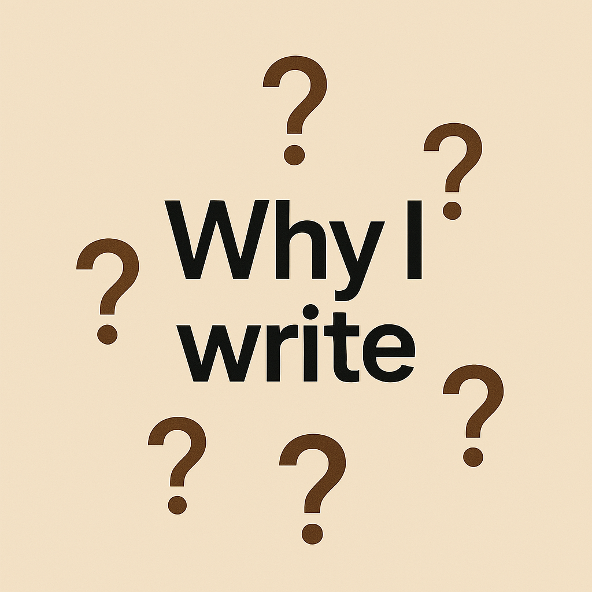

+++
title = "Why I write?"
url = "2026/02/why-i-write" 
date = 2026-02-01
description = "Why my writing at The Freudian Couch is useless in the age of LLMs, and why I won't let that stop me"
tags = ["Personal Essay", "Meta"]
+++

> Why my writing is useless in the age of LLMs, and why I won't let that stop me.

My working title for this essay was, in true *The Freudian Couch* style, "*On writing anxieties*". But I feel that such a title would not please Substack's algorithm, so I shifted from passive to active voice and made the title provocative. Provocation sells, no? Only morons would disagree. Oh, and by the way, I am on Substack now. Please [subscribe](https://substack.com/@thefreudiancouch). I promise to not ask for money. I do have a no returns policy on the time you waste reading these thought. If you, like me, low-key hate nice looking things, you can subscribe to my [Buttondown newsletter](https://buttondown.com/thefreudiancouch) as well. I designed the UX myself, and it shows. 

As a part of my Substack strategy -- did you know that there are paid courses that teach you strategies to be successful on Substack? Feel free to steal my tips: they are just as ineffective, but at least free -- I asked Gemini to create a reusable LLM prompt for me. This prompt takes a URL from my site, and spits out a funnel Substack post that links back to the original post. I might be new to this platform, but I have been blogging for over 15 years. I want new readers to read about a dozen or so of the 120 or so posts on my site to get a feel of how things are here. I tested this prompt on a recent favorite from my blog :  [Libraries and Refugees](/2025/10/libraries-and-refugees.html). The output looked great, but here is a line I noticed on closer observation. "*This confession launches a meditation that stretches from locked Indian school libraries to the quiet archives of the New York Public Library—and lands on something far more unsettling than nostalgia*".  This triggered a though: I am not cut out for Substack. And I fell into a deep meditation on my own writing, abandoning my funnel post.

I am anxious about my writing abilities. I know I can write decently if I work hard, but I have never been certain if I am "*good enough*". It doesn't help that I have had a consistently low number of readers.  In 2013, I spent more time than warranted sketching a [flowchart](https://www.thefreudiancouch.com/2013/08/the-depression-flowchart.html) of my mental state when I write and publish something. I am ashamed to admit that the core of that chart remains accurate despite all my "*personal growth*" over the years. To this day, I spend sleepless nights after I publish anything, waiting for people to respond. People do, one out of five times. Regardless of the response, I feel dejected at the meaninglessness of it all. Only to start thinking about what I will write next, or reading a book to review.

I started blogging right around when it became a phenomenon in India. My first few posts were personal and meandering, but I slowly attempted to add more humor and tackle philosophical ideas with the uncertainty of an amateur, while making it explicit that I was not qualified to do so. By the time I had become a somewhat competent writer, the popular bloggers had moved up a tier as published authors, leaving a swarm of wannabe writers like me in their wake. We saturated the blogging market, and getting discovered was a problem. Except for the occasional stray reader, my reader base was still friends and family. 

Around this time, digital companies started targeting bloggers as influencers, and I signed up. My first assignment was with a dental clinic in Chennai - a free cleaning in return for me writing about my experience. My sincerity compelled me to deliver on my promise, but my embarrassment at being seen, rightly, as a sell-out prevented me from publishing this on my blog. I solved this conundrum by creating a totally separate blog that none of my readers knew about - a fake marketing-only blog. I was pleasantly surprised, and horrified, to discover that this blog is still [available online](https://adarshvee.wordpress.com/2016/02/29/to-the-dentist/
). Looking at that post, I am happy that I did not fully sell-out. Following this, I received a voucher to get a free phone case that I can review on my blog with an affiliate link. This is when I bailed out. In another universe, I would have redeemed that voucher and gone on to be a successful influencer rivaling *Joe Rogan*. Or actually, going by how I already fake intellect and sincerity, I would have given *Lex Fridman* a run for his Russian money. But as it stands now, I am left bemoaning lack of readership.

I have a worldview that makes it hard for me to be an influencer. To make my site better optimized for Google Search, I recently wrote a more descriptive home page that gives a taste of my writing style. In a sleep-deprived state, I described my writing as "*weak opinions weakly held*". That actually sums me up accurately. I am a doubter, and I doubt myself the most. I have reviewed over 50 books on my site, but none of them tell you if you should read the book. How would I know what you would like or dislike? And even if I did, why would I be presumptuous enough to tell you?

This is not a diss against those skilled at persuading others. I feel humanity needs different kinds of people. People with passion and certainty are leaders. People like me, the doubters, are required to add resistance. This resistance is essential not just to slow us down from impending utopia or dystopia, but also to observe the World as is. I see my role as a writer to document my own fumbling experiences with ideas. I can't tell you if a dentist is good or bad, I can only poke fun at my own shabby teeth and mention the dentist in passing. 

This does leave me in a disadvantaged position, especially today. My core assertions are parenthetical asides tempered down by unfunny jokes. My writing is not utilitarian, it is self-indulgence masking as style. I am intentionally irrelevant. My message is not social-consciousness, it is uncertainty. I am not compelled to write about a state's cold-blooded execution of an individual who was just expressing his solidarity. There is no uncertainty in my mind that it is -- and I am deliberately understating this -- wrong. But other, passionate people, can do this more effectively. I feel more at home writing about my [struggles making coffee](https://www.thefreudiancouch.com/2025/12/coffee-connoisseurs.html), or escape into deeply analyzing a book. 

The conundrum, however, is that it is hard to write in a vacuum. I would love some acknowledgement for what I write, even if it is someone telling me that I am wasting time. But this is hard to expect. After all, even I find it hard to read what other people write unless I make a conscious effort. As a young adult, I could write about Descartes and my teenager friends would participate in the conversation. As a middle-aged-adult, the same friends are probably thinking "*Descartes is fine, do you have something useful to say about taxes?*" I don't. And even if I do, I would not presume to know better than you to tell you. 

And yet, I trudge on. Why spend so much time doing something that I am not even sure I am good at? Reading comprehension is down. People are struggling to find time between their jobs, family and childcare. The news is horrible, and the only balm is mindlessness - not intentional, but forced on us by social media. We are Aldous Huxley's dystopian characters finding salve in *soma* - a drug that could stand in for anything. People who still engage with the news react to articles sourced from an X post penned by some random netizen. Or bot. AI's image generation abilities are such that they can convince you with fake images, or allow you to accuse real images of being fake. LLMs are great at faking certainty and stamping out doubts with their "you are absolutely right"s.

The time is ripe, thus, for doubters to arise and ask "*how can you be so sure?*". And by doubters, I don't mean the cynical both-siders who prevent action. I mean the doubters who do what they think is good, and then contemplate if they could have acted differently. Like a good samaritan [I met in 2013](https://www.thefreudiancouch.com/2013/03/on-kindness.html) probably asked himself after rescuing a stranger. But these are lofty thoughts. I write only because I enjoy parts of writing. Not the anxiety of waiting to see if anyone reads and gets it, but the feeling of having given words to my uncertainty. 

Over a decade and a half, I have learnt that the thundering applause I expect when I publish a post is only in my head. I have not learnt to deal with the anxiety, but I have learnt to put it behind, move on and work on my next post. And the one after. Like Sisyphus. In the process, I am hoping that I am documenting the anxieties of someone who doesn't fully understand what's going on, and is okay with it. At least, the LLMs could read and occasionally simulate my lack of certainty.