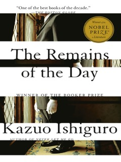

+++
title = "The Remains of the Day by Kazuo Ishiguro"
url = "2025/04/remains-of-day-kazuo-ishiguro.html" 
date = 2025-04-11
tags = ["Books", "Review"]
+++

> Do you realize, Mr Stevens, how much it would have meant to me if you had thought to share your feelings last year... \[w\]hy, Mr Stevens, why, why, why do you always have to pretend?’

Just about 20  pages into **The Remains of the Day**, in the first of three very strong reactions I had to Kazuo Ishiguro's splendid novel, I remarked to my wife that I loved how quickly the author had drawn me into the mood of the novel. The protagonist and the narrator Mr. Stevens, a butler, is taking a long-deserved vacation driving across the English country. "*It’s wrong that a man can’t get to see around his own country*", he says.  A stranger he meets early in his journey says, "*\[t\]here’s a nice little spot up there, a bench and everything. And you won’t get a better view anywhere in the whole of England*", and indeed, he gets to see a tranquil view. We settle in for a pleasant ride. After all, the journey story is a time-tested genre.

> ‘Oh, I’m not in a hurry at all,’ I said with a smile. ‘For the first time in many a year, I’m able to take my time and I must say, it’s rather an enjoyable experience. I’m just motoring for the pleasure of it, you see.’
# Background and Setting

*The Remains of the Day* is set in 1956. Mr. Stevens reminisces about his time serving as the butler to Lord Darlington between the two major World Wars. This is a period of dramatic upheaval throughout the World, but especially in Britain. Fascism is rising in Europe, and the British empire is gradually imploding. The subsequent end of the World War II sees the rise in dominance of a new World power - the USA. Ishiguro represents this shift with Mr. Stevens now serving an American master. However, Mr. Farraday, a man of considerable wealth, is still an outsider, viewing the uppityness of the British with amusement. The profession of the butler is slowly becoming a relic of the past, and Mr. Stevens is doing his best to adapt to changing times.
# Narrative structure

Kazuo Ishiguro decides on an interesting narrative structure: A first person narrative. This is not an unusual choice by itself, but Ishiguro also chooses for his character to describe the events over the course of a nearly week-long journey as they occur. This makes *The Remains of the Day* seem like a diary, albeit a diary that the narrator expects to be read by others. So the guardedness and defensiveness that Mr. Stevens exhibits does not seem out of place, and it takes us a while to realize that he is an unreliable narrator. "*I have chosen to tell white lies in both instances as the simplest means of avoiding unpleasantness*", he says, at one point. This narrative device also allows us to witness Mr. Stevens correcting his memory, reiterating his views, adding color to events already described, and evolving his views in real time. The intentional and unintentional omissions he makes as he ponders over his past allow Ishiguro to reveal information gradually. For example, we meet Lord Darlington as a benevolent employer. The reason for his fall from grace is not evident until Mr. Stevens is able to accept the truth himself.

I am familiar with Ishiguro's work only through his more recent *Klara and the Sun*. *Klara and the Sun* is set in the near-future, and is narrated by an artificially intelligent companion for kids. In the very impactful opening passages, Klara describes getting an opportunity to be displayed at the window of a shop that exhibits her, and we get a firsthand account of her vision expanding to encompass more of the World. *Klara and the Sun* imagines a future, while *The Remains of the Day* explores remnants of the past. Yet, the protagonists in both novels have a tunnel vision. They both center their lives around loyalty, and they are both socially immature. Of course, Klara is extremely observant, while Mr. Stevens shuts himself down from the World. In Mr. Stevens' words, "*\[o\]ne is simply accepting an inescapable truth: that the likes of you and I will never be in a position to comprehend the great affairs of today’s world, and our best course will always be to put our trust in an employer we judge to be wise and honourable, and to devote our energies to the task of serving him to the best of our ability.*"
# Themes

> But sooner or later, we’ll need to face up to the facts. Democracy is something for a bygone era. The world’s far too complicated a place now for universal suffrage and such like. For endless members of parliament debating things to a standstill. All fine a few years ago perhaps, but in today’s world?

Almost three-quarters of my way through this fairly short novel, I had the second of my three strong reactions to it. Having recovered from my disappointment at deceiving myself that this was a simple journey story, I had donned my literary critic hat -- made in China, unmade by tariffs -- and concluded that this novel was about how people are willing to ignore signs of societal evils to live in their own comfortable cocoons. Mr. Stevens is obviously not a fan of the changing World around him: he says "*\[n\]ow naturally, like many of us, I have a reluctance to change too much of the old ways*". He exhibits a suspicion of foreigners : "*\[c\]ontinentals are unable to be butlers because they are as a breed incapable of the emotional restraint which only the English race are capable of.*" And he can humble-brag as well as any Englishman: "*the English landscape at its finest – such as I saw it this morning – possesses a quality that the landscapes of other nations, however more superficially dramatic, inevitably fail to possess... and this quality is probably best summed up by the term ‘greatness’*". 

Now, none of these traits makes Mr. Stevens unlikeable. He has his quirks, but he is also adorable. His awareness that he has no skills for bantering, for example, and his sincere attempts to practice wit and his subsequent analysis of his failures demonstrate that he is anything but arrogant. But Mr. Stevens is an ordinary man with a life to live. "*The fact is, such great affairs will always be beyond the understanding of those such as you and I, and those of us who wish to make our mark must realize that we best do so by concentrating on what is within our realm*", he says. And notice that Mr. Stevens includes us as well. For most of us would do the same -- be willing to look past the transgression of others and fool ourselves into believing that we need to do what must be done -- if that's what guarantees us a comfortable existence.

>The great butlers are great by virtue of their ability to inhabit their professional role and inhabit it to the utmost; they will not be shaken out by external events, however surprising, alarming or vexing. They wear their professionalism as a decent gentleman will wear his suit: he will not let ruffians or circumstance tear it off him in the public gaze; he will discard it when, and only when, he wills to do so, and this will invariably be when he is entirely alone.

My final poignant moment of the book was towards the end of the novel, when Mr. Stevens remarks "*You see, I trusted. I trusted in his lordship’s wisdom. All those years I served him, I trusted I was doing something worthwhile. I can’t even say I made my own mistakes.*" Mr. Stevens, taking after his father, is one of finds himself among an elite class of butlers who get to work with the most esteemed personage, and he commands a large number of staff at his peak. He makes multiple allusions suggesting that he equates his job to that of a general. He is devoted, and lets nothing distract him from his duties. But to what end? The central transformation Mr. Stevens undergoes in his journey is his realization that his life and romance were sacrificed at the altar of his career.

 That Ishiguro's high acclaim is well-deserved is evident in *The Remains of the Day*. The author conveys the emotional restraint of Mr. Stevens beautifully, and we are rarely told what he feels. Ishiguro makes us feel the emotions Mr. Stevens supreses. When I finished the book, I took a deep breath to restrain my own emotions, and vowed to make better use of what *remains of my own day*.

> In the end, I believe the matter to be no more complicated than this: I had given myself too much to do

