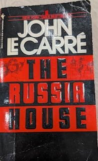

+++
title = "Review of The Russia House by John le Carr&eacute;"
url = "2025/04/russia-house-le-carre.html" 
date = 2025-04-05
tags = ["Books", "Book Review", "Thriller"]
+++

> "Today one must think like a hero to behave like a merely decent human being."

> "Some people, I reflected, are cursed with too much loyalty, for a day could come when there was nothing left from them to serve."

As a teenager, I enjoyed spy thrillers and action adventures. *Alistair MacLean*, *Robert Ludlum*, and *Frederik Forsyth* were among the authors I gravitated towards. I have read some of *John le Carr&eacute;*'s works, and I knew that his mold of spy thrillers is not the same. Unlike many other writers of the genre, his focus is not on the mechanics of espionage itself, but on the humans involved. Nevertheless, I purchased his **The Russia House** from a library book sale hoping that the genre would still entertain me. Though I’d picked it up long ago, the theme felt both too relevant and not relevant enough—so it sat untouched on my shelf until now. I finally gave it a shot, and I can report that well written spy thrillers still interest me. *The Russia House's* core thesis -- once we remove the veneers of flags and idealism, humanity is not so different across borders -- is timeless.

## Plot and setting

>"We all thought science could rule the world. Well I suppose it does now, though not in the way it was meant to be."

*The Russia House* is set, for the most part, during the late 1980s. *Mikhail Gorbachev*, the last leader of Soviet Union, attempts to reform Russian politics by spearheading a movement known as *perestroika* (restructuring). A part of this was increased *glasnost* (transparency), and involved creating forums for the interaction of western and Soviet intellectuals and artists. During an audio publishing fair held in that vein, a Russian woman hands over a manuscript and a letter meant for a missing English publisher to an unsuspecting salesman. British intelligence gets hold of this manuscript, and realize that if its contents are true, the document could change the course of the weapons race between the USA and Russia. However, is it genuine? Even if it is, what's the political appetite to act on such a message? A complicated board game staking lives and some careers ensues, even as the main pieces of the game grapple with love and a need to protect those who they love.

> "In our profession the couriers are the message."

Parts of the novel occur in England and involve "*those Englishmen with hope in their faces and none in their hearts*". We also travel to an island off the coast of Maine for a bit to experience some American exceptionalism  : "*(t)his is not London. This is Washington. And for Washington, intelligence has to be useful, and that means it has to be used, not contemplated in Socratic detachment. No English reticence, no old-school persiflage.*". But for the most part, *The Russia House* is set in Russia - with Moscow and Leningrad being the centers of action. The plot driver is Russian "*love of anarchy and their terror of chaos, and the tension in between.*"
## Characters and style

> "I'm a moral outcast… I trade in defiled theories."

We first meet the colorful *Niki Landau* who is  "*a street kid, up to all the tricks*", while also having "*an unencumbered mind*". Niki has main-character-energy, and I instantly took a liking to him. However, we realize that Niki is narrating events to an unseen narrator who eventually reveals themselves with the lines "*(w)hich is where, in the history of the affair, I made my own modest entrance, as legal errand boy, as fixer and bit player, and pleaser, and finally as chronicler*".  Once the narrator, *Horatio Benedict dePalfrey* (who notes, “somehow nobody has ever remembered the ‘de’ at all”) is revealed, we retrospectively realize that Niki is just a small character in the author's narrative. In fact, he is quickly dismissed with the lines "*He was the perfect prologue. He never came back.*" As a narrator, Horatio is humble and manages to remain distant despite showing a preference for characters with integrity and sensitivity.

It takes a while before we get to meet the protagonist: *Bartholomew, alias Barley, Scott Blair.*  It takes longer until we see the perspective of *Katya*, the Russian woman who sets things in motion and who forces Barley to make a tough choice. Influencing their relationship from afar is *Yakov Yefromovich*, a patriotic physicist who is spurred to action by something Barley did in the past. We learn about Yakov that he has "*a part in him that refuses to grow up. It is the artist in him, but it is the perfectionist also.*"

*The Russia House* is a character driven novel, and the narrator has biases which color our view of characters. We get a favorable impression of Ned - "*(g)ood voices do not always belong to good faces, but Ned’s did.*" But not so much about a Clive: "*What has Clive studied, I wondered, if he ever had? Who bore him, sired him? Where did the Service find these dead suburban souls with all their values, or lack of them, perfectly in place?*" And these asides make us understand the narrator Henry better - his disillusionment with his work and the effects of his professional life on his personal life.
## Verdict

*The Russia House* is a dialogue heavy character study with the message that once we remove the veneers of flags and idealism, humanity is not so different across borders. Politicians and arms manufacturers benefit from international disputes, but people are people. *John Le Carr&eacute;* is an excellent writer who excels at depicting both the external landscape of shifting geographies and the internal mental terrain of conflicted characters. 

*The Russia House* starts at a pretty good pace, but I felt that I was not fully invested in the stakes towards the end. Barley and Katya's romance didn't work for me. I would have loved to see a mature and evolving relationship given that Katya is a mother of two and Barley is a 40-year old man, but what we see is *Barley* being an irritating teenager and *Katya* reciprocating. The fact that we live in a geopolitical situation that's vastly different makes the book hard to relate to at times as well. And finally, *The Russia House* is anglocentric with a white savior. Yakov is idealistic, but without the practical wisdom of Barley. Throughout the novel, we see that the narrator's respect for Barley but we are not always shown why. These, to me, are minor gripes in front of Le Carr&eacute;'s mastery of his craft. 

