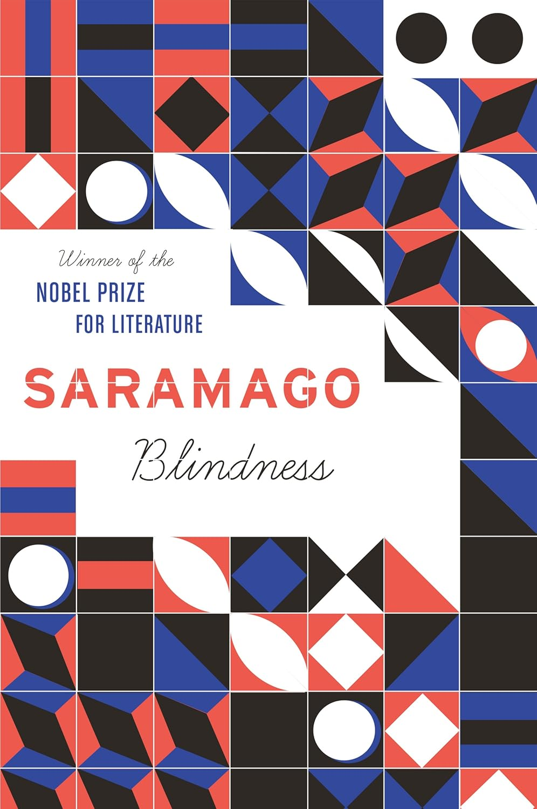

+++
title = "Blindness by José Saramago"
url = "2025/09/blindness-jose-saramago.html" 
date = 2025-09-13
tags = ["Books", "Book Review", "Dystopian"]
+++

> Perhaps only in a world of the blind will things be what they truly are

José Saramago's Blindness begins with the colorful lines: *"The amber light came on. Two of the cars ahead accelerated before the red light appeared. At the pedestrian crossing the sign of a green man lit up. The people who were waiting began to cross the road, stepping on the white stripes painted on the black surface of the asphalt, there is nothing less like a zebra, however, that is what it is called."* This is a deliberately ironic choice by the author for a book about an unnamed place afflicted by an unexplained and contagious blindness. 

# Premise

> \[J\]ust because that poor wretch turned blind is no reason why the same should happen to me, this is not some cold one catches

On a regular weekday, an automobile driver causes a minor commotion on a busy street. *"Seen merely at a glance, the man’s eyes seem healthy, the iris looks bright, luminous, the sclera white, as compact as porcelain."*  However, he insists that he cannot see. A stranger offers to help him, as others move on. The Good Samaritan makes a prescient remark, saying, *"\[n\]ow then, don’t give it another thought, today it’s your turn, tomorrow it will be mine, we never know what might lie in store for us"*. Soon there is a contagion, and the affected people are quarantined. Among the quarantined blind people, however, is one woman who can still see. Saramago examines the deterioration of civility in the quarantine facility and beyond, as a society of newly blind people abandons pretensions to become the primal creatures humans are beneath our civilized veneer.

# Narrative style and characterization

> If we cannot live entirely like human beings, at least let us do everything in our power not to live entirely like animals

José Saramago does not name his characters in this novel. He refers to people by their occupation, a personality trait, or an accessory. The characters in *Blindness* are like animals in this regard - *"no dog recognises another dog or knows the others by the names they have been given, a dog is identified by its scent and that is how it identifies others"*. This is consistent with his choice to not set his story in a specific place, lending the text a sense of universality. 

Saramago also is not a fan of punctuation, except for commas and periods. As a result, conversations are delineated just by capitalization, and read like *"The doctor’s wife said to her husband, The whole world is right here. Not quite all of it. The food, for example, was there on the outside and taking ages to arrive."* 

The narrative voice is firmly third person, and the narrator does not hesitate to digress to make tangential observations. Placing one character who can see among a group of blind people allows the narrator to visually describe the horrors inside the asylum. This character suffers, feeling helpless, *"contemptible and obscene"*.

> I am simply the one who was born to see this horror

# Themes 

The premise of *Blindness* makes a good dystopian setting. However, as one would expect from a Nobel prize laureate, it does not take too long for *Saramago* to show us that he is not interested in easy thrills. Saramago's ambition is to portray the human condition unflinchingly. In describing an isolated quarantine facility, Saramago wants to depict humanity as a whole, for *"human reason and unreason are the same everywhere"*. His central focus is the *"half indifference and half malice"* that constitute most humans.

Saramago deals with gender roles superbly. The men in *Blindness*, when they are not actively evil, are impotent. A man recognizes this, remarking *"this thing we call male pride, if after so many humiliations we still preserve something worthy of that name, I know that it will suffer"*. The women are burdened to be both a currency and a weapon.  In a poignant moment, the women get drenched in rain and purify themselves of the filth they have had to suffer with. The protagonist is a woman, and her compassion serves as the flickering light in the darkness of this book. 

A jarring element in *Blindness* is the author's relentless description of blind people's incompetence. A part of me squirmed at the debasement of people who suddenly lose a primary sense - *"\[t\]o be blind is not the same as being dead, Yes, but to be dead is to be blind"*. On the other hand, it is hard to imagine how society constructed around visual cues would react to every member of the society losing a primary sense. José Saramago is, however, making a deliberate artistic choice. His thought experiment allows him to hold a mirror to humanity.

The contagion in *Blindness* is sometimes referred to as *"white-blindness"*. It causes people to feel like they are *"plunged into a whiteness so luminous, so total, that it swallowed up rather than absorbed, not just the colours, but the very things and beings, thus making them twice as invisible"*. Elsewhere, Saramago questions the nature of his characters' blindness. A character remarks *"we were already blind the moment we turned blind, fear struck us blind, fear will keep us blind"*. The metaphorical blindness that Saramago is warning is about is not the indifference of someone who lacks of knowledge, but the apathy of someone who is bombarded with too much information. In this day and age, humanity has been desensitized to cruelty, we don't speak up until an event fits our pre-built biases. Linking *Blindness* to today's information overload and compassion fatigue is probably not too far-fetched, for José Saramago's work was published in 1995, right in the middle of the internet revolution. While the people struggle thus, the Government is incompetent. Saramago's hinted solution is for us to open our eyes, see, and organize.

> I don’t think we did go blind, I think we are blind, Blind but seeing, Blind people who can see, but do not see.

# Verdict

> *"Fortunately, as human history has shown, it is not unusual for good to come of evil, less is said about the evil that can come out of good, such are the contradictions of this world of ours, some warrant more consideration than others"*

*Blindness* is a dark and disturbing novel. It is one of the books that I would recommend sparingly, and this is purely because people I know are looking for books that give solace. However, my praise for the brilliance of *José Saramago* comes without reservation. *Blindness* is a study of human character under extreme conditions, and this necessitates that the characters be pushed to their worst. Despite the overall grimness, the novel provides a sliver of hope. At its core, *Blindness* is about how maternal love can save us from ourselves. The stubborn compassion of the best of us will keep us going.

> The only miracle we can perform is to go on living, said the woman, to preserve the fragility of life from day to day, as if it were blind and did not know where to go, and perhaps it is like that, perhaps it really does not know, it placed itself in our hands, after giving us intelligence, and this is what we have made of it

