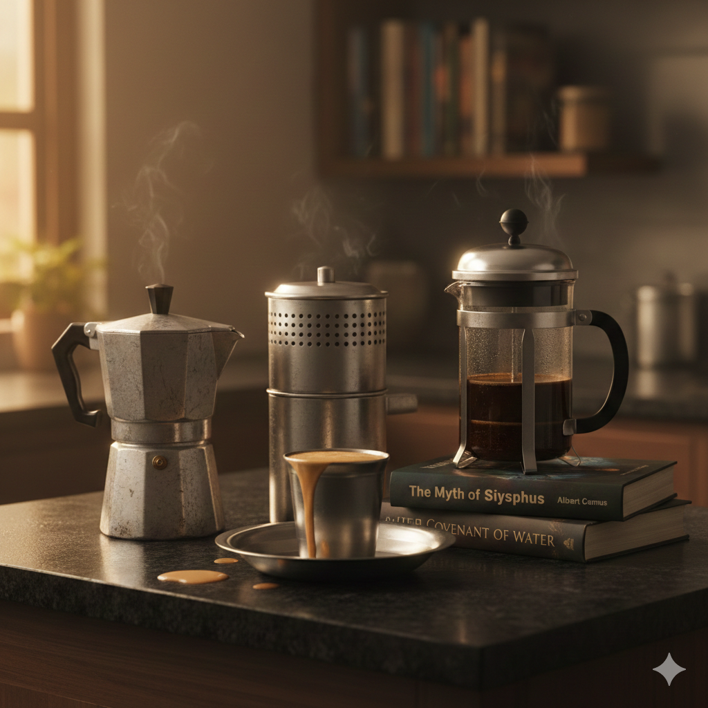

+++
title = "Coffee Connoisseurs"
url = "2025/12/coffee-connoisseurs.html" 
date = 2025-12-19
description = "From the parables of Hindu mythology to the color-coded labor hierarchies of Qatar, this explores the absurdity of the perfect cup. A humorous reflection on South Indian roots, American dreams, and the existential relief found in a disappointing brew."
tags = ["Personal Essay"]
+++

In my stripped down version of a much retold story from the Hindu mythology, *Narada* was a haughty sage proud of his devotion to *Lord Vishnu*, exemplified by his constant utterance of the Lord's name. *Lord Vishnu* claims that his greatest devotee is not Narada, but a measly farmer who utters the Lord’s name exactly once every day before carrying on with his peasantry life. To prove this, he assigns a task to *Narada*: walk a long distance carrying a bowl of milk filled to the brim without spilling a drop. Sage *Narada* achieves this task, only for the Lord to point out that he failed to utter the Lord’s name during his walk. The message I gather from this parable is that it is easy to be devoted when being devoted is your only job. It is hard to do two things well at once. My college canteen in a town in Tamil Nadu served filter coffee in an "*ever-silver tumbler*" and “*davara*” - the South Indian equivalent of a cup and a saucer, but tinier and made of stainless steel. The coffee from the cup overflows into the deep saucer. I used to think of the parable of *Sage Narada* every time I carried my cup of scalding hot coffee to find an empty spot.  I would invariably spill some of the coffee, burn my own fingers, stain my clothes, and mess up the floor. I was only proving Lord Vishnu’s point on being focussed. Or, I was just being clumsy.
  
My first taste of coffee must have been the "*golden coffee*” when I was a kid. A golden coffee is a huge glass of warm milk with plenty of sugar and a drop of coffee “*decoction*” to add color. The decoction itself is a coffee extract made using an inexpensive and simple two-compartment device known just as the “*coffee filter*”. At some point, I graduated to "*filter kaapi*". This was very hot milk with plenty of sugar and a liberal amount of decoction. In large family gatherings, I would wake up groggy eyed and one of my many aunties would force a cup of coffee in my hand. A few minutes later, everyone would have their second coffee. The day began after that. Tamil Nadu, the place I grew up in, is proud of its “*degree coffee*”. The book I am currently reading, *The Covenant of Water* by *Abraham Verghese*, tells me that the word "degree" in that phrase is derived from the fact that the density of milk in coffee was measured using a Lactometer during British rule. Milk is, after all, an essential ingredient of this coffee. I realized many years later that my essential ingredient was, in fact, sugar.

In Qatar, I worked at an Oil & Gas plant, and coffee breaks were at a "porta cabin" pantry managed by two Nepalese guys. It took me a while, but I realized that my workplace had an unsaid hierarchy, a sort of caste system. The system was defined by the color of overalls you wore. Blue was near the top, if you discount Qataris in all-white, since blue indicated that you worked directly for the Oil & Gas plant. My orange attire easily outed me as a contractor, and though I was at a higher rung compared to other colors like red or yellow, I was still below the blues. The intricacies of this system hit me when I happened to enter the pantry on a random day and there was someone very important in the pantry. The younger pantry manager, himself a contractor, quickly hid the milk and coffee from us. Little did I know that contractors were technically prohibited in the pantry. This rule was rarely imposed, and it was generally accepted that contractors are people and they deserved an occasional hot beverage. Gradually, we were starting to notice that things were locked away in cupboards. On some days, our coffee would be missing coffee, sugar and cream, and we will be left with plain hot water. 

Things improved for me when word got around that I was the computer guy, and the younger Nepali once requested my help to print his birth certificate with a minor adjustment to make him seem above 18. He was two years shy of meeting the mark set by an agency that hired him in Nepal for a job in Qatar, for a large fee. I humored him. In return, he would sometimes make me his special coffee that was reserved for Sheiks. Now, this would be a cue to examine the lives of people whose conditions at home are so bad that they are forced to resort to faking their ages, borrowing money, and jumping various other hoops to get to work in a country which is in no way the gold standard for working conditions. However, I will ignore these cues and ramble on about more important things. Like social media engagement. If you ever see someone reacting to my unliked posts announcing a new blog article on Facebook or Instagram, it is probably one of these two grateful pantry managers. They don't open the links to read these posts though, I think. Nobody does.

In terms of total coffee consumption, the US -- my current place of residence -- is the largest coffee consumer in the world. Coffee shops abound, and people frequently buy a cup of coffee and carry them as they commute. Doing everyday things armed with a cup of coffee has been my US dream. Each time I buy coffee with great anticipation though, I am invariably disappointed by my inability to judge if it is good. I once tried shopping at a grocery store with a cup of coffee in one hand and a loaded cart in the other. Thoughts of *Sage Narada* did not distract me, but my tomatoes ended up having a mysterious brown tinge.

I did bring a South Indian coffee filter with me to the US, and have accumulated more since then. With the help of YouTube videos and my mother's approximate instructions, I tried to replicate the perfect South Indian coffee from my childhood. My initial pride gave way to the realization that I was not really enjoying the coffee. Accepting defeat, I fell back to Instant coffee. Never has my dad been more disappointed in me than the day when I confessed that I prefer instant coffee over filter coffee. I still like the filter coffee that my mom makes when she visits us, but I can live with instant coffee. Tangentially, did you know that a regular size coffee filter is exactly the size of a standard kitchen drain in the USA? I discovered this when our coffee filter got stuck inside the garbage disposal unit in an apartment where we lived. After struggling for two days trying to get it to budge, we called maintenance. The whole garbage unit had to be replaced, at a considerable cost to us. For what it was worth though, the maintenance guy good-naturedly mocked me and my mom when he saw us outside for the next few days. "*Had your coffee, yet?*", he would remark. With so many misadventures, I almost gave up on my quest for good coffee. At work, I just grab black coffee. At home, it's usually instant coffee. I need my caffeine as much as the next person, but the form it takes stopped being as important. With all of us progressing gradually towards doom, caffeine helps keep away the horrors around and focuses the brain on the 3 things we absolutely need to do to get through today. Tomorrow will be dealt with by tomorrow's caffeine. 

But I was recently hit with a mid-life crisis. I felt that I deserved to treat myself better and drink decent coffee. This thought, starting with a trickle, has slowly been flooding my brain over the last few years. My online shopping carts started to magically include coffee makers, challenging me to remove them before checkout. You see, I am just a cog in the consumerist machine that is society, and I will not hesitate to throw money at random things to avoid facing real problems. Who is to say that better coffee will not magically fix my life, and end the Syrian civil war? However, good sense has generally prevailed. What probably helped me was that I asked for recommendations from an American friend, and the person I chose happened to care little about taste. He suggested that I buy a cheap French Press and an electric kettle. Getting a French Press meant that I had a coffee machine, and guilt tripped me into not buying another one. It also meant that I was not using it to make coffee on most days.
  
I almost fell prey, and arguably did, to my mid-life crisis this year. I did some Black Friday research with Google Gemini and it convinced me that buying a $400 espresso machine recommended by baristas would get me the perfect South Indian coffee, simultaneously relieving about half a million people from abject poverty. I was one click away from buying it. But fortunately for me, I found another coffee maker for half the price and asked the LLM to compare the two options. Gemini sighed, and explained the difference between an espresso maker and a filter coffee maker like I was a 5-year-old. I realized that I had no idea about anything, and I am not fit to enjoy expensive coffee. Instead, I could learn to make decent coffee with what I have. There should be some scientific method to the madness of using a South Indian filter. As a compromise, I did buy a Moka pot - a fascinating device that works like a pressure cooker to subject coffee grounds to high pressure and make espresso. I did not realize that this device is infamous for requiring precision and being harsh if used incorrectly. Armed with a Moka Pot, a French Press, instant coffee powder, and 3 different South Indian coffee filters, I now have 4 different ways to make coffee. I have been enjoying waking up with excitement everyday and trying to pick a method to make disappointing coffee. This is as good a solution to my mid-life crisis as any other.

I watched a recent YouTube reel that put things into perspective for me. I have been watching so many videos on coffee that the algorithms now show me videos by the coffee expert James Hoffman and other coffee related reels. However, since I have watched so many reels and videos since then – after all, paraphrasing George Carlin, I am a Modern Man, digital and smoke free – there is no way for me to find it again to provide a link. You will have to trust me as I paraphrase the reel. The click-baity title of this reel was aimed at people who judge coffee lovers for picking an expensive hobby, and I was the target audience -- I am human and I judge people who are caught in calamities I barely escaped from. The reel baits us by initially convincing us that it is mocking coffee lovers, only for the narrator to reveal himself as a coffee enthusiast who defends his enthusiasm as a hobby that's worth spending money on. 

Life, in my worldview, has no purpose. Albert Camus's existential philosophy suggested a way out: accept the absurdity of life and find our own purpose to justify our existence. If that purpose is love for coffee, so be it. Based on my experiments with coffee though, I should probably stick with reading arcane books and rambling unread thoughts. I will keep trying to make good coffee, but my time and money will be splurged more on books and courses on writing. Until I discover another hobby, like podcasting.

