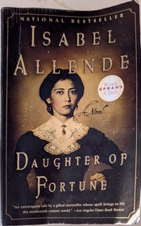

+++
title = "Daughter of Fortune"
url = "2025/02/daughter-of-fortune-allende.html" 
date = 2025-02-23
tags = ["Books", "Review"]
+++

> ..she had fallen in love with love and was trapped in the morass of a legendary passion with no link to reality. 

Before I picked up *Isabel Allende*'s **Daughter of Fortune**, I had a preconceived notion about her writing. The words "*magical realism*" and "*South America*" were in my mind, and I couldn't help but think of **Gabriel Garcia Marquez**. This was a useful reference, for a while. But soon, I realized that the comparison with Marquez is unfair to Allende, and I constantly had to battle against my presumption as I read this book.

*Daughter of Fortune* is, distilled to its essence, a coming of age story of its protagonist: *Eliza Sommers*. It is also a historical fiction set, for the most part, in early to mid-nineteenth century Chile and California. The novel begins exotically with the words "*Everyone is born with some special talent, and Eliza Sommers discovered early on that she had two: a good sense of smell and a good memory.*" Found abandoned outside an English home in Chile in 1832, Eliza is raised as an adopted daughter of the *Sommers* family. She is trained with Victorian etiquette towards the sole purpose of getting married respectably. But Eliza falls in love, and goes on an adventure that puts her in the middle of the California gold rush. Isabel Allende uses this setting to describe the external and internal transformation witnessed by Eliza in her journey.

## Chile

>"This is a land of thieves. Nowhere else in the world does the company spend so much on safeguarding the merchandise as here. Everything gets stolen, and everything we save from the rabble is soaked by winter floods, scorched in summer, or smashed during one of their ungodly earthquakes."

The novel begins in Chile -- with "*wild geography of imposing mountains, clifflined coasts, fertile valleys, ancient forests, and eternal ice*" -- and is immediately engrossing. Chile is also described as the “*most intolerant country in religious matters of any on the American continent.*" We are introduced to the Sommers family. The breadwinner, Jeremy is the sort of man who would go "*stiff just shaking a human hand, and the thought of more intimate contact sent him into a panic.*" His brother John is a sailor and a captain, and his travels make him the most liberal of the lot. "*Had I known, Mr. Todd, that you were coming to preach the designs of a tyrannical god among those good people, I would have thrown you overboard in the middle of the Atlantic*", he remarks, the tyrannical god being Christ and the good people being the native Indians of Chile. The most dominating of the siblings is Rose. Due to a past affair, "*her chances of making a good marriage was minimal*". She does not let this come in the way of being central to the social circle she builds. When Jeremy suggests that it is "*a man's nature to be savage; it's a woman's destiny to preserve moral values and good conduct,”* she responds with "*you and I both know that my nature is more savage than yours*”.

>This was a national characteristic in Chile, where hospitality was manifested by forcing one's guests to drink and eat beyond the bounds of human endurance. 

While the Sommers instill Victorian morals into Eliza, their maid *Mama Fresia* -- a Mapuche Indian woman -- counters with some practical wisdom. Mama Freisa also teaches Eliza skills that will serve her later. And, she acts as Eliza's most trusted confidant in Chile when Eliza runs into trouble. We also meet other characters - *Jacob Todd* is an agnostic bible salesman who lands in Chile with little knowledge of the country. He is there having made a bet to sell Protestant bibles in any part of the World, and luck puts him in the proudly Catholic country about which he knows nothing. "*He imagined a Chile as warm and humid as India because that was what one expected of poor countries*", the narrator tells us, when Todd is surprised by how cold Chile is. Todd has liberal ideas, but his high-mindedness comes into conflict with his personal corruption and a self-serving nature. Don't we see such people all the time in our own world as we descend into fascism? We then meet the idealistic *Joaquin Andietta*, whose "*calls for justice were lost at the mercy of the wind and human indifference.*" Joaquin causes Eliza's pivot into a transformative journey.

## China
> "It isn't cruelty. It's just that human life is not valued in my country. There are many, many people, and there are always more children than the family can feed."

Daughter of Fortune forays briefly into China to introduce another major character. Born a nameless fourth son, Tao grows up as “*a happy child who laughed over nothing, but he also had an unusual ability to concentrate and a keen curiosity for learning.*" China is described as an equally conservative society. Women are valued only for their lotus feet, and men see women as inferior. Even as China gets humiliated in the opium wars by the imperialistic British, there is a sense of superiority over foreign cultures. Tao Chi'en escapes poverty mostly through luck. His curiosity is his dominating trait, leading him to join Eliza on her journey. Tao's tranformation is more gradual compared to Eliza's.

## America
> Here men are proud, with no one above them but the sky overhead; they bow to no one because they are inventing equality.

The latter half of Daughter of Fortune is set in and around California. Just 8 days after a war with Mexico which ends in the US's purchase of California, gold is discovered. People flood from all across the World, and we learn that many natives of Chile, being expert miners, were uniquely positioned to be drawn to this bustle. "*Bachelors were the first to set sail; soon married men were leaving their children and starting off without a backward look, despite harrowing stories of obscure illness, disastrous accidents, and brutal crimes. The most peaceful men were ready to confront dangers of pistols and knives, the most prudent abandoned the security won with the years of daily struggle and threw themselves into the adventure with their carpetbags of illusions.*" 

In Allende's writing, the USA is both good and bad. It is the land of possibilities and opportunities, but also a land where "*property was much more valuable than life*". The contrast is even more profound when seen from the perspective of one's privilege in their native land. Tao, despite his dire circumstances in his home country, glorifies his native land and customs. It takes him a long time to move out from the circle of his own countrymen. Eliza, on the other hand, marvels at "*the openness, the freedom, and the ostentation of that young society, exactly the opposite of the hypocrisy of Chile.*" Daughter of Fortune expands from the narrow scope of its central characters to describe the fast-paced growth of California, while still keeping focus on the humans "**chasing yellow dust and illusory love*".

## Verdict

Daughter of Fortune is fast-paced and adventurous. It is ambitious in scope with diverse characters and two major geographical locations. The description of the effects of the California gold-rush seems well researched. We see men "*turning the world upside down, moving mountains, diverting rivers, destroying forests, pulverizing rock, displacing tons of sand, and digging monumental pits.*" On the flipside, I felt that it is unfair to classify Daughter of Fortune as magical realism, as there is not much magic here. I also felt that it missed out on exploring some very interesting characters. We see a momentary glimpse into Jeremy Sommers's loneliness, and we see glimpses of his brother John's open-mindedness. We learn about the eventful affair that changes Rose for good. However, we don't delve a lot into these characters. I wonder if Allende compromised on some characters to keep the novel fast-paced. I would have loved to learn more about Joaquin Andietta as well, but the choice Allende makes here seems more deliberate. Despite these minor gripes, I would recommend Daughter of Fortune. It is a fast-paced romance set in a historical era that's ripe with possibilities.

## Love in the time of a gold rush

As a postscript, since I did confess to being unsuccessful in comparing Allende's work with Marquez's, bear with me when I briefly pursue this line further with a purely thematic comparison of Marquez's *Love in the Time of Cholera* with *Daughter of Fortune*. Both novels have teenagers suffering an all-consuming first love, causing families bound by traditional values scorn at the class difference and discourage the romance. The teenagers in both stories exchange passionate letters which more than compensates for their dumbstricken nature when they are together. Distance separates the lovers. The protagonists, however, are in no mood to give up. *Love in the time of Cholera* focuses on the love itself. Arguably, Marquez's work suffers from a male gaze, and the protagonist's morality is questionable. *Daughter of Fortune*, on the other hand, is written with a feminist eye. Unlike Marquez's protagonist, Allende's protagonist realizes that there are other kinds of love in life, and that there is more to life than love.

