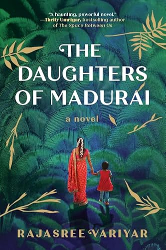

+++
title = "The Daughters of Madurai by Rajasree Variyar"
url = "2025/10/daughters-of-madurai-variya.html" 
date = 2025-10-26
tags = ["Books", "Book Review", "Indian Literature"]
description = "TBD"
+++

> “.. some things are not important to tell. And even .." she hesitates. “Some things that you shouldn't tell. The past is gone, no?" 
> 
> *Janani* in *The Daughters of Madurai*

*The Daughters of Madurai* by *Rajasree Variyar* is a very eye-catching book. Its cover is dark green with illustrations of palm leaves, and depicts a woman draped in a saree, her head adorned with Jasmine flowers, walking with a girl child who is presumably her daughter. The pages are embossed on the sides with a shade of green too. I have been to the historic town of *Madurai* in *Tamil Nadu* only twice, but I was captivated by the title and attracted to the book as soon as my eyes caught it. It is, after all, a comforting feeling to read a book in English as a non-native speaker and still be able to resonate with the little things the characters do in their life: eating a dosa, humming to the tune of an *Illayaraja* song, or bargaining at a vegetable shop.

However, relating to anything Indian as an Indian is seldom guaranteed. I had alluded to this in [my review](https://www.thefreudiancouch.com/2017/09/review-of-sujatha-gidlas-ants-among.html) of *Ants Among Elephants* by *Sujatha Gidla*. Rajasree Variyar agrees, for in her afterword to her novel she remarks "*\[r\]ather than a homogeneous entity, India has thousands of cultural, religious, and linguistic groups–indigenous groups and those that are influenced by wave after wave of invaders, migrants, and traders over thousand of years*". *The Daughters of Madurai*  is set partly in Sydney and mostly in Madurai. It shifts between a contemporary timeline and the early 1990s, and the protagonists are *Nila* and *Janani*. The former is trying to find her roots, while the latter is trying to erase the memories of her past. The two desires collide as they are both forced to return to *Madurai*. While *Ants Among Elephants* is a biography that depicts the brutal struggle of the powerless who get trampled by the comparatively privileged, *The Daughters of Madurai* is an ambitious fictional account that attempts to tackle a weighty issue -- female infanticide -- but falters due to its inauthenticity.

> It took me a long time to realize that that life, that place, must hold something too painful for her to ever return.

The first person contemporary narrative is from the perspective of Nila. Nila is searching for the right opportunity to open up on her romantic partner to her parents. She hesitates because of her mother, who loves Nila so much that the latter feels stifled. It does not help that the mother, *Janani*, is secretive about her past. No amount of probing causes Janani to open up. She is, in the words of Nila, the *"\[m\]ost resolute, persistent, bull-headed person I've met"*. Nila's mother is Tamil, but her dad is a Malayali. The dad is depicted as the pinnacle of goodness. He is in fact so good that he gives the impression of being less a character and more a counterbalance to *Variyar*'s narrative on the struggles of a woman in a patriarchal society. In the earlier timeline, a character called *Darshan* is depicted as a *"a gormless, apathetic fool"* who rarely stands up for his wife. His mother, on the other hand, is *"an evil bitch of a woman, scarred and twisted"*. The implication is that that the evils of dowry system and female infanticide is often perpetuated more by the system's former victims who are now its enforcers. Among the other characters, two spinster women from different strata of the society who live life on their own terms stand out. Kamala is a midwife who has the unnerving quality of being at the right place at the right time. Priya is an upperclass woman who is self-sufficient and generous to a fault.

*Variyar* has put in a lot of research, and it shows. For example, I learnt that Madurai is also known *Kadambavanam* due to the prominence of *Kadamba* trees. When a character mentions a Bollywood movie in 2019, it is *Ek Ladki Ko Dekha Toh Aisa Laga*, whose plot dealing with a closeted lesbian is relevant to the novel. We see references to Tamil movies and songs that were in vogue. As the backdrop of The *Daughters of Madurai*, alluring to its characters, is the many centuries old *Madurai Meenakshi Amman* Temple, which enamors the characters. We see a character remark about the presence of "*\[r\]ock temples older than Christ in an unknown place*".

This level of detail in *The Daughters of Madurai* has the unintended effect of highlighting its flaws, and there are some glaring ones. For example, *Janani* is shown addressing her mother-in-law a couple of times as *mamiyar*, which is the literal translation from English, but a word that one never uses in addressing their mother-in-law directly. *Janani*'s family, we are told, is from the *Kallar* caste. But we never see them consuming any meat, and they frequently cook *aviyal* - a coconut based dish made of vegetables that is seen as a luxury. Tamil characters refer to God as "*Bhagawan*", which is the Hindi/Sanskrit word for God. They occasionally use the word "*Iraiva*", which is Tamil, but more formal and rare in everyday conversations. When a character drives an expensive car in a low-income neighborhood in the 1990s, when cars were a rarity in India, nobody bats an eyelid. This is justified with a statement to the effect that there was a lot happening around in the streets. A justification that betrays the author's non-nativeness. A car entering the exact street in 2019, on the other hand, attracts the attention that one would expect. 

Occasionally Rajasree Variar ventures into political commentary. There a couple of lines about the Chief Minister of Tamil Nadu, *Ms. Jayalalitha* and her "*Cradle Baby*" scheme, where the Government publicized a way to give away unwanted girl children for adoption. But these throw-away lines are not well-developed. A remark uttered on the *Babri Masjid* demolition comes from a character who shows no political acumen before or after, making it feel like an after thought added by the author.

This is not to say that I did not enjoy *The Daughters of Madurai*. The emotional theme dealing with a family that discovers secrets about each other and become stronger in the process resonated with me. A resolution among an extended family is symbolized through a late night game of carrom board, and a conversation at the end of this game between *Nila* and *Sanjay* 
moved me more than I will confess. Janani's character arc is impactful, and we see that her strength as a mother is derived from her suffering. Her children walk the tightrope between lashing out at her for not being honest and offending her. "*Amma looks as though I've slapped her, and the expression on her face, eyes wide, lips parted, melts my irritation into guilt in one breath*", remarks Nila. *The Daughters of Madurai* shines when dealing with more universal themes.

I struggled with *The Daughters of Madurai* because I had to second guess myself in the first few pages. The book holds a  mirror to the society that contributed to shaping my own World view. And I couldn't help compare it, unfairly, to *Ants Among Elephants*. But it is valid to compare my reactions as a reader to both books. *Sujatha Gidla*'s work is an insider picture of a society that tramples, consciously and otherwise, the less fortunate. *Rajasree Variar*'s work is authentic in depicting India through a second generation Indian's eye, but it reveals itself as an outsider's account when dealing with a lower-income class Tamil family.

 [Ants Among Elephants](/2017/09/review-of-sujatha-gidlas-ants-among.html) · [The Illicit Happiness of Other People](/2014/09/the-illicit-happiness-of-other-people.html) · [The Ministry of Utmost Happiness](/2017/06/review-of-arundhathi-roys-ministry-of.html) 

