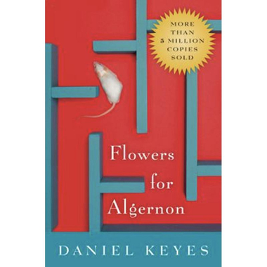

+++
title = "Flowers for Algernon by Daniel Keyes"
url = "2025/08/flowers-for-algernon-daniel-keyes.html" 
date = 2025-08-18
tags = ["Books", "Book Review", "Dystopian", "Science Fiction", "Classics"]
+++

> Who's to say my light is better than your darkness?

> Before, they had laughed at me, despising me for my ignorance and dullness; now, they hated me for my knowledge and understanding.

## Overview

I have my own term for a genre of novels that were written in the early to mid 20th century. I call these books *"concept novels"*. These examine the philosophical implications of a concept in the author's mind, letting everything else be in service of this central idea. They usually work well as science fiction or dystopian novels - genres blanketed together as speculative fiction. Apart from a veneer of scientific themes, they also rely on Jungian and Freudian psychology. Think **1984**, **Brave New World**, or **Fahrenheit 451**. 

**Daniel Keyes**'s extraordinary **Flowers for Algernon**, published in 1966 as an expanded version of his own short story fits my made-up genre. It examines intellectual disability - the book refers to it as *"mental retardation"* -- and society's treatment of people who fall below the average intellect. *Flowers for Algernon* also follows another template - the Greek tragedy, explored through a rise-and-fall arc. Charlie's transformation, though, is due to factors completely out of his control.

# Plot

> I dont care so much about beeing famus. I just want to be smart like other pepul so I can have a lot of friends who like me.

*Flowers for Algernon* begins with the lines *"Dr Strauss says I shoud rite down what I think and remembir and evry thing that happins to me from now on."* The spelling is deliberately bad because the book is narrated in the form of a journal written by *Charlie Gordon*. Charlie is a low-IQ individual who works in a bakery. He desires being smart though, and attends *"Beekman School for retarted adults"*, which teaches "*reeding for slow adults*". Ms. Kinnian, a teacher at the school, recommends Charlie for an experimental technique to increase IQ, a technique that has proved successful on a mouse called *Algernon*. Gradually, Charlie responds positively to the treatment. The novel dives into the question of if Charlie gets what he wants, and if what he wants is actually what he needs.

# Narrative style

Daniel Keyes's brilliant narrative style of a journal written by a protagonist undergoing massive internal transformation allows him to tell a story just through the structure of the novel. Charlie starts out with a limited vocabulary, bad spelling, and limited perception. We see a gradual change in the tone of his voice as he undergoes treatment. As Charlie's IQ rises, he is more perceptive. This is evident just from the style of his prose. We also slowly start glimpsing into Charlie's childhood through his memories and nightmares. These are the most impactful parts of the novel. When the older Charlie recollects his memories, he is disembodied from his younger self who he describes in third person, indicating Charlie's own disconnect with his past, which becomes a major plot point. 
# Characters

 In tragic stories such as these, we usually have an abusive father making things worse. *Daniel Keyes* reimagines this trope -- Charlie's mother *Rose* gets the role of the mentally and physically abusive parent. Rose is obsessed with how society views her and her special child. There is also a hint of Rose's love for Charlie before the birth of his sister Norma, and the lack thereof after her birth. The most impactful moment in *The Flowers for Algernon* for me is a scene where Rose warns Charlie not to pee in his pants and he does so nevertheless. As a parent myself, the description of young Charlie's thoughts are affecting. His father, Matt Gordon, seems more accepting : *"It's not fair to us or to him. Pretending he's normal. Driving him as if he were an animal that could learn to do tricks."* However, we also get the impression that the father is not present, leaving Charlie's mom to deal with everyday complexities of raising a special child. When things get uncomfortable, Matt just steps away, leaving Charlie to deal with consequences. This might explain Charlie's lack of feeling towards Matt when he eventually goes in search of his father.

The scientists and academics who treat Charlie are also portrayed realistically. In Charlie's eyes before his treatment, they are extremely smart and selfless people. But as Charlie grows in awareness, he realizes that people around him are acting largely out of self-interest. He sees the academics as showmen hawking their invention - *"A mouse and a moron turned into geniuses before your very own eyes!"*. Like with every other character in the book, Charlie eventually becomes sympathetic towards them. As someone says of the lead researcher,  *"he's just an ordinary man trying to do a great man's work, while the great men are all busy making bombs."*

Apart from Rose, there are only two other female characters of notice. Ms. Kinnian plays Charlie's mentor as long as he needs one, and his romantic interest later. Charlie also runs into *Fay* - a stereotypical liberal artist who seems to be around only to resolve a specific plot point. The characterization of the women seems rudimentary, but there is a moment in the book where Ms. Kinnian indicates that she is weighing the consequences of a relationship with Charlie because she needs to be considerate of her feelings. This may not be a lot, but to me, this moment indicates an awareness on Daniel Keyes's part. As Charlie says to himself in relation to another character, *"I passed your floor on the way up, and now I'm passing it on the way down"*.

Algernon is Charlie's doppelgänger, and foreshadows Charlie's fate to both the reader and Charlie. Charlie is initially jealous of the mouse that consistently beats him at various puzzles. However, he eventually sympathizes with the creature who has as little say in his fate as Charlie. However, what makes Charlie humane is his realization that *"Although we know the end of the maze holds death.. I see now that the path I choose through that maze makes me what I am"*.

Charlie himself comes across as sincere. His selflessness in using his acquired gifts to try and help society could even be seen as too idealistic. However, Daniel Keyes gives us a moment of perversion that makes Charlie doubt himself, and this is left open ended. I loved the author's willingness to provide us something to ponder about. After all, it is too easy to judge the family of someone with a special child. The moment could explain his mother's harsh treatment of Charlie.

> I've discovered that nobody really cares about Charlie Gordon, whether he's a moron or a genius
# Themes and verdict

Charlie Gordon is seeking one thing - love. He wants his mother to love him, and he wants friends. His journey in *Flowers for Algernon* is his quest for love, and his realization that being at either extreme of intelligence causes people to dislike you for no fault of yours. As someone tells him early on, *"The more intelligent you become the more problems you’ll have, Charlie. Your intellectual growth is going to outstrip your emotional growth"*. 

Through Charlie's journey, Daniel Keyes has done a brilliant job on how society used to treat, and still treats, people with learning disabilities. The author also touches upon the role religion has to play in how others view Charlie when a random character remarks to Charlie at one point : *"If you'd read your Bible, Charlie, you'd know what it's not meant for man to know more than what was given to him to know by the Lord in the first place"*.

There are very few false notes in *Flowers for Algernon*. Like the best of novels, *Flowers for Algernon* is profound, impactful and unforgettable. I would not hesitate to recommend this book.

