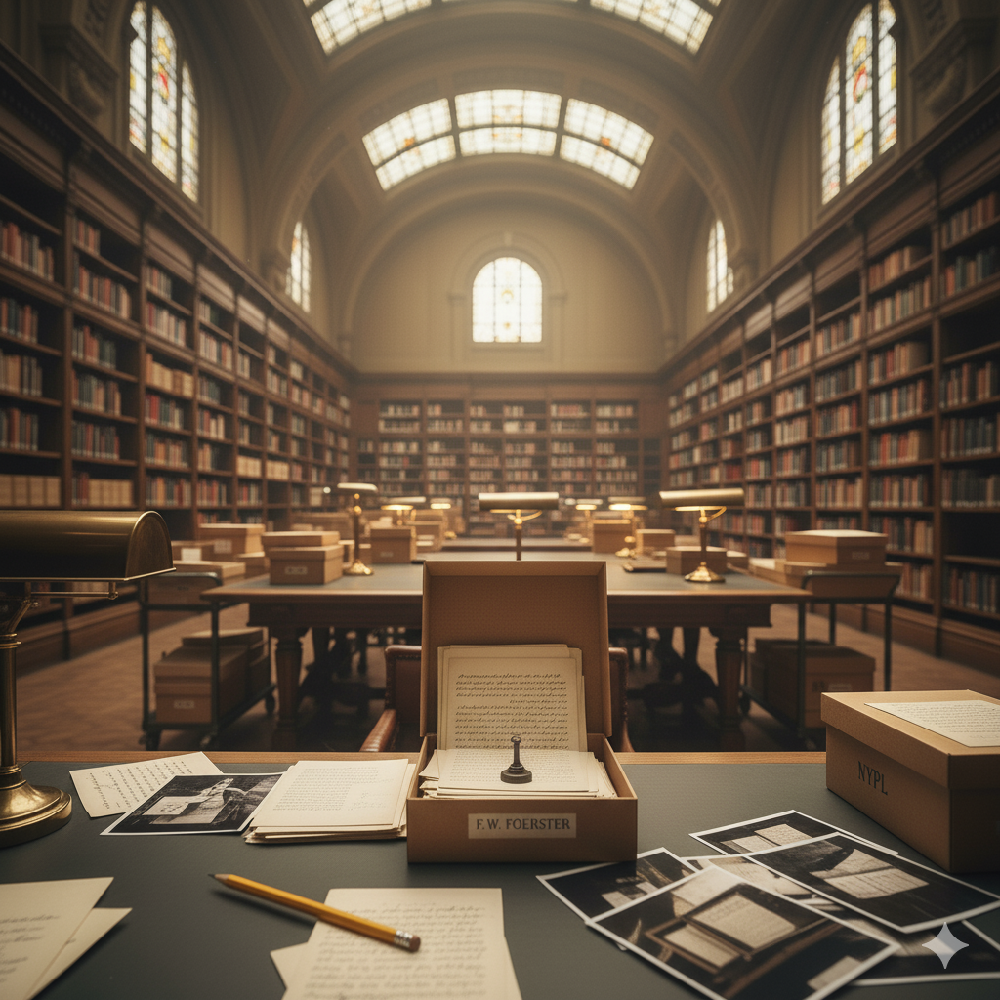
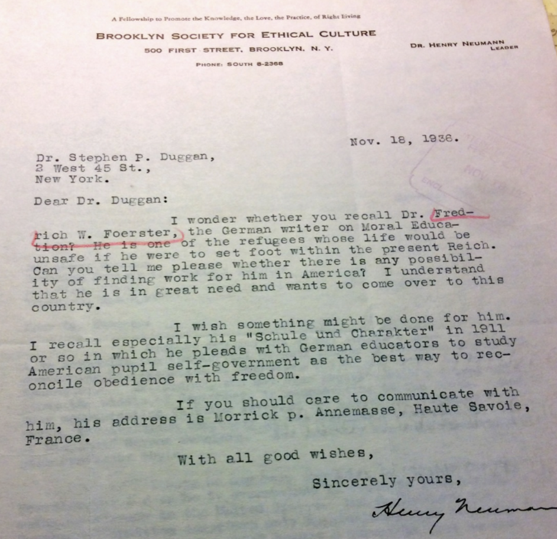

+++
title = "Libraries and refugees"
url = "2025/10/libraries-and-refugees.html" 
date = 2025-10-05
tags = ["Personal", "Libraries", "Books", "Nostalgia"]
+++

I remember my school library visits when I was about 12 years old. The book shelves were inviting and packed with books that I wanted to get hold of. However, these book shelves were usually locked. We had one *"library period"* every week. My friends and I would line up and walk to the library, and find our seats around a humungous table. Each of us would be handed a random magazine or a newspaper. Instead of reading, most of us played made-up games with the kids sitting across the table.  If our librarian felt generous, he would sometimes allow us to check out a book. But he would randomly pick some books and distribute them to us. I usually ended up with a non-fiction on a topic I had zero interest in. I would return the unopened book a week later. The library had a good collection of subject books too. As a 14-year old, I figured out that displaying an exaggerated deference to my Librarian would allow me the privilege of checking out a few subject books. I did not hesitate even a tiny bit to bend to authority if it offered an easy way out.

Unlike me, *Friedrich Wilhelm Foerster* did not bend to authority. Foerster was multifaceted - a Philosopher, a political commentator, a teacher, and an educationist. He was born in *Germany* in 1869, and was a prominent critic of militarist tendencies of *Otto von Bismarck*'s policies and the growing hyper-nationalism in Germany around the First World War. So much so that in 1922, he was forced to resign his University position and flee the country to Switzerland. You see, this thing we call *"cancel culture"* has always existed. It is arguably worse when people in authority *cancel* you than when some random netizens do, but historical events are cyclical in nature. With the Nazi party's rise to power, Foerster continued his criticism from France, which had granted him citizenship. But in the 1940, Germany took control of France. Foerster must have foreseen this, for he had already identified a new destination for his continued exile - the USA. In 1940s, he was working hard to acquire a visa to the USA.

About six decades later, when I first came to the USA, I realized that things were not always what I expected. It is hard to visualize a country so different in so many aspects from where I was born, and no one had even attempted to explain one of the most amazing aspects of the USA - *Public libraries*. I must have been an early teenager when I first experienced my first real library. I was visiting my cousins in *Trichy*, *Tamil Nadu*, and one of my cousins extolled an amazing library that she was a member of. I didn't think too much of it, until we visited this library. In retrospect, it was a standard lending library you find in India where you pay a deposit for membership and then pay a little for each book you borrow. But back then, I was stunned by the sheer number of options we had to pick from. *Enid Blyton*; *Tin Tin*; *Hardy Boys*; *Nancy Drew*; *Asterix and Obelix*. It had everything to satisfy me at that age.

In Chennai, where I lived, lending libraries were far away from home. I was in high school, an age where I could bicycle to them, when my friends and I became members of a couple of libraries. The first had books in pristine condition, but the choices were limited. The second had books that were damaged, missing covers, or even worse, pages. I once had the misfortune to read a Hardy Boys novel borrowed from this library, only to realize that the exact page that revealed the identity of the murderer was missing. But the librarian here was wonderful. He suggested a progressively more challenging set of books that encouraged us to grow as readers. You should progress from *Hardy Boys* to *Alistair McLean*, move on to *Robert Ludlum* and then to *Frederik Forsyth*, he would say. In response to his generosity, or possibly due to it, my friends discovered that he didn't notice (or care) if some books went missing from his library. They stole books by hiding them in their shirts. We were teenagers, and we were only executing our assigned role of correcting the kindness of others too well. We were perfect cogs in the machine that is society.

In the USA, the librarians somehow continue to be kind. One might say that the cogs are not well-oiled these days, but I won't. In our initial days here, my wife and I did not have a car. And if you haven't been to the USA, it is hard to fathom how limiting it is in most parts of USA to not have a car. It was not too bad for us though. If we wanted to do something fun, we could take a bus and a train to New York City. This would be a day trip and involve some planning. Alternatively, we could decide impromptu and walk a few miles to the local public library. It suffices to say that my wife and I are not great at planning, so we often ended up at the Plainsboro Public Library in New Jersey. The library was packed with books. But it was also a cultural center with an active community. Among others, the library hosted book clubs, cultural celebrations, and a *"Socrates Club"*, where I pretended to be a philosopher and met some broad-minded people trying their hardest to make sense of the world. Having access to this library made this the most productive year for me in terms of the number and variety of books I read. 

Every town I have been to in the USA has had a welcoming library. A membership from any of these libraries gives access to physical books, magazines, and various online resources such as learning courses, movie streaming services, audiobooks, e-books and more. You can borrow arcane things such as reading lights, board games, DVDs of forgotten Bollywood movies, and passes to museums. Once, my wife and I attended a beginner's lesson in *Ukulele* at a library in Massachusetts, only to be worried sick the next few days, for this was at the very beginning of the COVID pandemic. Fortunately, the session was not long enough to infect me with the virus or an aptitude to music.  A recent habit I have developed is checking out physical copies of the excellent *The New Yorker* magazine. I can now read long form articles without stopping to browse Instagram or Reddit. In theory.

My high productivity in terms of reading during that year was also because I had quit my job and had a long gap before I enrolled in a graduate course. I became busier once my course started. Eventually, I discovered a professor who held an honorary post in my University. This professor is the author of some ground breaking ideas, and has collaborated with some of the greatest brains in mathematics and statistics. However, by the time I met him, he was too old to care about what others considered important. His courses were arcane - say, the *History of Probability* -- and designed to discourage more than 5 students from signing up. Of course, I immediately wanted to assist him in his research. After all, I gravitate towards things that do not provide concrete benefits to my career. As part of my role as a Research Assistant, my professor once offered an assignment to me. He wanted me to visit the *New York Public Library*'s (NYPL) archives to comb for any mentions of a person's mathematical contributions. My subject was, of course, *Friedrich Wilhelm Foerster*.

I had been to the imposing NYPL building only once before, and as a tourist. I had perfectly played this role by quickly walking through the building, taking pictures, keep an eye on my watch to see if I would make it to the next tourist trap in time, and generally being noisy and disturbing the visitors who were at the library to -- can you believe this -- read. This time, I had to write an email to the archive department beforehand stating my purpose. I was assigned a temporary library card that would be ready for me before my visit. When I entered the library, I was viewed as a student and a researcher, which meant that I was treated like royalty. After a crash course on how not to destroy delicate documents that have been preserved for decades, I was examined for dangerous weapons such as pens, and let in. I was also handed a sharpened yellow pencil - half a pencil to be precise - that had the words NYPL embossed on it. I am pretty sure that this pencil is still lying around in my house even as I write this. An archivist brought me one box of materials at a time, and I peeled the papers from each other with care. As I attempted to decipher the contents, I found Foerster's cursive hand the hardest to understand. This despite a life spent reading my own terrible handwriting. I spent the whole day attempting to find any mention of Foerster's contribution to Mathematics without success. I did take a bunch of pictures of the letters, but my journey had not been fruitful.

Or maybe, it was. The materials in my hand were correspondences from and about Foerster. It started with Foerster's European friends vouching for him and requesting a role for him as a lecturer. These requests were reviewed by an *"Emergency Committee"*. The committee deliberated on their decision. *"I know about Mr. Foerster's fine career but he is now sixty-eight years old. We have reorganized our lecture system in a manner that would absolutely prevent any possibility of his undertaking this"*, said the Director of the committee in a letter. Mr. Foerster himself pleaded his case, prefixing his plea with the words: *"It is very difficult to make propaganda for myself. But the present circumstances allow no other way."*

Even back then, some Americans wanted only the "*best*" and the "*brightest*" people from elsewhere inside the country. The modern addition is, of course, the *"richest"*. Despite the immense scrutiny, Foerster was eventually allowed into the country. He spent his time as a traveling lecturer, teaching Christian theology. His writings transformed into pleading for little grants that would help him meet his expenses. Here was a man who had escaped the German tragedy of death and persecution, only to suffer, albeit briefly, the American tragedy of hunger and poverty. 

Sitting in the quiet room with a treasure trove of materials that represented the struggles and success of individuals, I couldn't help but reflect on my privilege to access this information. By extension, I also couldn't help but reflect on the privilege of others who were born with an easy access to such a library system, but do not consider it a privilege. Maybe we should visit libraries more often. Maybe that will teach us when it is okay to bend to authority and when it is not.

