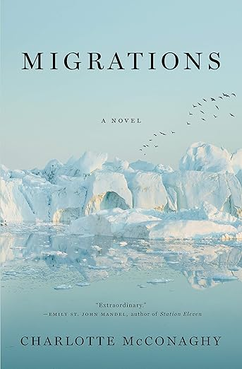

+++
title = "Migrations by Charlotte McConaghy"
url = "2025/09/migrations-charlotte-mcconaghy.html" 
date = 2025-09-19
tags = ["Books", "Review"]
+++

> If I were capable of staying any place, it might be here. But the birds won't stay, and neither will I.

In an early scene in *Charlotte McConaghy*'s *Migrations*, the lead character Franny Stone spots a man outside a pub in Greenland. The man seems to unwittingly walk into an ice-cold fjord. Franny instantly plunges in to rescue the man. She drags him out, only for his shocked response: *"I was only taking a dip to sober up!"* This scene encapsulates Franny's character. She is a savior, and someone who would selflessly brave unforgiving conditions to achieve her goals. But she is also imperfect.

## Plot

*Migrations* is set in a dystopian world in some future time period. Human activity has caused the extinction of many species of birds and animals. Wolves are almost extinct and the crows are gone. The ocean is bereft of fishes. There is only one known colony of Arctic terns: birds famed for the distances they migrate every year. These birds fly an estimated annual distance of more than 70,000 kilometers from the Arctic coast to the Antarctic coast and back. 

Franny Stone is seeking help from the man who walked into the fjord to follow and study these terns. The man is Ennis Malone, the captain of a fishing trawler in a time when fishing is neither viewed favorably by the public nor profitable. She convinces Ennis, despite her distaste for people of his trade, and joins his suspicious crew. As her journey unfolds, we learn more about her troubled childhood, her passionate love, and her reasons for embarking on this perilous journey.
## Themes and characters

I was introduced to McConaghy's writing through her *Once There Were Wolves* (August, 2021), and having now read her *Migrations* (March, 2021) as well, I feel there are thematic parallels between the two works. Humans are causing irreparable damage to the ecosystem. Scientists are doing the best they can to salvage what's left. This attempted resistance, however, has an economic impact on working-class men and women. The protagonist gets to know some of these people, sees the world from their eyes, and makes them sympathize with her perspective. After all, these people are victims of circumstance as well. In such a setting, Charlotte McConaghy anchors her novels around love and affection. Her books fall under the emerging genre of climate fiction, or *"cli-fi"*. They pivot around the conflict between humanity and nature.

 *Migrations* is metaphorical. Franny is like a migratory bird -- she likes home, but she also hates being caged and needs space to fly away. She grows up in Australia and Ireland, and a significant part of her backstory involves her attempts to find her roots. *"Because one thing was clear to me from the start – I didn't belong."* There are other metaphors as well. Franny is compared to a Scottish mythological creature called [Selkie](https://en.wikipedia.org/wiki/Selkie) that is part seal and part human. She is, like a Selkie, both helpful and harmful to the people around her. Folk legend has it that a man once convinced a Selkie to marry him. She did. However, she kept longing for the sea and eventually abandoned her husband and child. This legend mirrors Franny's own story. *"\[i\]t isn't fair to be the kind of creature who is able to love but unable to stay"*.

The man she marries is Niall Lynch, an ornithologist. Niall has *"dedicated his life to the questions by which others are dwarfed*". He is in many ways the opposite of Franny. Their common passion is birds. He approaches things scientifically while Franny trusts her instincts. More akin to Franny is Ennis Malone. He is defined by his single-mindedness. 

Mental illness is a subtext throughout *Migrations*, but the novel does not grapple with it head-on. As a character in the book observes, Franny seems to be someone *"who suffers a quality that can damage their lives and those of the people around them."* She is never shown to be medically diagnosed, but her actions, especially towards her husband, seem questionable at times. It is not clear if the author is deliberately making a choice to portray her this way.

# Verdict

I loved *Once There Were Wolves* and how cleverly it mixed genres and themes to create a cli-fi novel that is also a murder mystery, while deftly dealing with themes such as abuse. My expectations that *Migrations* would be something similar were likely misplaced. *Migrations* is more poetic, and focuses less on the plot and more on the human-nature conflict. McConaghy is a lyrical writer. She makes use of tropes from mythology and romantic novels to establish her plot. This allows the author to focus on what she does best, describe nature in words like *"Galway where the changing light leaches the blue from the water and drapes it over the long grass."*

*Migrations* hinges on the romance between Franny and Niall, but this romance did not work for me. We don't see a lot of moments between Franny and Niall, and some of what we see makes us wonder why Niall does not suggest that Franny get professional help. For a woman with great agency on a lot of things, Franny seems resigned to some of her behavioral traits, and hints that they are determined by her troubled familial history. From Franny's perspective, Niall's conviction that *"it's a fool who tries to protect a creature from its own instincts"* seems to explain why she thinks of him as home.

Franny and Ennis are both relentless in their pursuit of what they want. They are both driven by a feeling of guilt. However, Ennis's reason as to why he is stuck in a dying trade when he says *"\[i\]t's the one thing I am good at. There has to be some way to be a father and a good man, and still be me"* does not seem convincing enough. The dialogues, too, feel contrived. Here is an example:

> "Why are you talking to me?" I ask eventually.
> Ennis glances at me. "I'm taking pity on you."
> I roll my eyes.
> The horses thunder by, a storm of sound. Two tails of red hair stream out behind them, tangled with the dark manes of the animals.
> "The fish will come back," Ennis says abruptly.
> "No, they won't. Not while humans are here."
> "There are always cycles---"
> "This is mass extinction, Ennis. They're not coming back."
> "Why do you do this to yourself?" I ask him. "It's like punishment. Why?"
> "Because there's nothing else. There's nothing else for me."

The conversation begins with an attempt to avoid the reader's question on why the conversation is happening. And then it talks about two disconnected things in a short interval. The two characters travel together through the novel, but don't have too many conversations with each other. As a result, it seems like the author is cramming a lot of information in these little moments.

*Migrations* is great at showing us the stunning landscape most of us would probably not experience firsthand, and is steadfast in conveying its central theme. However, it feels short on drama to hold it together, despite the author's attempt to touch upon various subplots. Overall, I am still a fan of McConaghy's writing and her thesis. Her writing transports us to gorgeous locations that are not always accessible, and she beseeches us to examine the impact we have on the world around us.

> A life’s impact can be measured by what it gives and what it leaves behind, but it can also be measured by what it steals from the world.

