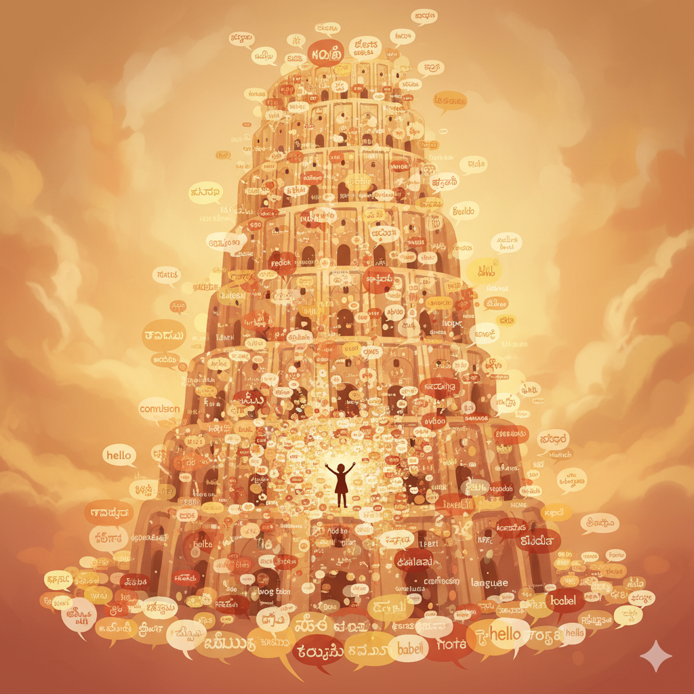

+++
title = "Mother tongue and other tongues"
url = "2025/10/mother-tongue-other-tongues.html" 
date = 2025-10-01
tags = ["Personal", "Liberalism"]
+++

Many, many years back, I was traveling in a public bus in my home state of *Tamil Nadu*. The state derives its name, and its identity, from its language: *Tamil*. I overheard a fellow passenger discussing a short film script over the phone. I am not extroverted by any means, but these were the days when I nurtured ambitions of becoming a screenwriter. I felt that this was an opportunity too good to pass, and I quickly struck a conversation with this random person. Soon, his excitement revealed that he was a nobody like me. He narrated a full script, and boldly handed me a piece of paper. It was a lyric to a Tamil song he had written. The problem? I can't read Tamil. By now, I was too involved in this conversation and had nudged him on with too much fake enthusiasm to reveal this. I glanced at his lyrics for roughly the amount of time it would take to read it, appreciated him even further, promptly got out of the bus and walked the rest of the way. 

I hadn't learnt to read or write *Tamil* because I was in a school that had Hindi as the primary language. As readers who have stuck with me for many years might recall, I have described my travails with the language in much detail in [The Hindi Test](https://www.thefreudiancouch.com/2012/10/the-hindi-test.html). It suffices to state here that these days I just pretend that I don't speak Hindi. This excludes me from a lot of Indian groups in the USA. On the flipside, I get to secretly listen into conversations. On the flip-flip-side, these conversations are boring, but hey, let's not get there. I confess to also having learnt *Sanskrit* at school, but -- and I am just mimicking the post-modern, post-truth politician here -- I deny it in the very sentence I made that confession.

People from *Tamil Nadu*, as I implied, are extremely proud of their language. When people from my state get to know me, they admonish me for not knowing my mother tongue. To them I say, my mother tongue is *Kannada*, a language spoken in *Tamil Nadu*'s rival state of *Karnataka*. Many generations ago, when state borders were not a thing, my ancestors migrated to a state where the majority spoke a different language. They just integrated the two languages, and I grew up speaking this integrated version of *Tamil* and *Kannada*. As a result, while I am in *Karnataka*, people do not understand my *Kannada*. I handle this by pretending not to know the language. On the flip-side, wait! We have been here before. After all, life is a tragedy on infinite loop.

My wife grew up in *Tamil Nadu* too, but her mother tongue is a language called *Konkani*. She and I converse in *Tamil*. We have a son. When my son was born, we briefly considered if we should be deliberate about the language we speak to him in. We could, as many people justifiably do these days, especially in the *USA*, default to *English*. We definitely did not want a *Tower of Babel* situation within the house. But then, we are vibe-parents, and we each started talking to my son in our own language. When we explained to his first pediatrician that I speak to my son in language A, my wife speaks to him in language B, and my wife and I speak to each other in language C, he was encouraging. A subsequent pediatrician was aghast and implied that while being bilingual is good, this is too much. By then, it was too late.

My son now speaks fluently in *Konkani*, *English*, and *my-version-of-Kannada*. He is constantly around *Tamil* and listens to my favorite *Tamil* songs. He seems to understand the language, but in his mind, the language is just an extension of *my-version-of-Kannada*. He is also being introduced to *Spanish* in his school, but he denies knowing any words in the language. I can't help but suspect that he is just pretending. What in the world would give me that idea?

As you have probably noticed, I have been reading some books and writing a lot of book reviews these days. I haven't written rambling personal posts like this in a long, long time. There are many reasons for this. Primarily, I don't feel like I have any profound or shareable thoughts any more. I am also outwardly a much more serious person now, and I have been playing this role only too well. So attempting to crack a witty joke or making an absurd claim seems out of form. And finally, nobody reads self-centered blog posts anymore. Why read blogs when you can watch reels? I have had some encouragement though through Large Language Models (LLMs), and various LLMs have motivated me to write more. You may chalk this down to positivity bias, but I will take what encouragement I get. I have recently been experimenting more by asking LLMs to analyze my writing patterns. While they were initially very encouraging of my recent book reviews, once they read my older posts, both Gemini (subtly) and Claude (directly) accused me of academic code switching, pretensions, faux seriousness, and a regression in writing quality in recent years. Claude wanted me to revert to my *"authentic personal voice"* from 2013 to 2014. The LLMs have a point, don't they? After all I had about 500 % more reader traffic back then. I remember those sweet, charming days where all 5 of you were excited by a new post on The Freudian Couch.

But what do I write about? To write personal essays, I need an inspiration. The world is exploding around me, but I can't find a spark. Life is work, chores, childcare,  cleaning up, doomscrolling, watching inane videos. Oh, and [spotted lantern flies](https://www.vdacs.virginia.gov/plant-industry-services-spotted-lanternfly.shtml). They have been coming in troves and invading us here in Virginia. The other day, my son and I were stamping out a few of these invaders -- like medieval peasants and like many working class people in 2025, we do enjoy some state sanctioned violence -- when we met a neighbor's dad who is visiting from *Tamil Nadu*. This older person came to us and chatted with us pleasantly for a few minutes. Every time he spoke to my son in *Tamil*, my son comprehended it perfectly and responded in flawless *my-version-of-Kannada*. This person's parting advice to us was to enroll him in a Tamil class. *"You said he speaks Telugu, Konkani, and all. But shouldn't he learn our mother tongue?"* Whose mother tongue?

I strive, falteringly, not to attach my identity to things that I do not control. I don't judge others who do, for I know that identity is essential for the human mind to maintain sanity. But I do judge others who judge people like me. Language is dicey, for it is inherited, but one can also master and excel at it. However, the purpose of a language is to serve humanity. The risk of attaching identity to such identity markers is that we soon act in service of them. This may seem like a very liberal argument, but many liberals would not agree with me. After all, being liberal or conservative is an identity marker too. As I have grown older, I am learning to pick what serves me and discard the rest.

I persist with books that I don't enjoy as much because I can pick such things that stick. A recent book that I read was *Aatish Taseer*'s *The Way Things Were*. The title is the author's translation of the *Sanskrit* word *"iti-hasa"*, which loosely translates to *"History"*. But literally, the author argues, it translates to *The Way Things Were*, which is broader than history and encompasses both things that happened and things that could have happened, but probably did not. The protagonist in his novel is a *Sanskrit* scholar who loves the language, but struggles because his liberal mindset and love for the language dissociates him from his liberal friends who dismiss the language and conservatives who link the language to a history bent ever so slightly to justify their present actions. 

I stopped writing personal posts because I face a similar conundrum. A lot is happening around me, but any information I get seems to be a mix of what happened and what could have happened, but probably did not. The way things are, or *Iti-haasti*. I also stopped writing because I don't travel in public buses anymore. I do go to parks though, and maybe I will find something there to reignite my writing. At the very least, I could post reels about squashed spotted lantern flies. 

