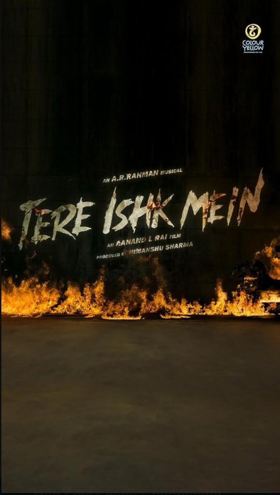

+++
title = "On Artistic Liberties"
url = "2025/12/artistic-liberties.html" 
date = 2025-12-05
description = "The tenuous connection between Love in the Time of Cholera, Tere Ishk Me and Clockwork Orange; and bemoaning the lack of nuance in criticism."
tags = ["Personal Essay", "Movies", "Review"]
+++

In *Gabriel Garcia Marquez*'s **Love in the Time of Cholera**, a shy and introverted 18-year-old boy falls in obsessive love with a 13-year-old girl. He serenades her from outside her window by playing a waltz with his violin for multiple nights in a row. He goes to the extent of positioning himself so as to take advantage of the direction of wind, using it to amplify the sound of his music when it reaches her. The author was a master of weaving fantastical elements into realistic narratives that allowed him to elevate emotions while still helping us resonate with his characters. The "*magic*" in magical-realism that Marquez was famous for makes the archetypes of his stories timeless.

I have always loved watching movies. As a young adult, I had already started consuming a variety of movies from across the World. I once came across a single shot of some Japanese movie while browsing channels on TV, and instantly declared, correctly, that this movie must have been the inspiration for *Director Mysskin*'s Tamil movie - *Nandalala*. The Japanese movie was *Kikujiro*, and the low camera angle signifying a child's perspective was a giveaway. Needless to say, I was gradually becoming a snob, akin to *Director* *Mysskin* himself. I was harshly critical of many mainstream Tamil movies and quick to point out logical flaws. How does the evil lookalike of the protagonist in *Vijay*'s *Azhagiya Tamil Magan* find one single diary that tells him all he wants to know about our hero across many years, I asked, to the chagrin of the actor's fans around me. I did have my favorite movies that disregard logic, reason, and aesthetics. I was, as one is, more accepting of a flaw if the movie involved people I liked. But I could be very critical when I wanted to be, and I judged people based on the movies they liked.

My love for movies was such that I had even harbored dreams of becoming a screenwriter. I once attended a two-day screenwriting workshop spearheaded by *Director K. Hariharan*, who was then a professor at various film schools. The workshop included talks by extremely popular and well-regarded movie icons such as *Kamal Haasan*, *Singeetham Srinivasa Rao* and *Anurag Kashyap*. The first session on the second day was a talk by *Rohan Sippy*, who was himself a director but also the son of *Ramesh Sippy*, director of one of the most iconic Indian films ever -- *Sholay*. This session was so much in demand that people from a neighboring workshop aimed at already established professionals walked in. I was a little late, and as soon as I found a seat, an empty seat to my right got occupied too. My neighbor asked me in a whisper to catch him up on what he had missed, only for me to respond that I had just arrived as well. This profoundly upset him, and he berated me for being an insincere youngster. I looked up and was amused to realize that I was being scolded by *Dharani*, a very popular mainstream Tamil director at that time who directed *Dhill*, *Dhool* and *Ghilli*.

I was insincere because I subconsciously knew that my aptitude for movies is not as great as I imagined it to be in my late teens and early twenties. It does not help that I am not a visual person. When I read fiction, my mind rarely imagines the scenery described in a book. I skim over physical descriptions and focus on the psychology of characters. In my mid-thirties, I have mostly given up the pretense of being a movie buff. I [just wrote](https://www.thefreudiancouch.com/2025/10/mother-tongue-other-tongues.html#:~:text=The%20world%20is%20exploding%20around%20me%2C%20but%20I%20can%E2%80%99t%20find%20a%20spark.%20Life%20is%20work%2C%20chores%2C%20childcare%2C%20cleaning%20up%2C%20doomscrolling%2C%20watching%20inane%20videos.) about how hard it is to find time to do anything these days, and there is no point repeating it. I am still obsessed with trying to keep up with movies though, but being up-to-date on movies you will never get to watch is a Sisyphean game. 

I sometimes slip up and declare that I like watching movies. I made this mistake during a job interview in the USA, and ended up having to fake my love for the insanely popular *RRR*. "*Hey Indian guy who likes watching movies, you must be in love with the one Indian movie I know!*". But I am often more cautious. After all, I have barely watched any Marvel film. How can I hold a conversation with someone else who is in love with movies too? People already avoid talking to me. Why would I make it worse by talking about Alfred Hitchcock to a 20 year old? It turns out that I have, if you think about it -- and humor me kind reader as I stretch metaphors to a point that it doesn't make sense anymore, as I am wont to do -- shaped my whole life as a homage to a popular Tamil movie trope - an ordinary-looking guy whose everydayness hides a secret past. When the noobs around me discuss movies, I smile inwardly, and scenes of watching *Alejandro Iñárritu*'s *Birdman* in an empty theater in Chennai flash in my mind. In black-and-white. Like *Rajnikanth*'s *Manickam* in *Baashaa*, I now live a humble life avoiding scrutiny, hiding an exciting past. For all you know, I might have a crew of erstwhile gangster friends also in disguise around me. But what would they be doing? Drop their books at the clap of my hands to utter random movie trivia? "*Did you know that in Alfred Hitchcock's Rope, the timeline in the movie is almost the same as the timeline outside the movie?*" (\*Background music intensifies\*).

Once, an American conservative told me that as I get older, I would tend to become more conservative like he did, and like most people do. I don't know about ideological transformations, but my taste in movies has definitely changed. I am now more forgiving. When I pick a movie to watch in the little time I have, I prefer for it to not require any thought from me. I am less inclined to artistic or ideological movies that are imperfect. A flawed mainstream movie that aims only to entertain at a surface level is, on the other hand, fine. I still love the idea of a great movie, but I often tend to postpone watching such movies. One thing that hasn't changed is my love for watching movies in theaters alone.

I watched *Aanand L. Rai*'s ***Tere Ishk Mein*** in a theater recently. I attempted to time it such that I would be the only person in theater. A weekday afternoon show a week or two after release has very low footfall in the USA. Once my show began, two other people walked into the theater. Thankfully, that didn't diminish the experience, and may even have enhanced it. *Dhanush* is my favorite actor of all time, and I have found this Tamil actor's forays into Hindi films very exciting. I loved his two previous movies with the same director, and I am finding that as I become older, I am developing an appreciation for A.R. Rahman's music that I didn't have as a teenager. His background score for this movie is exceptional. I am not averse to spoilers, and I consume a lot of reviews before deciding to watch a movie. My thinking is that I probably would not find time to watch the movie anyway. I don't let these reviews decide for me, but I am interested in what people think. *Tere Ishk Mein* has had extremely polarizing reviews. From what I can tell, the movie is commercially doing very well. But most critics are bashing it for its toxic portrayal of romance, its misogyny, and its logical loopholes. *Baradwaj Rangan*, one of my favorite critics, had a more nuanced take, but his video also started with a one-line summary that was -- thanks to the need to grab people's attention instantly in the era of too much content -- reductive.

I wanted to watch the movie despite these reactions. Or probably because of these reactions. And as I expected, I enjoyed the movie. I loved the performances of most actors. I am not surprised by my enjoyment, for I have recently enjoyed most movies I get to watch. Even movies starring actor *Vijay*, indicating that my opinions have transformed, much like the actor himself. I am however very surprised by how dismissive some of the reviews were, especially given the movie's genre.

*Tere Ishk Mein* is a minefield of controversial ideas. A violent do-gooder falls in love with a richer woman from higher class and demands that she loves him. Why is this relationship being glorified? He then transforms his life magically. Is this even possible? And why is a psychology student so dumb? Why are her feelings complicated? And why does the movie try to do so much? These are great questions that should be examined. But not at the expense of dismissing the primary question - does the movie entertain? It entertained me, despite many flaws. I (and my two companions) laughed at the funny scenes, and my eyes welled up in a scene I have seen play out many times, thanks to the sheer intensity of the actors involved. However, having described my own journey as a movie consumer in such detail, I have been trying to answer the question of what worth, if any, my opinion holds. After all, many recent movies that I found interesting have been bashed by most critics. Am I out of touch, or are the critics being too binary?

Theaters in the US have subtitles for non-English movies, and this helped me overcome my [struggles](https://www.thefreudiancouch.com/2012/10/the-hindi-test.html) with Hindi to understand the lyrics of the soaring background score. One of the songs compares the situation of a character to that of a lonely flaming ember that is wandering in the sky. These few words succinctly foreshadow a later scene in the movie in a way that only poetry can do. My worry is that most people who term themselves critics, and everyone is a critic these days, miss these artistic aspects of a movie to provide an instant verdict. Art involves artistic license. You may or may not like a piece of art. But you can't criticize Marquez's book for not following the laws of Physics, or Picasso's painting for not being realistic. You are free to dislike *Anthony Burgess*'s [*Clockwork Orange*](https://www.thefreudiancouch/2022/07/review-of-anthony-burgesss-clockwork.html) or Stanley Kubrick's movie adaptation of it. The plot after all is about a psychological treatment to fix a violent youngster that goes haywire. But if your main criticism against the book is that the protagonist is a bad person, you are missing the point.

This is not to say that art is above criticism. In *Love in the Time of Cholera*, the protagonist is spurned by his lover, but maintains his obsession for more than half a century. During this time, this character has many physical relationships, but he apparently does not "*love*" anyone else.  One of his physical relationships involves practically a child whom he grooms, something that should be unpalatable to most people in 2025. If you thought the five year age difference highlighted in my opening paragraph was bad, the age difference here would make one squirm in your seat. To complicate things further, it is not very clear if *Marquez* was aware of the problems with this relationship. Readers have conflicting interpretations, and many women who notice patterns across Marquez's oeuvre find *Love in the Time of Cholera* extremely off-putting. Analyzing *Love In the Time of Cholera* without mentioning this aspect would not be okay. 

*Tere Ishk Mein* is nowhere in the league of *Love in the Time of Cholera*. It is not an all-time classic love story. Unlike *Burgess*'s work, it is also not an overtly cautionary tale. Indian mainstream movies are cynical, and they make what they think sells. If that involves glorification of some morally grey aspects, it is fair game. But art is complicated. "*This is toxic*" is easy to say. Analyzing why you think a piece of art did not work and making sure those specific aspects do not cloud your judgment on the other aspects that might have worked otherwise, is not as easy. I have been wondering if in calling out the problematic aspects of artistic works, and in being too intent to criticize, we fail to engage with these works as we should - on a subconscious level. Can you judge a work of art purely based on its conformance to your moral ideology? You can't pretend that art exists in a vacuum insulated from the morality of people around it. Art exists in society, and reflects the flaws of society, either consciously or otherwise.

 [Arts, Movies and Philistines](https://www.thefreudiancouch.com/2013/07/art-movies-and-philistines.html) · [Critique on Movie Criticism](https://www.thefreudiancouch.com/2013/11/critique-on-movie-criticism.html) · [Review of Anthony Burgess's A Clockwork Orange](https://www.thefreudiancouch.com/2022/07/review-of-anthony-burgesss-clockwork.html) 

