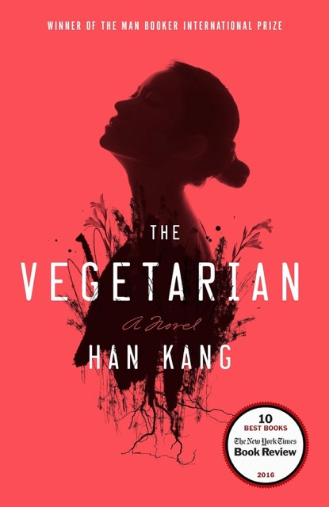

+++
title = "The Vegetarian by Han Kang"
url = "2025/06/vegetarian-han-kang.html" 
date = 2025-06-18
tags = ["Books", "Review"]
+++

> It’s your body, you can treat it however you please. The only area where you’re free to do just as you like. And even that doesn’t turn out how you wanted.

> I have dreams too, you know. Dreams…and I could let myself dissolve into them, let them take me over…but surely the dream isn’t all there is? We have to wake up at some point, don’t we? Because…because then…

*Han Kang*’s **The Vegetarian** is one of my quickest reads in recent times. But I am doing a disservice to the difficulty of reading the book when I say that out loud. Engrossing, yes, but also challenging. Han Kang mixes East-Asian modernism popularized by the likes of *Yasunari Kawabata* with the existentialism of *Franz Kafka* to examine South-Korean culture and family structure, and the status of women in both. The book is structured as a three-part novel, adding up to less than 200 pages. Each part is narrated from the perspective of a different person, and together portray the distance between close family members. 

**

# Part 1 - The Vegetarian

> Intolerable loathing, so long suppressed. Loathing I’ve always tried to mask with affection. But now the mask is coming off

In the first part of the novel, titled *The Vegetarian*, we meet *Yeong-hye*. However, we see her through the eyes of her husband, Mr. Cheong. Her husband describes her as “*as completely unremarkable in every way*”, adding that “*(t)o be frank, the first time I met her I wasn’t even attracted to her.*” Mr. Cheong is completely fine with this arrangement, as he suffers from an inferiority complex of his own. Mr. Cheong is a working man, someone who strives for normality, and he wants nothing out of the ordinary from his wife. Imagine his shock then, when Yeong-hye, “*the most run-of-the-mill woman in the world*”, decides out of the blue to turn into a vegetarian, thanks to an indescribable dream. 

Yeong-hye’s metamorphosis is Kafka-esque, but Han Kang cleverly introduces a twist. In Franz Kafka’s novel, Gregor Samsa finds himself transformed, and his first worry is about being late to work. Characters around him overcome their surprise to react matter-of-factly. In The Vegetarian, Mr. Cheong himself does not undergo any transformation, but his primary worry when his wife changes drastically is his own work life. And he reacts matter-of-factly : “*(w)hen a person undergoes such a drastic transformation, there’s simply nothing anyone else can do but sit back and let them get on with it.*” Han Kang's choice to narrate this chapter from the perspective of the husband is interesting. Disguised in his rant on fate's cruel denial of his ordinary desires, his indifference to his wife's suffering is illustrated in his own words.

# Part 2 - Mongolian Mark

> And so, for someone who had previously worked on 3D graphics of people worn down by the vicissitudes of late capitalist society, to be screened as factual documentaries, the carnality, the pure sensuality of this image, was nothing short of monstrous.

The second part of The Vegetarian, titled *The Mongolian Mark*, is the strangest. A couple of years after the event of the first part, we now get the perspective of *Yeong-hye*’s brother-in-law. This character is  quite unlike Mr. Cheong in many ways. For one, he is an artist in search of inspiration. We also learn, albeit in passing reference, that he survived the [Gwangju uprising](https://en.wikipedia.org/wiki/Gwangju_Uprising), where a protest calling for democratic reforms was brutally suppressed by a fascist regime resulting in the death of possibly thousands. He seems to be one of the few people in the novel who treats *Yeong-hye* with some semblance of sensitivity. If you were to box him in modern day terms, this character is a left-leaning liberal. Unlike Mr. Cheong, who suffers from inferiority complex dealing with women, he even has a girlfriend from a past, one who is still amicable with him. When he learns something unexpected about Yeong-hye’s body, he is engulfed by an obsession that borders between artistic and perverse, disrupting his life and causing havoc to those around him. This is the most morally ambiguous section of The Vegetarian, and I am still trying to come to grips with it.

# Flaming Trees

> The feeling that she had never really lived in this world caught her by surprise. It was a fact. She had never lived. Even as a child, as far back as she could remember, she had done nothing but endure. She had believed in her own inherent goodness, her humanity, and lived accordingly, never causing anyone harm.

Flaming Trees, the final part of the novel, shifts perspectives once more to examine *In-hye*, *Yeong-hye*’s sister. In-hye is, outwardly, the most stable person in the family. She is a successful entrepreneur, while supporting a toddler and a preoccupied husband who is a man-child. She can do all this and more because she is the “*kind of woman whose goodness is oppressive*”. However, her sister's unstoppable descent into madness and her husband's transgressions stretch her limits to the extreme. In-hye is well intentioned, but does she really understand her little sister? Who is the flaming tree? Is it the younger sister whose distance from reality convinces her that she is a tree, or is it the older sister who stabilizes and gives and gives and gives without expecting anything in return?

# Themes

The Vegetarian, despite being a very short novel, evokes a multitude of themes and ideas. At the core, as I see it, Han Kang explores the role of women in a patriarchal society which constrains her from making her own choices. Yeong-hye and In-hye grow up in an extremely abusive household. The former, especially, suffers because her father “*whipped her over the calves until she was eighteen years old.*” Their husbands, though different, add as much to the women's suffering as their father. *The Vegetarian* also explores the nature of art and the morality of an act that Yeong-hye’s artist brother-in-law performs. From In-hye’s perspective, his behavior is dastardly. But the younger sister could be seen as complicit in this act, at least to an extent. Han Kang leaves us grappling with this unresolved conundrum.

The Vegetarian also explores loneliness, and how difficult it is to convey the inner workings of a mind to another person. We are all connected to everyday life by a “*slender thread*” that can break at the smallest of provocations, and when it does, even well-meaning people around us would not find it easy to relate to us. 

Buried underneath all this is a glimpse of a late-capitalistic society that keeps chugging along,  punishing those who go wayward by refusing to understand them. Though *The Vegetarian* is set sometime in the past in what is, to me, a different culture, I see parallels in our own world today. I trudge along everyday making sympathetic noises at stragglers. I might try to help them, but I do not have the time to listen.

# Verdict

The Vegetarian is a disturbing but engaging and memorable work of fiction. I will be ruminating on the questions Han Kang poses, and I do not have hopes of black and white answers. The  novel's strength is in exploring so many themes without biasing its readers towards specific conclusions. I look forward to reading Han Kang’s other works - especially Human Acts, which explores the Gwangju uprising in even more depth.

>Slowly she turned to face him, and he saw that her expression was as serene as that of a Buddhist monk. Such uncanny serenity actually frightened him, making him think that perhaps this was a surface impression left behind after any amount of unspeakable viciousness had been digested, or else settled down inside her as a kind of sediment.

