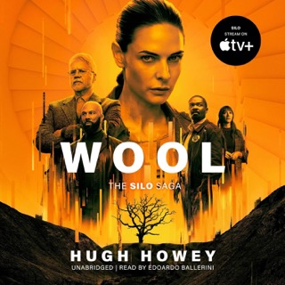

+++
title = "Review of Wool (Silo # 1) by Hugh Howey"
url = "2025/03/wool-silo-howey.html" 
date = 2025-03-05
tags = ["Books", "Review"]
+++

> What god would make so much rock below and air above and just a measly silo between?

> They put us in this game, a game where breaking the rules means we all die, every single one of us. But living by those rules, obeying them, means we all suffer.

I had an awareness of *Hugh Howey*'s self-publishing success story before I started reading his immensely popular **Wool** (part # 1 of the **Silo** series). What I hadn't known was that Hugh's journey began with a self-contained short-story titled *Holston* as an outlet for his personal grief. The unexpected success of this story prompted Hugh to write four more novellas. The combination of these five short stories cum novellas together make Wool.

## On Speculative Dystopian novels

Introspecting on my encounters with the dystopian genre, I realized that I have actually read a surprising number of these books, which gives me a benchmark to compare **Wool** with. While some dystopian novels like *Cormac McCarthy*'s **Road** or *Octavia Butler*'s **Parable of the Sower** portray an anarchic future with individuals in control of their own fate, many envision a more authoritarian state with individuals or an organization being firmly in control. Even within this sub genre, authors imagine widely different Worlds, the most famous contrasts being between *George Orwell*'s **1984** and *Aldous Huxley*'s **Brave New World**. The former depicts a top down authoritarian system with the Government firmly controlling the flow of information. Huxley's more prescient work imagines a World where people are conditioned to be compliant. The joy of reading this genre is in recognizing that there are multiple ways for things to go wrong. Good dystopian works provide a compelling warning about the future, while being relatable in the present.

## The structure of Wool

All we know for a while into Wool is that people live in some sort of a silo. The outside is a dangerous place, and people are discouraged from even entertaining thoughts of venturing out. Some do so at the risk of, well, being granted their wish. We meet *Sheriff Holston* who suffers from the grief of having lost his wife Allison. As some sort of vaguely described computer whiz who specializes in recovering *deleted* files, Allison discovers that all is not what it seems, and her discovery and subsequent loss haunts Holston. As readers, we are drawn into the story simply as we try to piece together the setting as information is revealed slowly

> The world around her was stratified. She saw that ever more clearly. The up top concerned itself with a blurring view, taking for granted the squeezed juice enjoyed with breakfast. The people who lived below and worked the gardens or cleaned animal cages orbited their own world of soil, greenery, and fertilizer. To them, the outside view was peripheral, ignored until there was a cleaning. And then there was the down deep, the machine shops and chemistry labs, the pumping oil and grinding gears, the hands-on world of grease-limned fingernails and the musk of toil. To these people, the outside world and the food that trickled down were mere rumors and bodily sustenance. 

Hugh's second novella titled *Proper Gauge* is my most favorite part of Wool. The mayor of the silo journeys with an old friend into the *"deep-down"*, covering a vertical distance of 144 levels. Through this journey, we discover the lay of the land, and understand the stratification of silo and the subtle difference between *upper*, *mid*, and *lower* levels. We also meet other characters along the way. Despite the flood of information we gather, Howey succeeds in depicting a very subtly romantic relationship between two old friends effectively. We meet *Juliette*, the protagonist of Wool, towards the end of this chapter. The rest of *Wool* deals with Juliette's discovery of the Silo's secrets, and her quest to enlighten the people.

> Jahns was old, had been mayor a long time, partly because she got things done, partly because she prevented worse things from happening, but mostly because she rarely made a ruckus. She felt like it was about time—now, while she was old enough for the consequences not to matter.

The three subsequent novellas weren't as well delineated, probably because of the breakneck pace of the book.
## Cast of characters

Juliette, the protagonist, spends her life growing up at the lowest level underground the silo, maintaining the mechanical machines that, unbeknownst to most people in the silo, power their lives. Juliette's defining characteristic is her stubbornness. *"She had come to believe that there were no fasteners she couldn’t unstick, had learned to attack them with grease and with fire, with penetrating oil and with brute strength. With enough planning and persistence, they always gave. Eventually."*  She is tireless, relentless, smart and, TLDR, flawless. 

I have already mentioned my favorite character, Mayor Jahns. I loved reading about a geeky older person who figures out information that is critical to the plot. We also see many other characters flourish, albeit briefly, before their flourish recedes. However, everyone pales in comparison to Juliette, who doesn't seem to get all the help she needs from the other characters. There is arguably only one character in the whole novel who undergoes any sort of transformation, and we don't meet this character enough until they surprise us with the said transformation. This lack of development of secondary characters is my biggest gripe with *Wool*.

Silo also suffers from a very weakly written antagonist. This character considers the mechanics from deep-down as *"grease monkeys, those uncivilized tinkerers. He thought of the ugly and loud machines down there, the smell of leaking exhaust and burning oil. He had only needed to see it once—to kill a man—but even that was too much."* This is just a convenient writing telling us about stratification that we do not feel in the other parts of Wool. To add on to my frustration, we witness this character's romanticization of computer hardware : *"Here was where silicone chips released their tangy scent as they heated under the strain of crunching data. Here was where one could smell the rubber coating the wires, running in parallel, neatly bundled, labeled and coded, and streaming with gigabits of glorious data every second. Here was where he oversaw the refilling of their data drives with all that had been deleted from the last uprising. Here, a man could think, surrounded by machines quietly doing the same."* 
## Verdict

I don't think it is fair to judge stories before they are complete, and this makes it hard for me to formulate thoughts on a single book in a series of stories. The Silo is as effective in terms of its setting as many modern dystopian novels. It has a lot of logical flaws if you sit down to think about it. One wonders why the one person who knew the secrets of silo did not want to formally control it earlier. More glaring is the  passiveness of the people in the Silo. When the floodgates burst and some people attempt to take control of their lives and surroundings, we do not hear the view of the common person in the silo. And worse, why are the people in control so lacking in nuance? I mean, if I wanted cartoonish villains, I would read the news!

Wool attempts to explore some broader themes such as freedom vs. greater good, but only at a surface level. When a character utters what they think is a novel idea -- *"Think about it. Instead of manipulating people, why not empower them? Let them know what we’re up against. And have that drive our collective will"* -- I literally groaned. To be fair to Howey, the themes are probably explored in more depth later in the series. *Hunger Games*, for one, was a series that became broader in scope and ambition as the series progresses.

It is easy to look past any flaws *Wool* might have given its pace and its focus on action. Wool was my quickest read in recent times, and I will reserve my full judgement until I read more Silo books.

